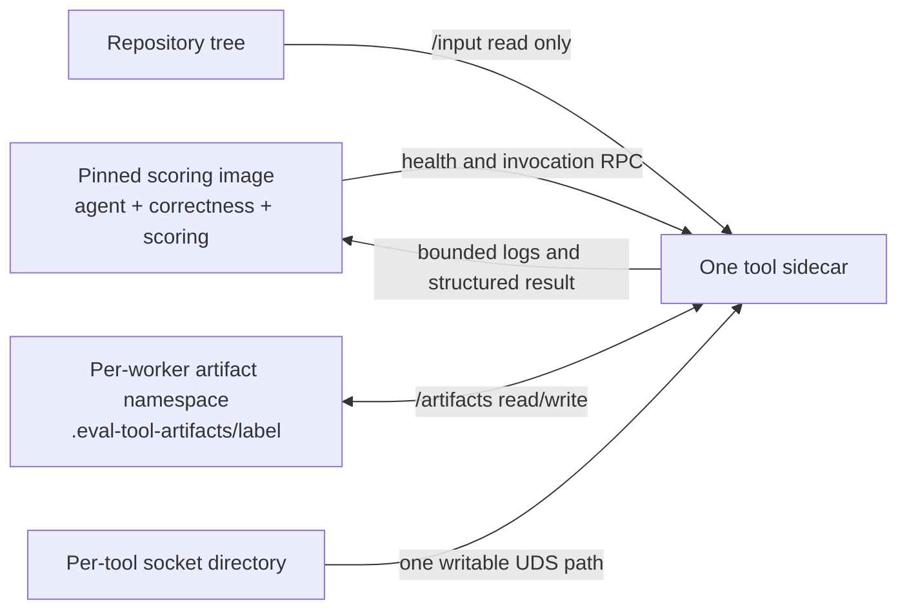

---
myst:
    html_meta:
        "description": "Run Triton FpSan, ROCm GPU AddressSanitizer, rocJITsu Race Detector, Waitcheck, ConSan, and HIP-FpSan as isolated AgentKernelArena evaluation tools."
        "keywords": "AgentKernelArena, sanitizer, Triton FpSan, GPU ASan, rocJITsu, Waitcheck, ConSan, HIP-FpSan, ROCm, gfx950"
---

# Check kernels with evaluation tools

AgentKernelArena can run optional kernel-analysis tools after ordinary
compilation and correctness checks and before performance measurement. The
initial tool set is:

- Triton FpSan for reference-versus-candidate floating-point semantic
  comparison.
- ROCm GPU AddressSanitizer (GPU ASan) for invalid device-memory accesses.
- rocJITsu for simulated race detection.
- rocJITsu Waitcheck for static missing or too-weak wait detection on one exact
  final code object and kernel entry.
- rocJITsu ConSan for strict dynamic record/replay concurrency checking of one
  exact code object launched by a focused native harness.
- HIP-FpSan for explicitly ported HIP/C++ floating-point comparisons.

This feature is experimental and opt-in. Capability and evidence checks fail
closed; whether an incomplete result blocks performance is controlled by the
`advisory` or `required` policy. It is not a general sanitizer suite:
sanitizer suite: every result is qualified by the kernel language, generated
artifact, adapter, tool image, GPU architecture, and evidence that the intended
kernel was actually instrumented or dispatched.

> **Current validation boundary:** sidecar build locks, integrated startup
> controls, and end-to-end fixtures exist only for MI355X (`gfx950`). All six
> startup controls passed in the current hardware qualification. Candidate
> readiness still depends on language, artifact, adapter, and attestation.
> `gfx942` is unverified, and the Docker runner currently rejects
> evaluation-tool sidecars on that architecture. Do not interpret normal
> MI300/MI325 task support as sanitizer support.

## Keep the scoring runtime unchanged

Evaluation tools do not get installed into the agent or scoring container.
Each enabled tool runs in a separate run- or worker-scoped sidecar, reused
across that worker's tasks, and communicates with the evaluator over a Unix
socket:



The runner creates a narrow repository-root
`.eval-tool-artifacts/<worker-label>` namespace. It mounts only that directory
as writable `/artifacts` in each sidecar and explicitly bind-mounts the same host
directory read/write at `/workspace/.eval-tool-artifacts/<worker-label>` in the
scoring container. The explicit submount keeps reports writable when the broad
repository mount is read-only, as it is in the quality loop, and avoids asking
Docker to create bind sources on a root-squashed NFS home. Task workspaces and
captured source evidence are not reachable through a writable sidecar alias.
In ordinary and parallel runs, the runner also overlays the top-level
`.eval-tool-artifacts` namespace read-only before overlaying only the current
worker child read/write. This prevents the broad writable repository mount from
becoming a second path to sibling workers' reports or bind sources.
All sidecars for that worker still share this artifact namespace. Each sidecar
receives only its own nested writable socket directory, while the scoring
container receives the socket parent read-only. These changes reduce accidental
cross-tool mutation, but do not create an agent/evaluator trust boundary; the
remaining security consequences are described later.

All six tool images bake the worker, trusted replay helper, and synthetic
probes into the read-only image at `/opt/aka-eval-tools`. Worker startup verifies
that it imported this image-owned tree rather than the repository mounted at
`/input`. This protects the sidecar control-plane code from a task changing the
checkout used by a running worker; candidate-specific commands and inputs remain
separate, explicitly mounted data.

The verified `gfx950` scoring image remains:

```text
lmsysorg/sglang-rocm:v0.5.14-rocm720-mi35x-20260705
lmsysorg/sglang-rocm@sha256:b435b508b5aa696abb25c909341ce73e41574c4271cf716bed72418dcea86b78
```

When any evaluation tool is enabled, the runner resolves Docker's immutable
local image ID for both the selected scoring-image reference and the
content-addressed manifest reference above. Startup fails unless the two IDs are
identical, then launches the scoring container by that verified ID rather than
the mutable tag. A different tag that is an exact alias of the same image is
accepted; an upgraded, rebuilt, or retagged scoring image is rejected even if it
looks compatible. The selected reference and verified image ID are recorded under
`plan.source_evidence.metadata.scoring_runtime`, serialized with the report,
and covered by the plan fingerprint.

The current design deliberately does **not** upgrade that image, FlyDSL 0.2.2,
or AITER `0.1.17.dev110+g9127c94a1`. The Triton FpSan sidecar replaces Triton
only inside its own container; the other tool dependencies are likewise local
to their sidecars. A sidecar is not a replacement scoring image and must not be
used to establish a new performance baseline.

FlyDSL does not promise that every generated artifact or task remains compatible
across releases. If the scoring image, FlyDSL, AITER, PyTorch, ROCm, or Triton is
upgraded later, treat that as a benchmark-runtime migration: rerun compilation,
correctness, held-out, sanitizer positive/negative fixtures, and performance
baselines rather than assuming backward compatibility.

The pinned sidecar dependencies are recorded in
`docker/eval-tools/images.lock.yaml`:

| Sidecar | Isolated dependency change |
| --- | --- |
| `triton_fpsan` | AMD Triton `3.7.0+amd.rocm7.2.0.gitd0d77a509` and matching `triton-kernels` wheels. |
| `gpu_asan` | ROCm 7.2 ASan runtime packages, including `hip-runtime-amd-asan`. |
| `rocjitsu` | rocJITsu from pinned `rocm-systems` commit `0bf561a0...`, built with GCC 13 for `gfx950`. |
| `rocjitsu_waitcheck` | rocJITsu Waitcheck C API and CLI from pinned `rocm-systems` commit `ed35c0b...`; zstd source is separately checksum-locked. |
| `rocjitsu_consan` | rocJITsu ConSan HSA hook from the same pinned `ed35c0b...` source, forced to strict record/replay mode. |
| `hip_fpsan` | HIP-FpSan headers/source from pinned commit `0ac9be8a...`. |

## Understand support levels

“The engine can execute a code object” and “the evaluator can safely wrap a
Python submission” are different claims. The report therefore records four
capability dimensions:

| Dimension | Question |
| --- | --- |
| `engine` | Can this analysis engine reason about the language or generated ISA? |
| `adapter` | Is there a task-specific build, comparison, or replay path that identifies the exact candidate? |
| `runtime` | Is the isolated sidecar reachable, architecture-matched, and carrying the required assets? |
| `effective` | Is the tool ready after combining the other three dimensions? |

Possible states are `ready`, `adapter_required`, `unsupported`,
`not_applicable`, and `unavailable_runtime`. A non-ready tool is not executed.
Unsupported tooling is also not converted into an ordinary kernel correctness
failure.

### Use evaluator plugins, not agent skills, for enforcement

A sanitizer belongs in the evaluator control plane. An agent skill, prompt, or
tool-use recipe may help an optimizer author an adapter or interpret a report,
but it runs on the untrusted optimization side and cannot prove that a required
check happened. It must never be the source of a scoring gate.

The extension boundary deliberately separates four responsibilities:

| Layer | Responsibility |
| --- | --- |
| Core manager | Resolve task profiles, combine capability states, enforce policy, fingerprint plans, and serialize one stable report schema. It contains no sanitizer-specific parsing. |
| Tool plugin | Implement deterministic `assess`, `build_invocation`, and `parse` behavior for one tool. It converts raw output into independent execution/finding states. |
| Sidecar runtime provider | Own the pinned image, dependencies, health evidence, runtime-internal paths, architecture guard, and synthetic startup control. |
| Task adapter | Compile or replay the exact candidate and emit candidate-specific build/dispatch attestation. It is selected by language/artifact kind, not merely by tool name. |

This makes a future analyzer additive: add its typed plugin/parser, isolated
image and lock, worker health/startup control, runner allowlist, task adapters,
support-matrix entry, and positive/negative tests without changing ordinary
correctness or performance code. The current registry is an explicit built-in
allowlist; arbitrary third-party plugin discovery is not implemented. That is
intentional while report provenance and the evaluator/agent isolation boundary
remain experimental.

### Strict support matrix

The following table describes the current end-to-end evaluator, not just a
successful standalone experiment. “Ready with adapter” means the task must
provide the dedicated argv/harness and required attestation described later;
it does not mean the ordinary correctness command is automatically reused.

| Kernel path | Triton FpSan | GPU ASan | rocJITsu | HIP-FpSan |
| --- | --- | --- | --- | --- |
| Editable Triton Python/JIT | Ready with comparison adapter and instrumentation attestation | Ready with dedicated command, fresh JIT cache, XNACK, and build attestation | Trusted `triton_aot` capsule replay is implemented on `gfx950`; whole-Python JIT remains unsupported, and capsule capture/binding to the correctness run is not automatic, so use it only as advisory evidence | Not applicable |
| HIP source controlled by the task | Not applicable | Ready only after recompiling the candidate with `-fsanitize=address -shared-libsan --offload-arch=gfx950:xnack+`, then attesting that artifact | Ready with a dedicated native launcher | Source port and comparison adapter required; both reference and candidate paths must explicitly use `fpsan::Value` |
| FlyDSL 0.2.2 Python/JIT | Unsupported; FlyDSL does not use the Triton FpSan pipeline | Unsupported; the current ROCDL pipeline does not insert AMD GPU ASan instrumentation | Trusted `flydsl_aot` capsule replay is implemented on `gfx950` and detects the seeded LDS race; automatic capsule capture/binding to the correctness run is not ready, so use it only as advisory evidence | Not applicable |
| Editable Triton source inside AITER | Engine may be eligible for the explicitly selected source only, with a dedicated comparison adapter; this does not sanitize AITER library kernels | Unsupported by the current default AITER runtime path | Unsupported by the current Python/AITER runtime | Not applicable |
| AITER or another precompiled HSACO/library kernel | Cannot retrofit instrumentation | Unsupported unless the exact kernel source is rebuilt and attested; preloading the runtime is insufficient | Unsupported by the current evaluator runtime | Cannot retrofit value semantics |
| rocBLAS or RCCL internal kernel | Do not enable; library internals are outside the selected submission | The stock library is not instrumented and is not covered | Not a supported general library-runtime path | Do not enable |

Waitcheck and ConSan use narrower, explicit final-code-object adapters:

| Kernel path | rocJITsu Waitcheck | rocJITsu ConSan |
| --- | --- | --- |
| Standalone final `gfx950` HSACO from HIP, Triton, or FlyDSL | Advisory-ready only when `code_object`, `expected_kernel`, and exact `kernel_entry` identify one descriptor in an unbundled final ELF. It is static and receives no GPU device. | Advisory-ready only with `code_object`, a focused native `command` that names and loads that file, and an independent `oracle_command`. Strict record/replay must report the same FNV-1a identity and complete coverage. |
| Whole Python/JIT process | Not automatically captured or bound to the correctness dispatch. Extract and declare the exact final code object first. | Unsupported by this first integration; incidental framework and library code objects make exact candidate attribution ambiguous. |
| AITER, rocBLAS, RCCL, or another broad library runtime | A selected extracted kernel may be inspected statically, but that does not cover the surrounding runtime or prove it was dispatched. | Unsupported; the current adapter deliberately rejects broad library runtimes. |

Both tools are currently qualified only for `policy: advisory`. The generic
manager can enforce `required` when explicitly configured, but doing so for
these tools is unsupported until the selected task adapter and candidate
provenance have been independently promoted. The evaluator does not
automatically discover optimized kernels or reuse the ordinary correctness
command for either tool.

This matrix describes engine and adapter support once the corresponding runtime
is qualified. The current `gfx950` startup qualification is stricter:

| Tool runtime | Current startup qualification |
| --- | --- |
| Triton FpSan | Passing on hardware; eligible task paths can proceed to candidate attestation. |
| HIP-FpSan | Passing on hardware; explicitly ported task paths can proceed to candidate attestation. |
| GPU ASan | Passing on hardware for both HIP and Triton safe/OOB lanes; an applicable candidate still needs its own instrumentation/build attestation. |
| rocJITsu | Passing on hardware with barrier-safe and deliberately racy LDS fixtures; an applicable candidate still needs a native HIP launcher or validated AOT replay capsule. |
| rocJITsu Waitcheck | Passing on hardware: a correct `s_waitcnt lgkmcnt(0)` fixture is clean and a missing-wait fixture produces one exact hazard. Candidate use still requires exact SHA-256, kernel name, and entry attestation. |
| rocJITsu ConSan | Passing on hardware in strict record/replay: a single-wave LDS fixture is clean and a two-wave conflicting fixture produces complete FNV-attributed diagnostics. Candidate use still requires an exact code object, focused loader, and separate oracle. |

Additional boundaries:

- Static Triton HSACO fixtures, including dynamic matmul, buffer-async matmul,
  and flash-attention fixtures, have executed under the `gfx950` rocJITsu
  engine. That evidence does not make `rocjitsu -- python task.py` supported.
- A FlyDSL HSACO with a deliberately missing LDS barrier produced a rocJITsu
  race report. Directly wrapping the FlyDSL Python process failed before a
  usable dispatch. The implemented adapter therefore extracts that boundary
  into a strict, single-dispatch replay capsule rather than wrapping Python.
- For Triton/FlyDSL, the rocJITsu plugin rejects arbitrary launchers, validates
  the language-specific capsule and all manifest hashes, requires `gfx950`, and
  invokes an image-owned helper that generates and compiles a native launcher.
  The parser requires the expected kernel dispatch, capsule/code-object digest
  attestation, and a successful replay/golden-output marker. The missing piece
  is automatic evaluator-owned capsule capture and proof that the capsule came
  from the exact correctness run; a task-supplied capsule is still weak
  candidate provenance.
- A deliberately out-of-bounds, **uninstrumented** HIP HSACO exited normally in
  a complete GPU ASan runtime. This is why a runtime preload alone is never
  accepted as GPU ASan coverage.
- ConSan embeds Waitcheck as a preflight. The ConSan parser records that preflight
  as metadata but does not duplicate its diagnostics as ConSan race findings;
  enable `rocjitsu_waitcheck` separately when a standalone wait-hazard result is
  required.
- `gfx942` has not completed the same image, positive-control, adapter, and
  end-to-end validation. Its status is unverified, not unsupported by theory.

## Build and check the sidecars

Building requires Docker and network access to the pinned package and source
locations. Runtime sidecars themselves start with networking disabled.

Build all six local `gfx950` images from the repository root:

```bash
src/scripts/docker_benchmark.sh build-eval-tool-images
```

The default local tags are:

```text
agent-kernel-arena/eval-tool-triton-fpsan:gfx950
agent-kernel-arena/eval-tool-gpu-asan:gfx950
agent-kernel-arena/eval-tool-rocjitsu:gfx950
agent-kernel-arena/eval-tool-rocjitsu-waitcheck:gfx950
agent-kernel-arena/eval-tool-rocjitsu-consan:gfx950
agent-kernel-arena/eval-tool-hip-fpsan:gfx950
```

Check that the workers start and report their pinned assets:

```bash
src/scripts/docker_benchmark.sh eval-tools-smoke
```

To check a subset:

```bash
AKA_EVAL_TOOLS=gpu_asan,rocjitsu \
  src/scripts/docker_benchmark.sh eval-tools-smoke
```

`AKA_EVAL_TOOLS` is a host-side subset override. When it is set for either a
smoke test or a normal run, the runner starts exactly that normalized set and
publishes it through the internal `AKA_EVAL_TOOLS_SELECTED` variable; the
scoring process then plans the same set instead of the YAML `enabled` value.
This prevents a sidecar/plan mismatch. Leave the override unset when YAML should
remain authoritative, and record any override as part of the run invocation.

Worker startup runs a tool-specific synthetic positive control before the Unix
socket appears. Health output includes its verdict, commands, durations,
bounded log paths/excerpts, and the immutable Docker image ID reported by the
worker:

| Tool | Startup positive control |
| --- | --- |
| `triton_fpsan` | Compile instrumented reference/candidate kernels and require a known numerical mismatch to produce different digests plus FpSan compiler metadata. |
| `gpu_asan` | Compile and run safe/OOB HIP fixtures and safe/OOB Triton fixtures; the task profile selects the relevant lane. |
| `rocjitsu` | Require a barrier-protected fixture to remain clean and a deliberately racy LDS fixture to report a race. |
| `rocjitsu_waitcheck` | Compile unbundled `gfx950` code objects and run the production entrypoint, inventory, C API, and parser on the correct-wait and missing-wait fixtures; retain a direct CLI hazard check as an independent engine control. |
| `rocjitsu_consan` | Compile raw safe/racy HSACOs plus an image-owned module launcher, run the production entrypoint with separate instrumented/oracle argv, require the oracle environment to be scrubbed, and make the production parser return clean/finding with exact FNV attribution. |
| `hip_fpsan` | Require explicitly ported equivalent expressions to match and a known-wrong expression to produce a different digest. |

`eval-tools-smoke` prints this evidence and exits nonzero if a worker reports
`degraded`, including a failed nested positive control. Inspect and retain the
JSON summaries before promotion. A normal evaluation with
`positive_control: required` repeats the fail-closed check during the typed
runtime probe.

As of the current `gfx950` qualification run, all six integrated startup
controls pass on hardware. This qualifies the installed tool runtimes only. It
does not promote a candidate path without the language-specific adapter and
attestation in the strict support matrix.

The same final image set also passed evaluator-manager-to-sidecar candidate
fixtures on the physical MI355X host:

| Tool and language | Safe fixture | Seeded bug fixture |
| --- | --- | --- |
| Triton FpSan, Triton | `clean` | Numerical mismatch `found` |
| GPU ASan, HIP | `clean` | Out-of-bounds access `found` |
| GPU ASan, Triton | `clean` | Out-of-bounds access `found` |
| HIP-FpSan, explicitly ported HIP | `clean` | Wrong expression `found` |
| rocJITsu, Triton AOT replay | `clean` | Not exercised in this candidate pair |
| rocJITsu, FlyDSL AOT replay | Not exercised in this candidate pair | Missing-barrier LDS race `found` |

These are controlled synthetic fixtures that validate the current adapters,
transport, parsing, and attestation paths. They do not qualify any bundled
production task, broaden the strict support matrix, or close the AOT
correctness-dispatch provenance gap.

## Recommended rollout plan

Promote one language/tool path at a time. Do not make “all sanitizers enabled” a
global milestone.

| Phase | Work | Exit criterion |
| --- | --- | --- |
| 0. Freeze baselines | Keep the pinned scoring image, FlyDSL 0.2.2, and AITER version unchanged; build each tool from its lock into a sidecar. | Existing compilation, correctness, held-out, and performance baselines remain unchanged with tools disabled. Sidecar image IDs and the verified scoring-image ID/reference are captured in plans. |
| 1. Qualify installations | Run automatic safe/known-bug startup controls on `gfx950`; repeat the now-passing six-tool qualification on clean hosts. | Both positive and negative lanes pass repeatedly. `eval-tools-smoke` evidence is archived and independently reviewed. |
| 2. Build trusted pilot adapters | Start with one editable Triton task for Triton FpSan, one Triton and one HIP task for GPU ASan, one native HIP task for rocJITsu, one final-HSACO task for Waitcheck, one focused native loader for ConSan, and one explicitly ported HIP-FpSan task. Put harnesses under protected `scripts/` paths and declare all inputs. | Each pilot distinguishes a safe fixture from a seeded bug, identifies the selected candidate, and produces bounded structured artifacts. No precompiled AITER/library kernel is claimed as broadly covered. |
| 3. Finish AOT capture and binding | The trusted `triton_aot`/`flydsl_aot` replay path now validates one-dispatch capsules and generates the launcher. Add evaluator-owned extraction immediately after correctness and bind the capsule to that exact candidate/case. | Safe and racy fixtures pass end to end, malformed capsules fail closed, and a task cannot substitute a different valid capsule for the correctness dispatch. |
| 4. Harden provenance and phase isolation | The runner now uses per-tool writable socket directories, a read-only socket parent in scoring, a narrow per-worker artifact mount, fresh per-invocation artifact directories, a complete serialized plan, and capsule digests in the fingerprint. Next run tools only after the agent exits, freeze the candidate, use evaluator-only/authenticated RPC and evaluator-owned artifacts, strengthen artifact/dispatch binding, and wire resume to plan freshness. | An adversarial task cannot call a worker, overwrite evidence, reach another task's artifacts, spoof a clean result, or reuse a stale report. This phase is required before sanitizer output becomes a reward signal. |
| 5. Advisory campaign | Run qualified paths with `policy: advisory` across representative and private held-out shapes; measure overhead, timeouts, log volume, flakes, false positives, and GPU recovery behavior. | Each task/tool pair has reviewed coverage cases, stable resource limits, and an explicit owner/runbook. Incomplete results remain visible and never score as clean. |
| 6. Narrow required gates | Change only individually qualified task/tool pairs to `required`; leave unsupported and not-yet-qualified paths advisory or disabled. | Required gates block seeded findings and infrastructure failures without changing ordinary correctness semantics or the scoring performance baseline. |
| 7. Add `gfx942` separately | Build architecture-specific images/configs and rerun every startup, adapter, security, and workload fixture on MI300X/MI325X. | Only mark `gfx942` supported after independent qualification; do not infer it from `gfx950`. |

Phase 0, the six integrated startup controls, complete plan serialization, the
narrower runner mounts, and the trusted AOT replay core exist. No bundled task
has completed production qualification through phases 2–6. Automatic capsule
capture, exact candidate/dispatch provenance, top-level resume freshness, and
the same-phase agent/evaluator boundary remain blockers.

## Start from the disabled example

Copy `example_configs/evaluation_tools_advisory_mi355x.yaml`. It is a normal
MI355X run configuration but has `evaluation_tools.enabled: false`, so copying
and running it does not build or start any sidecar when the host
`AKA_EVAL_TOOLS` override is unset:

```bash
cp example_configs/evaluation_tools_advisory_mi355x.yaml my_sanitized_run.yaml
```

After building the images and adding task-specific adapters, opt in to only the
tools that can actually inspect the selected task:

```yaml
evaluation_tools:
  enabled:
    - gpu_asan
    - rocjitsu
  policy: advisory
  positive_control: required
  timeout_s: 600
  tools:
    gpu_asan:
      options: {}
    rocjitsu:
      options: {}
```

Do not enable all six tools merely because all six images exist. On a
heterogeneous task set, irrelevant tools become `not_applicable`, unsupported
paths remain visible as unsupported, and missing adapters remain
`adapter_required`.

Timeouts are exact YAML/JSON integers from 1 through 3600 seconds; booleans,
floats, numeric strings, and larger values are rejected. A task-level timeout
must also be no larger than the run-level timeout. Explicit
`evaluation_tools` sections and per-tool entries reject unknown fields rather
than silently weakening the requested policy. Supplying both `runtime_ref` and
its `image_digest` alias is rejected when the two assertions differ.

### Select and attest each tool image separately

The host runner selects the Docker image using the default local tag or an
environment override. For example:

```bash
export AKA_EVAL_TOOL_IMAGE_GPU_ASAN='registry.example/eval-tool-gpu-asan@sha256:<digest>'
make docker-run CONFIG=my_sanitized_run.yaml RUN_ARGS='--run-suffix asan_advisory'
```

The override names are `AKA_EVAL_TOOL_IMAGE_TRITON_FPSAN`,
`AKA_EVAL_TOOL_IMAGE_GPU_ASAN`, `AKA_EVAL_TOOL_IMAGE_ROCJITSU`,
`AKA_EVAL_TOOL_IMAGE_ROCJITSU_WAITCHECK`,
`AKA_EVAL_TOOL_IMAGE_ROCJITSU_CONSAN`, and
`AKA_EVAL_TOOL_IMAGE_HIP_FPSAN`.

After selecting a tool-image reference, the runner resolves its local immutable
image ID with `docker image inspect`, launches the sidecar by that bare
`sha256:...` ID, and injects the same ID as runtime identity evidence. Runtime
health reports that ID, and the typed probe fails with
`RUNTIME_REF_MISMATCH` if the planned and observed values differ. The resolved
ID belongs in the plan fingerprint. Scoring-image verification likewise launches
the scoring container by its verified local ID. A registry reference such as
`name@sha256:...` is not string-equal to Docker's local image ID and must not be
used as a manual substitute.

YAML `runtime_ref`/`image_digest` fields are identity assertions, not image
selectors. Omit them when using automatic host injection. If supplied manually,
use the exact bare ID returned by:

```bash
docker image inspect --format '{{.Id}}' <selected-image>
```

## Add a task adapter

Run-level configuration chooses tools, policy, optional image-identity
assertions, and maximum timeout. A task can only add options for an
already-enabled tool and lower its timeout. It cannot enable a tool, change the
image or top-level policy, or raise the run-level timeout.
Reserved framework options are rejected at both run and task level. They are
`positive_control_required`; GPU ASan's `asan_runtime_dir`,
`hip_asan_runtime`, `host_asan_preload`, `host_asan_lib_dir`, and
`normal_rocm_lib_dir`; rocJITsu's `rocjitsu_binary` and `config_path`; and
Waitcheck's `waitcheck_binary` and `waitcheck_capi_wrapper`; ConSan's
`consan_hook`; and HIP-FpSan's `include_dir` and `public_header`. The
host/runtime probe is the only authority for those values.

Commands must be argv lists, never shell strings. A dedicated tool command is
required because reusing `correctness_command` could instrument the reference,
load a precompiled library kernel, or sanitize the wrong candidate.

For example, a HIP task can declare the shape of its adapters as follows:

```yaml
evaluation_profile:
  language: hip
  artifact_kind: source_aot
  framework: standalone
  instrumentation_control: recompile
  source_available: true
  submission_paths:
    - optimized_kernel.hip
    - scripts/eval_tools/run_gpu_asan.py
    - scripts/eval_tools/rocjitsu_launcher

evaluation_tools:
  tools:
    gpu_asan:
      timeout_s: 300
      options:
        command: [python3, scripts/eval_tools/run_gpu_asan.py]
    rocjitsu:
      options:
        launcher: [scripts/eval_tools/rocjitsu_launcher]
        expected_kernel: my_kernel
```

These are adapter contracts, not automatically generated files. The task
wrapper must build and launch the optimized candidate, exercise representative
inputs, and emit the required evidence. Sidecar health is the only authority
for container-internal ASan libraries and preload, the rocJITsu binary and
architecture config, the Waitcheck CLI/C API wrapper, the ConSan HSA hook, and
the HIP-FpSan include directory. The runtime probe attests and injects those
values into the plugin context; neither run nor task configuration may supply
or override them.

Common built-in option keys are:

| Tool | Required adapter options | Additional evidence/options |
| --- | --- | --- |
| `triton_fpsan` | `comparison_command` or `command` | `attestation_path`; command must emit one `AKA_FPSAN_RESULT` JSON line |
| `gpu_asan` | `command` | Candidate `attestation_path`; a HIP command must use the required compile flags. Runtime/preload/library paths come from health. |
| `rocjitsu` | HIP: `launcher` or `command`. Triton/FlyDSL: `capsule` plus an exact profile adapter of `triton_aot` or `flydsl_aot`; user launchers are forbidden on these AOT paths. | HIP may set `expected_kernel` and `race_report`. AOT capsule path must stay below the task workspace and target `gfx950`; the executable/config and trusted replay helper come from the sidecar image. |
| `rocjitsu_waitcheck` | `code_object`, `expected_kernel`, and integer `kernel_entry` | `code_object` must be an unbundled final AMDGPU ELF below the workspace. The image-owned inventory helper must attest exactly the requested `gfx950` descriptor before the C API runs. |
| `rocjitsu_consan` | `code_object`, `command`, and `oracle_command` | `command` must be a focused native argv that explicitly names and loads `code_object`; `oracle_command` runs separately without the hook. Exact SHA-256 and FNV-1a64 identities are required. |
| `hip_fpsan` | `comparison_command` or `command`, plus `evaluation_profile.fpsan_ported: true` | Candidate `attestation_path`; both paths must be instrumented. The include directory comes from health. |

The plugin validates these adapter options directly, so both tools may inspect
the same declared candidate in one advisory plan. For example:

```yaml
evaluation_profile:
  language: hip
  artifact_kind: hsaco_precompiled
  framework: standalone

evaluation_tools:
  tools:
    rocjitsu_waitcheck:
      options:
        code_object: build/optimized.hsaco
        expected_kernel: optimized_kernel
        kernel_entry: 0
    rocjitsu_consan:
      options:
        code_object: build/optimized.hsaco
        command: [scripts/load_hsaco, build/optimized.hsaco]
        oracle_command: [scripts/load_hsaco, build/optimized.hsaco, --check]
```

With ROCm 7.2, `hipcc --genco` produces a clang bundle by default; use
`--no-gpu-bundle-output` or explicitly extract the final device ELF before
supplying `code_object`.

`attestation_path` is resolved below the fresh artifact directory for the
current tool invocation and the same resolved path is used for the injected
environment variable, metadata, and parser. Relative paths are recommended;
an absolute path is accepted only when it resolves below that invocation
directory. Native HIP rocJITsu applies the same containment rule to
`race_report` and requires the report filename to remain `race.log`. AOT replay
does not accept a task-configured race-report path.

For repository or image-kernel tasks, declare every candidate file whose change
must invalidate evidence with `evaluation_profile.submission_paths`. Paths must
be workspace-relative and cannot contain `..`. If this field is absent, capture
falls back to `source_file_path` and `target_file_path`; silently hashing an
entire multi-gigabyte repository is intentionally avoided.

Put evaluator-owned adapter code under a harness-protected path such as
`scripts/`, not an arbitrary agent-editable `eval_tools/` directory. Also list
adapter scripts, HSACO files, and input blobs in `submission_paths` when their
contents must affect the general candidate fingerprint. A configured replay
capsule or Waitcheck/ConSan code object receives additional handling:
immediately before plan construction the manager records its SHA-256 and size under
`source_evidence.metadata.option_artifacts`, so that digest is covered by the
plan fingerprint. The validated capsule manifest contains and verifies the
HSACO and blob digests. This binds the plan to the supplied capsule bytes; it
does not prove who captured the capsule or that it came from the same dispatch
as ordinary correctness.

## Require evidence before accepting “clean”

Process success is not proof that an analysis ran. The built-in parsers require
tool-specific attestation:

- GPU ASan requires `build_attestation.json` for the declared artifact. HIP
  attestation must include all sanitizer/XNACK flags and `HSA_XNACK=1`; Triton
  attestation must include `TRITON_ENABLE_ASAN=1` and `HSA_XNACK=1`.
- Triton FpSan and HIP-FpSan currently require one build attestation whose
  evidence contains the self-declared `reference_instrumented` and
  `candidate_instrumented` booleans, plus an `AKA_FPSAN_RESULT` payload with the
  two digests. Exactly one result marker is required; zero or multiple markers,
  a timeout, or any nonzero/unknown process exit is a tool error. They do not
  validate two independently attested artifacts.
- Native HIP rocJITsu requires a canonical simulator dispatch in the
  evaluator-owned report sink, optionally matched to `expected_kernel`.
  Task-launcher stdout/stderr cannot attest a clean dispatch, even if it prints
  the complete rocJITsu prefix. The task launcher still inherits the report
  configuration, so this lane remains advisory rather than trusted reward
  evidence.
- Triton/FlyDSL rocJITsu uses the image-owned replay helper instead of a task
  launcher. It revalidates the capsule and manifest, generates the native
  launcher, and requires an exact capsule/code-object attestation, expected
  kernel dispatch, and `AKA_REPLAY_RESULT pass`. Missing or changed evidence is
  inconclusive. This is stronger replay integrity, but the task-supplied capsule
  is not yet automatically tied to the correctness run.
- rocJITsu Waitcheck re-hashes the selected final code object, inventories its
  descriptors with the image-owned CLI, matches the exact kernel name and entry,
  and obtains structured diagnostics through the stable C API. Missing,
  duplicate, truncated, or incomplete evidence is inconclusive.
- rocJITsu ConSan re-hashes the code object, requires the configured launcher to
  name it, matches the hook's FNV-1a64 identity, enforces strict record/replay
  completeness and accounting, and runs a separate correctness oracle without
  the hook. Embedded Waitcheck text is preflight metadata, not a duplicate
  ConSan finding.
- Build attestation records the compiler, compiler version, and target
  architecture. The current validator directly checks tool identity,
  `instrumented: true`, required build flags/environment, artifact existence,
  and artifact SHA-256. Required flags are matched as complete argv tokens
  (including supported split-value forms), not as substrings of unrelated
  arguments. The host/runtime `gfx950` guards provide the current
  architecture boundary; stricter compiler/version/target comparisons remain
  future attestation hardening.

These checks establish integrity evidence, not complete candidate provenance.
Build-attestation validation does not compare every compiler/version/target
field with an expected build or cryptographically bind the declared artifact to
the actual dispatch. It does require the artifact path to be relative to, and
contained below, the directory holding the attestation. A user-controlled build
JSON and native HIP wrapper output can therefore still satisfy checks without
proving which candidate ran. AOT replay binds its generated launcher to a
validated capsule and digest, but the capsule can still have been supplied for
a different candidate/case. Current `required` policy is suitable for trusted
integration diagnostics, not an adversarial reward boundary.

The default build-attestation location is the fresh invocation directory below
the external per-task/tool artifact root described later. A wrapper executing
in a sidecar must write it through the writable `/artifacts` mount; the
repository/workspace input mount is read-only. GPU ASan, Triton FpSan, and
HIP-FpSan invocations inject `AKA_BUILD_ATTESTATION_PATH`, and the runtime client
translates that output path into the sidecar namespace. The adapter must place
the built artifact beside or below that JSON file and write `artifact_path` as a
relative path such as `build/candidate.hsaco`. The scoring-side parser resolves
the same relative path below its corresponding artifact directory, rejects
absolute/escaping paths, and checks the declared SHA-256. Do not embed either
the sidecar `/artifacts/...` prefix or a scoring-container absolute path.

### Positive controls and candidate attestation are both required

`positive_control: required` is the default. Each sidecar runs its synthetic
known-bug control once at worker startup and writes an audit summary and bounded
logs. Health returns that evidence. For every applicable task, the typed runtime
probe selects the relevant control (HIP or Triton for GPU ASan) and returns
`unavailable_runtime/POSITIVE_CONTROL_FAILED` unless it passed. The requirement
and host-resolved tool runtime identities are covered by the plan inputs. The
separately verified scoring-image ID/reference are recorded in plan source
evidence as well.
Control evidence is retained in runtime capability/reporting, but its startup
artifact content is not itself part of the plan fingerprint.

This proves that the isolated installation detected its synthetic bug; it does
not prove that the optimized candidate was instrumented or replayed. Candidate
build/dispatch attestation remains a separate requirement. A minimally
meaningful clean diagnostic result needs both:

1. a passing startup positive control for the applicable language lane; and
2. a task result with the declared candidate's build or dispatch attestation.

Setting `positive_control: optional`, `disabled`, or `false` records
`positive_control_required: false`. The startup probe still runs and remains
visible in health evidence, but a failure no longer blocks runtime capability.
Use that only for tool bring-up, not trusted benchmark results.

## Choose the policy

The policy governs whether performance measurement may proceed. It does not
rewrite `pass_correctness`.

| Policy | Finding, tool error, inconclusive result, missing adapter, unsupported applicable path, or missing runtime | Performance |
| --- | --- | --- |
| `advisory` | Recorded; `policy_satisfied: false` | Continues (`allowed: true`) |
| `required` | Recorded with a reason | Skipped (`allowed: false`) |

An explicitly `not_applicable` tool is ignored by the gate. Under `required`,
every other selected tool must have effective capability `ready`, execution
`completed`, and finding status `clean`. Start new integrations in `advisory`
mode. Move to `required` only after task adapters, positive controls, and
architecture-specific fixtures are independently reviewed.

## Read execution and findings separately

`execution` answers whether the tool invocation completed. `finding` answers
what the parser concluded about the selected kernel:

| `execution` | Meaning |
| --- | --- |
| `not_run` | No invocation was made. |
| `completed` | The parser obtained a complete tool outcome; a detected bug can still have this state. |
| `tool_error` | The runtime, wrapper, or parser failed without a valid finding. |
| `timeout` | The isolated process group exceeded its timeout. |

| `finding` | Meaning |
| --- | --- |
| `not_evaluated` | No supported evaluation ran. |
| `clean` | The intended instrumented/simulated kernel ran and no finding was observed. |
| `found` | One or more structured issues were reported. |
| `inconclusive` | Absence of a finding cannot be trusted, often because attestation is missing. |

A sanitizer can deliberately terminate with a nonzero process status while
still producing a valid finding. Conversely, an uninstrumented out-of-bounds
kernel can return zero and must remain inconclusive. Never use return code alone
as the sanitizer result.

The report keeps ordinary scoring fields and adds:

```yaml
pass_tool_gate: true
tool_policy_satisfied: false
tool_evaluation:
  schema_version: 1
  plan_fingerprint: "..."
  plan:
    schema_version: 1
    policy: advisory
    profile: {}
    tools:
      - tool: gpu_asan
        runtime_ref: "sha256:..."
        plugin_version: "1"
        timeout_s: 600
        options: {positive_control_required: true}
    fingerprint: "..."
    source_evidence:
      metadata:
        scoring_runtime:
          image_id: "sha256:..."
          reference: "lmsysorg/sglang-rocm:v0.5.14-rocm720-mi35x-20260705"
  policy: advisory
  overall_status: incomplete
  resolved_task_profile: {}
  source_evidence: {}  # legacy mirror of plan.source_evidence (abbreviated)
  decision:
    allowed: true
    policy_satisfied: false
    reasons: ["gpu_asan:capability:adapter_required"]
  tools:
    gpu_asan:
      capability:
        engine: {state: ready}
        adapter: {state: adapter_required}
        runtime: {state: ready}
        effective: {state: adapter_required}
      result: null
```

Large stdout/stderr streams are not embedded in `task_result.yaml`; they remain
bounded artifacts. The report serializes the complete immutable `plan`,
including each tool's runtime reference, plugin version, timeout, options,
profile, source evidence, and fingerprint. This makes a result reconstructable
for audit without relying on the digest alone.

## Artifact and evidence layout

For a normal run, the relevant files are:

```text
<repository-root>/
├── .eval-tool-artifacts/
│   └── <worker-label>/                     # dedicated sidecar/scoring RW submount
│       ├── _eval_tool_runtime/
│       │   └── <sidecar-instance>/<tool>/positive-control/
│       │       ├── summary.json            # startup verdict and step metadata
│       │       └── <step>.{stdout,stderr}.log
│       └── <task-name>-<path-hash>/
│           ├── gpu_asan/<plan-fingerprint>/<invocation-id>/
│           │   ├── stdout.log
│           │   ├── stderr.log
│           │   ├── build_attestation.json # when the adapter supplies it
│           │   └── triton-gpu-asan-cache/ # Triton only
│           ├── triton_fpsan/<plan-fingerprint>/<invocation-id>/
│           │   ├── stdout.log
│           │   ├── stderr.log
│           │   ├── build_attestation.json
│           │   └── triton-fpsan-cache/
│           ├── rocjitsu/<plan-fingerprint>/<invocation-id>/
│           │   ├── stdout.log
│           │   ├── stderr.log
│           │   ├── rocjitsu-report/race.log
│           │   └── rocjitsu-replay/       # generated AOT launcher, when used
│           └── hip_fpsan/<plan-fingerprint>/<invocation-id>/
│               ├── stdout.log
│               ├── stderr.log
│               └── build_attestation.json
└── experiments/workspace_<gpu>_<agent>/run_<timestamp>/
    ├── .eval-tool-evidence/
    │   └── <task-workspace-name>/
    │       ├── manifest.json
    │       └── files/                     # captured original declared files
    └── <task-workspace-name>/
        └── task_result.yaml               # nested tool_evaluation summary
```

Each tool attempt gets a newly created invocation directory, so a repeated plan
cannot consume an old attestation or race report. Each stdout and stderr file is
limited to 64 MiB by default and records truncation metadata. Tool processes run
in a new process group. The Linux worker also acts as a child subreaper and
tracks the invocation's complete descendant tree through `/proc`, including a
child that starts a new session or process group. Cleanup sends termination and
then kill signals; observing descendants after the command exits makes the
execution fail rather than clean. If survivors cannot be removed, the worker
exits so its container is not reused. Per-sidecar scratch and cache directories
outside `.eval-tool-artifacts` are deleted when the sidecar stops. The report
records absolute scoring-side paths below
`/workspace/.eval-tool-artifacts/<worker-label>`. The runner explicitly mounts
that path read/write even when `/workspace` itself is read-only. The per-worker
namespace prevents a writable sidecar alias to task workspaces but is not a
secret or an adversarial integrity boundary.
Raw parser excerpts are omitted from normal JSON/YAML summaries and remain in
the bounded log artifacts. If either stream is truncated, a result that would
otherwise be clean is changed to `inconclusive`; an already observed finding is
preserved.

## Resume and plan fingerprints

Every tool report has a SHA-256 `plan_fingerprint` covering:

- normalized tool configuration, policy, timeouts, options, and configured
  runtime references;
- the selected scoring-image reference and its immutable local image ID, after
  the runner resolves the pinned SGLang manifest reference to its local image ID
  and verifies that the two local IDs match;
- resolved task profile and explicit overrides;
- enabled plugin versions;
- captured-original and optimized-candidate fingerprints for declared paths,
  including both the lexical submission path and its current resolved symlink
  target;
- the SHA-256 and size of a configured replay-capsule JSON, whose validated
  manifest in turn binds the referenced HSACO and blobs.

This prevents a report from being considered current after a material input
change **when the caller checks it**. The reporting API exposes an exact
fingerprint check for this purpose.

Most coverage is declaration-based. A pathname stored in ordinary tool options
contributes only its string; adapter, HSACO, and input contents must be declared
in submission evidence or represented by an explicit digest. Replay `capsule`
is the exception: the manager captures its content digest during plan
construction. The current `has_current_plan` helper checks only the fingerprint
and presence of a tools mapping; it does not prove that every tool completed or
that its result is clean. The serialized `plan` makes the inputs auditable but
does not by itself change resume scheduling.

The top-level `--resume-run` and `--resume-latest` paths currently skip a task
when its `task_result.yaml` already exists; they do not yet rebuild the tool plan
and call that fingerprint check. Until this is wired into run scheduling:

- use a new `--run-suffix` after changing tool configuration, plugin code,
  sidecar image, adapter, source declaration, or positive-control policy;
- do not change `AKA_EVAL_TOOL_IMAGE_*` while resuming a run;
- do not change the selected scoring-image reference while resuming, even to
  another tag for the same image ID, because the reference is plan evidence;
- do not assume a changed `runtime_ref` causes a completed task to rerun;
- if a tool-only rerun is required, archive the old report and start a fresh run
  rather than silently combining evidence from two plans.

## AOT replay capsules for Triton and FlyDSL

rocJITsu can execute supported generated `gfx950` HSACO, but it cannot safely
wrap the current Triton/FlyDSL Python JIT process. The implemented adapter
boundary is a versioned replay capsule containing the exact HSACO and SHA-256,
kernel symbol, launch geometry, declared lowered ABI, allocation snapshots,
pointer relocations, scratch requirements, target architecture, producer
versions, and case identity. Configure the matching adapter and a
workspace-contained capsule:

```yaml
evaluation_profile:
  language: triton                 # use flydsl for a FlyDSL artifact
  artifact_kind: python_jit
  adapter: triton_aot              # or flydsl_aot

evaluation_tools:
  tools:
    rocjitsu:
      options:
        capsule: eval_capsule/capsule.json
```

The plugin validates the capsule in the scoring process, rejects `launcher` or
`command` on AOT paths, and hashes the capsule JSON into the plan. The
image-owned helper rechecks its digest and manifest inside the sidecar, verifies
the adapter identity and `gfx950` target, generates a native HIP launcher,
compiles it with the sidecar toolchain, and reconstructs exactly one dispatch
inside rocJITsu. Post-execution parsing revalidates the capsule and requires the
expected dispatch, exact capsule/code-object marker, and replay success marker.

The current validator fails closed for at least:

- more than one kernel dispatch;
- a capsule with no golden expected-output blob;
- non-integral, boolean, negative, or greater-than-`uint32` launch dimensions;
- launch dimensions, block size, or dynamic shared memory that exceed the
  selected device's runtime limits;
- opaque/tensor descriptors;
- empty, misordered, or unsupported ABI arguments and unknown implicit refs;
- invalid relocations and out-of-bounds allocation views;
- missing input blobs, mismatched hashes, or an architecture mismatch.

Do not reduce a Python cache entry to just “HSACO + kernel name.” Without ABI,
launch, allocation, and framework-version evidence, a clean rocJITsu result may
belong to a different execution than the scored task. The replay adapter itself
is implemented and its safe/racy Triton and FlyDSL capsules have run end to end.
What is not implemented is automatic, evaluator-owned extraction from the
ordinary correctness dispatch and a trusted binding between that capture and
the scored candidate/case. Until that provenance exists, treat a clean AOT
result as advisory diagnostics rather than a production-qualified reward gate.

## Resource, security, and held-out risks

### Resource controls

- The worker is sequential: one sidecar executes one GPU command at a time.
  Parallel runs create a separate sidecar set per worker/GPU.
- Do not schedule another benchmark or sanitizer on the same physical GPU.
  GPU ASan changes allocation behavior and rocJITsu can be much slower than
  native execution; neither runtime is a performance measurement environment.
- Begin with one representative case and a bounded timeout. Expand coverage
  only after measuring simulator time, HBM/host memory, and artifact growth.
- A timeout or truncated log is not clean evidence.

### Isolation is a boundary, not proof of safe untrusted execution

Runtime sidecars use no network, a read-only root filesystem, dropped Linux
capabilities, `no-new-privileges`, the host UID/GID, a read-only repository
mount, image-owned framework/probe code, and separate writable scratch/artifact
mounts. The scoring container gets the per-worker socket parent read-only, not
Docker access or tool-image credentials. Each sidecar gets only its own nested
writable socket directory, so it cannot replace or connect through a sibling's
mounted UDS path. RPC paths are relative and containment-checked, and normal
commands are argv lists.

Artifact isolation is narrower but not yet per-task/tool. Every sidecar for one
worker gets the same writable repository-root
`.eval-tool-artifacts/<worker-label>` namespace. It no longer receives a
writable alias of the whole `experiments` tree, task workspaces, or
`.eval-tool-evidence`, but candidate code in one sidecar can still modify another
task/tool report in that worker's diagnostic namespace. The runner explicitly
mounts this namespace writable in the scoring container even when the broad
repository mount is read-only.

However, a GPU kernel can still hang or reset the device, exploit a driver bug,
consume host/GPU memory, or affect another process sharing the GPU. Run
untrusted submissions on dedicated workers with external time, memory, process,
and machine-recovery controls. Do not mount secrets into a tool sidecar. An
explicit `bash -lc` command should be allowed only in a reviewed, trusted
adapter.

There is also no evaluator-versus-agent trust boundary inside the current
scoring container. Sidecars start before the agent, and their per-tool Unix
sockets remain mounted for the whole container run without client
authentication. An agent process can therefore observe or call the worker RPC
even though it cannot replace the socket path. The external tool-artifact path
is also writable during optimization, so an adversarial submission could
pre-create evidence unless the adapter independently verifies its provenance.
Filesystem placement and a SHA-256 inside an agent-writable JSON file are
integrity checks, not signatures.

The pre-agent `.eval-tool-evidence` copy is checked against an in-memory
manifest during an uninterrupted task, which detects ordinary mutation. It is
still stored on the current writable run mount and is not signed. After a crash,
an interrupted-run resume loads that on-disk manifest as its starting point, so
it is not a durable trust anchor against an adversarial process that can rewrite
both the manifest and copied files.

For adversarial or reward-bearing evaluation, use a separate evaluation phase:
stop the agent container, snapshot the candidate, start fresh sidecars with
evaluator-only sockets, mount the candidate read-only, give each task/tool only
its own evaluator-owned artifact directory, authenticate the RPC client, and
generate attestations and AOT capsules there. Per-tool socket directories and a
narrow per-worker artifact mount are already implemented, but the current
single-container runner does not automate this phase boundary, so its tool
results should be treated as diagnostic evidence rather than tamper-resistant
rewards.

### Held-out integrity

Sanitizers exercise only the cases launched by their adapter. A clean visible
case is not proof of safety for all shapes, strides, dtypes, schedules, or race
interleavings, and sanitizer runs do not automatically invoke the separate
held-out evaluator.

Task-local adapter code, commands, capsules, seeds, input blobs, expected
outputs, and positive-control structure may be visible to the optimizing agent.
The sidecar input mount currently contains the repository root, and the socket
is present during agent execution; merely moving a hidden file to another path
inside that mount does not make it private.
For a trusted held-out campaign:

1. Keep private cases outside the agent-editable workspace and configuration.
2. Generate replay capsules only after the candidate is frozen.
3. Mount private inputs read-only only for the evaluation phase.
4. Keep private seeds and golden outputs out of committed task files and public
   `.eval-tool-artifacts` reports.
5. Run ordinary held-out correctness and sanitizer coverage as separate signals;
   neither substitutes for the other.

## Known limitations checklist

Before treating evaluation tools as a required scoring gate, account for all of
the following:

- Only `gfx950` has pinned sidecar locks, passing integrated startup controls,
  and end-to-end fixtures; `gfx942` is unverified and rejected by the host
  runner.
- Every useful task still needs a reviewed adapter command. Tool installation
  alone usually produces `adapter_required`.
- All six startup positive controls pass on the current `gfx950` host. This
  qualifies tool installation, not candidate coverage.
- Runtime-internal asset paths are injected from verified sidecar health and
  cannot be supplied by task configuration.
- Build-attestation artifact paths must be relative to the attestation file;
  absolute paths and paths escaping that per-tool artifact directory are
  rejected.
- Build attestations and native-HIP rocJITsu dispatch text are weak,
  self-reported integrity evidence. Triton/FlyDSL replay validates and attests
  the capsule more strongly, but automatic trusted capture still does not bind
  it to the ordinary correctness dispatch.
- Sidecars have isolated writable socket directories, a read-only top-level
  artifact namespace in scoring, and a narrow writable mount for only the
  current worker. Sockets and that worker's agent-writable report paths remain
  visible in the same optimizing/scoring container phase, and its tool sidecars
  still share the worker artifact namespace.
- Tool startup resolves both the selected scoring-image reference and the
  pinned SGLang content-addressed manifest reference to local image IDs, then
  rejects the selected image unless those IDs match. The verified ID and
  selected reference are recorded in plan evidence; using an alias does not
  authorize a different image build.
- YAML `runtime_ref` does not select the image; it is an assertion compared with
  the host-injected, worker-reported local image ID.
- Top-level resume does not yet enforce `plan_fingerprint` freshness.
- Fingerprints cover declared file content plus configured capsule and
  Waitcheck/ConSan code-object digests; other option-referenced files need
  submission evidence or explicit digests.
  The report serializes the complete tool plan.
- Triton/FlyDSL AOT replay is implemented for validated, single-dispatch
  `gfx950` capsules and forbids arbitrary launchers. Automatic evaluator-owned
  capsule extraction and correctness-run provenance are not implemented.
- FlyDSL GPU ASan and Triton FpSan instrumentation are unavailable.
- Precompiled AITER, rocBLAS, RCCL, and other library kernels are not covered
  unless the exact source is rebuilt through a supported and attested path.
- “Clean” means no finding in the executed, attested cases; it is not a proof of
  memory safety, race freedom, numerical equivalence for all inputs, or
  generalization.

Use `advisory` while any applicable item above remains unresolved. See the
[configuration and API reference](../reference/api-reference.md#evaluation-tools)
for the canonical field schema.
