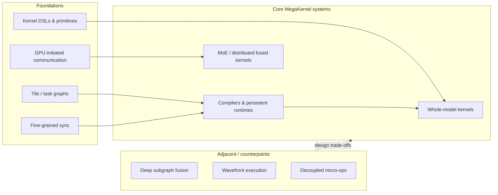
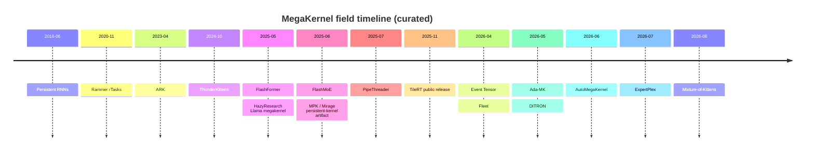

<div align="center">

# 🚀 Awesome MegaKernel

### A curated, evidence-first map of whole-model kernels, persistent runtimes, and deeply fused LLM systems

[](https://awesome.re)
[](https://github.com/qhy991/Awesome-MegaKernel)
[](#-research-papers--reports)
[](#-systems-repositories--artifacts)
[](#-blogs--deep-dive-reading)
[](CONTRIBUTING.md)

[中文 README](README.zh-CN.md)

[Introduction](#-introduction) · [Taxonomy](#-scope--taxonomy) · [Landscape](#-landscape) · [Chinese Survey](docs/megakernel-survey.zh-CN.md) · [Papers](#-research-papers--reports) · [Systems](#-systems-repositories--artifacts) · [Reading](#-blogs--deep-dive-reading) · [Contributing](#-contributing)

</div>

---

## 📖 Introduction

**Awesome MegaKernel** tracks systems that move work normally split across many
accelerator launches into one device-resident execution substrate. Depending on
the system, that substrate may be a statically scheduled whole-model kernel, an
in-kernel task interpreter, a distributed tile runtime, or a multi-operator MoE
kernel on a GPU or another accelerator.

This matters most in low-batch LLM inference and tightly coupled distributed
workloads, where launch gaps, inter-operator HBM traffic, wave quantization, and
coarse compute–communication barriers can dominate useful work.

> **Curatorial rule:** “large/fused kernel” is not enough. Core entries must
> schedule multiple model operations or communication phases inside a
> persistent kernel or equivalent device-resident engine. Foundations and
> adjacent work are labeled explicitly.

**Last curated:** 2026-08-14. Titles, venues, code relationships, and artifact
limitations were checked against primary paper pages, canonical repositories,
and first-party documentation.

### Quick takeaways

- The field now has several distinct paths: **hand-written whole-model
  kernels**, **compiler-generated task graphs/interpreters**, and
  **distributed/MoE persistent kernels**.
- The important scheduling unit is increasingly a **tile/task**, not an
  operator. MPK, Event Tensor, DITRON, Fleet, TileRT, and related systems expose
  different versions of that idea.
- Mixture-of-Kittens extends the open-source MoE frontier from forward fusion to
  deterministic Blackwell training, including backward, router gradients, and
  bounded activation replay.
- “Open source” needs qualification. Some projects publish complete research
  code; others expose Python tooling around a binary backend or remain
  model/hardware-specific artifacts.
- Megakernels are not universally better. Divergence, register pressure,
  instruction footprint, dynamic workloads, and asynchronous hardware units
  can favor wavefront or decoupled execution.

### Related lists

- [MegaKernel literature review (Chinese)](docs/megakernel-survey.zh-CN.md)
  — a route-based synthesis of the research landscape and open questions.
- [Mixture-of-Kittens source study (Chinese)](docs/case-studies/mixture-of-kittens.zh-CN.md)
  — an SM100-level audit of deterministic MoE training, communication direction,
  CLC scheduling, and activation replay.
- [What is distinctive about MegaKernel? (Chinese)](docs/megakernel-distinctive-capabilities.zh-CN.md)
  — separates generic overlap techniques from tile-level capabilities that
  require a device-resident cross-operator runtime.
- [Zhihu kernel reading guide (Chinese)](docs/zhihu-kernel-reading-guide.zh-CN.md)
  — a curated route through 30 saved articles on kernels, compiler DSLs,
  profiling, inference systems, and megakernel scheduling.
- [Awesome LLM Kernel Agent](https://github.com/qhy991/Awesome-LLM-Kernel-Agent)
  — LLM/agent-driven kernel generation and optimization.
- [Awesome LLM Circuit Agent](https://github.com/qhy991/Awesome-LLM-Circuit-Agent)
  — agentic circuit design and optimization.

---

## 🧭 Scope & taxonomy

| Level | Included here | Typical examples |
| :---- | :------------ | :--------------- |
| **Core** | Whole-model or multi-operator persistent kernels; compilers/runtimes that create them; MoE/distributed kernels that jointly schedule compute and communication | MPK, FlashFormer, Event Tensor, FlashMoE, TileRT |
| **Foundation** | Mechanisms directly reused by core systems: persistent threads, task graphs, tile synchronization, DSLs, GPU-initiated communication | Persistent RNNs, Rammer, PipeThreader, ThunderKittens, cuSync |
| **Adjacent** | Smaller-scope deep fusion, alternative execution models, or non-LLM studies that clarify the design boundary | VDCores, FlashFuser, path-tracing wavefront studies |

Usually excluded: isolated single-operator kernels, generic CUDA tutorials,
framework wrappers without a fused/persistent implementation path, and
marketing claims without a primary technical artifact.



The detailed definitions and evidence policy live in
[`megakernel_landscape/docs/taxonomy.md`](megakernel_landscape/docs/taxonomy.md).

---

## 🗺️ Landscape

The timeline uses the first public paper/artifact date, not the later conference
year. It is generated from the catalog and intentionally shows only major
milestones.

<!-- CATALOG:TIMELINE:START -->

<!-- CATALOG:TIMELINE:END -->

---

## 📚 Research Papers & Reports

Paper links point to the publisher/conference page when available, otherwise to
arXiv. A code link is shown only when the primary source establishes the
relationship; an ecosystem project is not silently presented as a paper's
official implementation. **First public** records the initial paper/artifact
date, which can precede the venue year.

<!-- CATALOG:PAPERS:START -->
### Whole-model kernels, compilers & persistent runtimes

Core work that turns a model or tensor program into one persistent execution substrate.

| Work | Venue | First public | Code | Scope & contribution |
| :--- | :---: | :---: | :---: | :--- |
| [**AutoMegaKernel: A Statically-Checked Agent Harness for Self-Retargeting Megakernel Synthesis**](https://arxiv.org/abs/2606.09682) | arXiv | 2026-06 | [Code](https://github.com/RightNow-AI/AutoMegaKernel) | **Core** — Uses an agent-facing schedule IR plus static deadlock and race checks to synthesize one cooperative CUDA forward kernel across several NVIDIA architectures.<br><sub>`Agent` `CUDA` `Verification`</sub> |
| [**Ada-MK: Adaptive MegaKernel Optimization via Automated DAG-based Search for LLM Inference**](https://arxiv.org/abs/2605.11581) | arXiv | 2026-05 | — | **Core** — Hoists scheduling decisions into an offline MLIR DAG search and integrates the resulting decode megakernel into a hybrid TensorRT-LLM serving path on NVIDIA L20.<br><sub>`DAG Search` `MLIR` `Ada GPU`</sub> |
| [**DITRON: Distributed Multi-level Tiling Compiler for Parallel Tensor Programs**](https://arxiv.org/abs/2605.02953) | ICML 2026 | 2026-05 | [Code](https://github.com/ByteDance-Seed/Triton-distributed) | **Core** — Introduces Core-, Device-, and Task-level tiling; the Task level composes Triton tasks and communication into a distributed megakernel with scoreboard scheduling.<br><sub>`Compiler` `Distributed` `Tiling`</sub> |
| [**Event Tensor: A Unified Abstraction for Compiling Dynamic Megakernel**](https://proceedings.mlsys.org/paper_files/paper/2026/hash/53d3f45797970d323bd8a0d379c525aa-Abstract-Conference.html) | MLSys 2026 | 2026-04 | — | **Core** — Represents dependencies between tiled tasks as event tensors, enabling static and dynamic scheduling for shape- and data-dependent persistent kernels.<br><sub>`Compiler` `Dynamic Shapes` `IR`</sub> |
| [**Fleet: Hierarchical Task-based Abstraction for Megakernels on Multi-Die GPUs**](https://arxiv.org/abs/2604.15379) | arXiv | 2026-04 | — | **Core** — Adds chiplet-aware tasks and per-chiplet scheduling to a persistent runtime so MI350 workers can coordinate through the correct private L2 hierarchy.<br><sub>`AMD` `Chiplet` `Persistent Runtime`</sub> |
| [**MPK: A Compiler and Runtime for Mega-Kernelizing Tensor Programs**](https://www.usenix.org/conference/osdi26/presentation/cheng) | OSDI 2026 | 2025-12 | [Code](https://github.com/mirage-project/mirage) | **Core** — Lowers tensor programs to SM-level task graphs and executes them with a decentralized in-kernel runtime, enabling cross-operator pipelines and fine-grained compute-communication overlap.<br><sub>`Compiler` `Multi-GPU` `SM Task Graph`</sub> |
| [**FlashFormer: Whole-Model Kernels for Efficient Low-Batch Inference**](https://arxiv.org/abs/2505.22758) | arXiv | 2025-05 | [Code](https://github.com/cheetah-lang/flashformer) | **Core** — A proof-of-concept whole-model kernel that fuses a complete Transformer forward pass for latency-sensitive low-batch inference.<br><sub>`Whole Model` `Low Batch` `CUDA`</sub> |

### MoE, distributed execution & communication

Layer- and subgraph-scale megakernels that jointly schedule expert computation, routing, and communication.

| Work | Venue | First public | Code | Scope & contribution |
| :--- | :---: | :---: | :---: | :--- |
| [**ExpertPlex: A High-Goodput Disaggregated Serving System for MoE LLMs with Adaptive Persistent Kernels**](https://arxiv.org/abs/2607.18002) | arXiv | 2026-07 | — | **Core** — Shares expert weights across prefill and decode while adaptive tile-granular persistent kernels isolate and schedule dynamic expert computation.<br><sub>`MoE` `Disaggregation` `Persistent Kernel`</sub> |
| [**UniEP: Unified Expert-Parallel MoE MegaKernel for LLM Training**](https://arxiv.org/abs/2604.19241) | HPDC 2026 | 2026-04 | [Code](https://github.com/ByteDance-Seed/Triton-distributed) | **Core** — Fuses expert-parallel communication and computation into configurable megakernels while preserving deterministic token ordering; its implementation lives inside the broader Triton-distributed project.<br><sub>`MoE Training` `Expert Parallel` `Overlap`</sub> |
| [**Alpha-MoE: A Megakernel for Faster Tensor Parallel Inference**](https://aleph-alpha.com/wp-content/uploads/Alpha-MoE_A-Megakernel-for-Faster-Tensor-Parallel-Inference_Report.pdf) | Technical report | 2025-12 | [Code](https://github.com/Aleph-Alpha/Alpha-MoE) | **Core** — A Hopper-oriented W8A8 MoE-layer megakernel that fuses the two projections, activation, quantization, and local combine for tensor-parallel serving.<br><sub>`MoE` `Tensor Parallel` `FP8`</sub> |
| [**FlashMoE: Fast Distributed MoE in a Single Kernel**](https://neurips.cc/virtual/2025/poster/119124) | NeurIPS 2025 | 2025-06 | [Code](https://github.com/osayamenja/FlashMoE) | **Core** — Fuses dispatch, expert computation, combine, and GPU-initiated inter-GPU communication into one persistent kernel.<br><sub>`MoE` `NVSHMEM` `Persistent Kernel`</sub> |

### Foundations

Persistent threads, task abstractions, synchronization, and software pipelines that modern systems build upon.

| Work | Venue | First public | Code | Scope & contribution |
| :--- | :---: | :---: | :---: | :--- |
| [**Eliminating Hidden Serialization in Multi-Node Megakernel Communication**](https://arxiv.org/abs/2605.00686) | arXiv | 2026-05 | — | **Foundation** — Complements FlashMoE by removing fence-induced serialization in its proxy RDMA transport while leaving the megakernel's core compute components unchanged.<br><sub>`Multi-Node` `RDMA` `MoE`</sub> |
| [**Mirage: A Multi-Level Superoptimizer for Tensor Programs**](https://www.usenix.org/conference/osdi25/presentation/wu-mengdi) | OSDI 2025 | 2025-07 | [Code](https://github.com/mirage-project/mirage) | **Foundation** — Provides the multi-level μGraph representation and verified tensor-program search that later underpins the MPK compiler stack.<br><sub>`Superoptimization` `μGraph` `Verification`</sub> |
| [**PipeThreader: Software-Defined Pipelining for Efficient DNN Execution**](https://www.usenix.org/conference/osdi25/presentation/cheng) | OSDI 2025 | 2025-07 | [Code](https://github.com/tile-ai/tilelang) | **Foundation** — Introduces sTask graphs and software-defined pipelines over specialized GPU units; it is a compiler foundation rather than a whole-model megakernel.<br><sub>`sTask Graph` `Software Pipeline` `TileLang`</sub> |
| [**ThunderKittens: Simple, Fast, and Adorable Kernels**](https://proceedings.iclr.cc/paper_files/paper/2025/hash/05dc08730e32441edff52b0fa6caab5f-Abstract-Conference.html) | ICLR 2025 | 2024-10 | [Code](https://github.com/HazyResearch/ThunderKittens) | **Foundation** — Supplies the tile primitives and persistent-grid programming layer used by HazyResearch's single- and multi-GPU megakernels.<br><sub>`CUDA DSL` `Tile Primitives` `Persistent Grid`</sub> |
| [**A Framework for Fine-Grained Synchronization of Dependent GPU Kernels**](https://conf.researchr.org/details/cgo-2024/cgo-2024-main-conference/14/A-Framework-for-Fine-Grained-Synchronization-of-Dependent-GPU-Kernels) | CGO 2024 | 2023-05 | [Code](https://github.com/microsoft/cusync) | **Foundation** — cuSync synchronizes dependent kernels at tile granularity, exposing overlap that kernel-wide barriers normally hide.<br><sub>`Synchronization` `Tiles` `Compiler`</sub> |
| [**ARK: GPU-driven Code Execution for Distributed Deep Learning**](https://www.usenix.org/conference/nsdi23/presentation/hwang) | NSDI 2023 | 2023-04 | [Code](https://github.com/microsoft/ark) | **Foundation** — A historical GPU-driven execution system whose loop kernel runs distributed application compute and communication without CPU intervention.<br><sub>`GPU-driven` `Distributed` `Loop Kernel`</sub> |
| [**Rammer: Enabling Holistic Deep Learning Compiler Optimizations with rTasks**](https://www.usenix.org/conference/osdi20/presentation/ma) | OSDI 2020 | 2020-11 | — | **Foundation** — Introduces hardware-neutral rTasks and static spatio-temporal co-scheduling across and within operators.<br><sub>`rTask` `Co-scheduling` `Compiler`</sub> |
| [**Persistent RNNs: Stashing Recurrent Weights On-Chip**](https://proceedings.mlr.press/v48/diamos16.html) | ICML 2016 | 2016-06 | — | **Foundation** — An early demonstration that a persistent GPU kernel can retain model weights on-chip and improve low-batch sequence execution.<br><sub>`Persistent Kernel` `Low Batch` `On-chip Weights`</sub> |
| [**A Study of Persistent Threads Style GPU Programming for GPGPU Workloads**](https://escholarship.org/uc/item/3j76d3td) | InPar 2012 | 2012 | — | **Foundation** — Establishes the persistent-threads programming style, its scheduling benefits, and the workloads where it can lose.<br><sub>`Persistent Threads` `GPGPU` `Scheduling`</sub> |

### Adjacent work & design boundaries

Useful counterpoints and smaller-scope fusion work; these are not presented as whole-model LLM megakernels.

| Work | Venue | First public | Code | Scope & contribution |
| :--- | :---: | :---: | :---: | :--- |
| [**Megakernel vs Wavefront GPU Path Tracing**](https://arxiv.org/abs/2605.27323) | arXiv | 2026-05 | — | **Adjacent** — A modern graphics comparison that helps separate the megakernel execution strategy from LLM-specific workloads.<br><sub>`Graphics` `Wavefront` `Cache Locality`</sub> |
| [**VDCores: Resource Decoupled Programming and Execution for Asynchronous GPU**](https://arxiv.org/abs/2605.03190) | arXiv | 2026-05 | [Code](https://github.com/vdcores/vdcores) | **Adjacent** — Challenges monolithic orchestration for asynchronous GPU units and instead schedules dependency-connected micro-ops over resource-isolated virtual cores.<br><sub>`Micro-ops` `Async GPU` `Alternative`</sub> |
| [**RaMP: Runtime-Aware Megakernel Polymorphism for Mixture-of-Experts**](https://arxiv.org/abs/2604.26039) | arXiv | 2026-04 | — | **Adjacent** — Selects among polymorphic CuTe kernel configurations from the runtime expert-routing histogram rather than batch size alone.<br><sub>`MoE` `Routing` `CuTe`</sub> |
| [**Deep Kernel Fusion for Transformers**](https://aclanthology.org/2026.acl-short.15/) | ACL 2026 (Short) | 2026-02 | [Code](https://github.com/ZixiBenZhang/deepfusionkernel) | **Adjacent** — Deeply fuses the SwiGLU MLP subgraph and integrates it with SGLang, but does not fuse the whole Transformer model.<br><sub>`MLP` `HBM Traffic` `SGLang`</sub> |
| [**FlashFuser: Expanding the Scale of Kernel Fusion for Compute-Intensive Operators via Inter-Core Connection**](https://2026.hpca-conf.org/details/hpca-2026-main-conference/33/FlashFuser-Expanding-the-Scale-of-Kernel-Fusion-for-Compute-Intensive-operators-via-) | HPCA 2026 | 2025-12 | — | **Adjacent** — Extends fusion across thread-block clusters using Hopper distributed shared memory; the scope is large subgraphs rather than a whole-model runtime.<br><sub>`DSM` `Fusion` `Compiler`</sub> |
| [**ClusterFusion: Expanding Operator Fusion Scope for LLM Inference via Cluster-Level Collective Primitive**](https://proceedings.neurips.cc/paper_files/paper/2025/hash/3760d0ea4709a913a4804f4b4c073836-Abstract-Conference.html) | NeurIPS 2025 | 2025-08 | [Code](https://github.com/xinhao-luo/ClusterFusion) | **Adjacent** — Uses Hopper thread-block clusters and distributed shared-memory collectives to keep intermediates on-chip across QKV projection, decode attention, and output projection; it is attention-stage fusion rather than a persistent whole-model runtime.<br><sub>`Hopper` `DSMEM` `Attention`</sub> |
| [**Megakernels Considered Harmful: Wavefront Path Tracing on GPUs**](https://research.nvidia.com/publication/2013-07_megakernels-considered-harmful-wavefront-path-tracing-gpus) | HPG 2013 | 2013-07 | — | **Adjacent** — The classic warning that large kernels can lose to wavefront execution when divergence, register pressure, and instruction footprint dominate.<br><sub>`Graphics` `Divergence` `Register Pressure`</sub> |
<!-- CATALOG:PAPERS:END -->

---

## 🧰 Systems, Repositories & Artifacts

Artifact status is part of the entry. “Core” describes topical relevance, not
portability, completeness, or production readiness.

<!-- CATALOG:REPOS:START -->
### Whole-model compilers, runtimes & artifacts

Systems that compile or execute a full model inside a persistent kernel or equivalent engine.

| Project | Target / role | Hardware & artifact status | Why it matters |
| :--- | :--- | :--- | :--- |
| [**AutoMegaKernel**](https://github.com/RightNow-AI/AutoMegaKernel)<br> | Llama-family forward synthesis | Public CUDA source; targets sm_75–sm_120, with verification varying by task | **Core** — Agent-drivable compile, validate, verify, and self-tune harness with a frozen safety validator. |
| [**Luminal**](https://github.com/luminal-ai/luminal)<br> | Compute graph → symbolic megakernel work queue | Open-source Rust inference compiler; megakernel support is evolving | **Core** — Partitions graph ops into block ops, derives fine-grained barriers, and emits a global instruction queue interpreted inside one kernel. |
| [**TileRT**](https://github.com/tile-ai/TileRT)<br> | Ultra-low-latency multi-GPU LLM decode | Python/tooling source; core backend ships as pinned binary wheels, currently 8×B200-focused | **Core** — A compiler-driven tile-task runtime that dynamically overlaps compute, I/O, and communication; compiler internals are being opened incrementally. |
| [**Mirage / MPK**](https://github.com/mirage-project/mirage)<br> | Tensor programs → single- or multi-GPU megakernels | Open source; CUDA compiler and in-kernel runtime | **Core** — The canonical implementation for MPK, built on Mirage's multi-level superoptimizer. |
| [**FlashFormer**](https://github.com/cheetah-lang/flashformer)<br> | Kernel components and synchronization primitives associated with FlashFormer | Partial public research source; no whole-model runner and no clearly visible license | **Adjacent** — The author-linked repository exposes operators, synchronization primitives, and tests, but not the paper's complete whole-model execution path. |
| [**AWS Transformer TKG**](https://awsdocs-neuron.readthedocs-hosted.com/en/v2.29.1/nki/library/api/transformer-tkg.html) | Multi-layer Transformer token generation | Official NKI library API; AWS Trainium2/Trainium3 only | **Core** — Extends the landscape beyond GPUs: attention, MLP, residuals, and cross-layer collectives execute in one megakernel invocation. |
| [**model-as-a-kernel**](https://huggingface.co/kernels/phanerozoic/model-as-a-kernel) | Llama-family forward and greedy generation | Apache-2.0 artifact; one CUDA device, batch size 1, greedy-only, limited Llama/RoPE variants | **Core** — A runnable teaching artifact whose phase interpreter can keep prompt consumption and an entire greedy-generation loop inside one launch. |

### Hand-tuned & model-specific implementations

Concrete implementations optimized around a model family, accelerator, or deployment shape.

| Project | Target / role | Hardware & artifact status | Why it matters |
| :--- | :--- | :--- | :--- |
| [**ClusterFusion**](https://github.com/xinhao-luo/ClusterFusion)<br> | QKV + decode attention + output projection | Source and Python package; CUDA 12.4 / H100; repository has no clearly visible license | **Adjacent** — Reference implementation of attention-stage cluster collectives on Hopper; it does not provide a persistent whole-model runtime. |
| [**HazyResearch Megakernels**](https://github.com/HazyResearch/Megakernels)<br> | Llama low-latency and tensor-parallel throughput demos | Open research code; H100/B200, compiler/environment sensitive | **Core** — Includes the original Llama-1B whole-forward kernel and an 8×H100 tensor-parallel Llama-70B throughput branch built with ThunderKittens. |
| [**Lucebox**](https://github.com/Luce-Org/lucebox)<br> | Local LLM serving with per-model megakernel paths | Open source; CUDA implementations under optimizations/megakernel | **Core** — A serving project with concrete model-specific persistent dispatch implementations rather than only a framework wrapper. |
| [**megagdn-pto**](https://github.com/huawei-csl/megagdn-pto)<br> | Gated DeltaNet / KDA layers | Public source; Ascend NPU and PTO-ISA; no clearly visible license | **Adjacent** — A layer-scale, non-CUDA example that fuses six GDN/KDA stages and integrates with vLLM-Ascend; it is not a whole-model persistent runtime. |
| [**MegaQwen**](https://github.com/Infatoshi/MegaQwen)<br> | Qwen3-0.6B batch-1 decode | Public CUDA learning project; RTX 3090 tuned; no clearly visible license | **Core** — A documented consumer-GPU implementation whose main cooperative kernel is followed by separate LM-head kernels, with a detailed optimization devlog. |
| [**qwen_megakernel**](https://github.com/AlpinDale/qwen_megakernel)<br> | Qwen3-0.6B BF16 decode | Open CUDA artifact; RTX 5090 and CUDA ≥12.8 | **Core** — Keeps embedding, all 28 Transformer layers, and final norm in one persistent kernel while leaving LM head and argmax separate; paired with a transparent optimization write-up. |

### Distributed, MoE & communication kernels

Persistent kernels and frameworks that fuse communication with tensor or expert computation.

| Project | Target / role | Hardware & artifact status | Why it matters |
| :--- | :--- | :--- | :--- |
| [**Mixture-of-Kittens**](https://github.com/cursor/mixture-of-kittens)<br> | Deterministic expert-parallel MoE training on NVL72 | Apache-2.0 CUDA source; SM100/SM103, CUDA 13+, PyTorch symmetric memory, EP 4/8/16/32/64 | **Core** — Closes the training loop with forward and backward megakernels that combine pull-dispatch/push-combine, dedicated communication SMs, CLC-scheduled two-CTA compute clusters, deterministic reductions, and bounded activation replay. |
| [**Alpha-MoE**](https://github.com/Aleph-Alpha/Alpha-MoE)<br> | Tensor-parallel W8A8 MoE serving | Apache-2.0; CUDA FP8 and shape/hardware specific | **Core** — A vLLM/SGLang-compatible fused MoE layer used as a concrete target by RaMP. |
| [**FlashMoE**](https://github.com/osayamenja/FlashMoE)<br> | Distributed MoE dispatch + FFN + combine | BSD-3-Clause; SM70+ supported, evaluated primarily on H100; NVSHMEM/CUTLASS/cuBLASDx | **Core** — The primary code artifact for fully GPU-resident MoE execution in one persistent kernel. |
| [**Microsoft ARK**](https://github.com/microsoft/ark)<br> | GPU-driven distributed application loop kernel | MIT; CUDA and AMD CDNA3 support; actively maintained in 2026 | **Foundation** — A historical system that moves distributed compute and communication orchestration off the CPU. |
| [**mKernel**](https://github.com/uccl-project/mKernel)<br> | Multi-GPU / multi-node fused kernels | MIT; Hopper sm_90a with CX7 or EFA paths | **Core** — Fuses NVLink or RDMA with GEMM, MoE dispatch/FFN/combine, and ring attention inside persistent kernels. |
| [**Triton-distributed**](https://github.com/ByteDance-Seed/Triton-distributed)<br>[Docs](https://triton-distributed.readthedocs.io/en/latest/getting-started/megakernel/index.html)<br> | Distributed Triton kernels and MegaKernel tutorials | MIT with some Apache-2.0 components; NVIDIA/AMD, NVSHMEM on distributed paths | **Core** — Contains Qwen tensor-parallel MegaTritonKernel and expert-parallel dispatch/GroupGEMM/combine examples, including the UniEP implementation. |

### Enabling runtimes & building blocks

Directly reused DSLs, tile primitives, synchronization, and communication substrates; not all are megakernels by themselves.

| Project | Target / role | Hardware & artifact status | Why it matters |
| :--- | :--- | :--- | :--- |
| [**Syncopate**](https://github.com/tie-pilot-qxw/syncopate)<br> | Triton source-to-source compute-communication overlap | Open OSDI 2026 artifact; Triton/CUDA | **Foundation** — Automatically generates chunk-level overlap from Triton programs; relevant to megakernel scheduling, though not a whole-model persistent kernel. |
| [**VDCores**](https://github.com/vdcores/vdcores)<br> | Resource-decoupled asynchronous GPU execution | Public research source with no visible license; 132-SM Hopper (sm_90a), demonstrated on GH200/H100 NVL | **Adjacent** — A concrete alternative to monolithic megakernel orchestration based on dependency-connected micro-operations. |
| [**ThunderKittens**](https://github.com/HazyResearch/ThunderKittens)<br> | CUDA tile primitives, persistent grids, and PGL | Open source; NVIDIA GPU focused | **Foundation** — The direct programming substrate for HazyResearch's single- and multi-GPU megakernels. |
| [**cuSync**](https://github.com/microsoft/cusync)<br> | Tile-level synchronization policies | Archived, read-only public research artifact; CUDA | **Foundation** — Compiler and runtime mechanisms for overlapping dependent kernels at tile granularity. |
| [**DeepEP**](https://github.com/deepseek-ai/DeepEP)<br> | Expert-parallel communication substrate | Open source; CUDA/NVLink/RDMA focused | **Foundation** — A widely used MoE communication substrate and comparison point; it is not itself a megakernel. |
| [**FlashInfer**](https://github.com/flashinfer-ai/flashinfer)<br>[Docs](https://docs.flashinfer.ai/api/fused_moe.html#monomoe-single-kernel-block-fp8-sm90a)<br> | Production LLM serving kernel library; MonoMoE path | Apache-2.0; broad NVIDIA generation coverage | **Foundation** — Not a whole-model system, but MonoMoE fuses routing, up projection, activation, down projection, and reduction into one launch. |
| [**FLUX**](https://github.com/bytedance/flux)<br> | Fine-grained computation-communication fusion | Open source; distributed CUDA kernels | **Foundation** — A neighboring substrate for overlapping collectives with GEMM; include it as a building block, not as a whole-model persistent runtime. |
| [**TileLang**](https://github.com/tile-ai/tilelang)<br> | Python tile DSL and compiler | Open source; NVIDIA and AMD backends | **Foundation** — The public code vehicle for PipeThreader and a reusable task/tile compiler substrate; not itself a whole-model megakernel. |
<!-- CATALOG:REPOS:END -->

---

## 📖 Blogs & Deep-Dive Reading

These are original project/author posts or clearly labeled case studies. Vendor
and project performance claims remain configuration-specific.

<!-- CATALOG:READINGS:START -->
### Design & implementation

First-party implementation notes and reproducible walkthroughs.

- [RTX 5090 Decode Optimization](https://blog.alpindale.net/posts/5090_decode_optimization/) — **Optimization diary.** The transparent engineering record behind qwen_megakernel, useful for understanding consumer-Blackwell constraints.
- [Compiling Models to Megakernels](https://blog.luminal.com/p/compiling-models-to-megakernels) — **Compiler walkthrough.** Luminal explains its global instruction queue, fine-grained barrier derivation, symbolic work queues, and one-kernel-per-model compiler path.
- [We Bought the Whole GPU, So We're Damn Well Going to Use the Whole GPU](https://hazyresearch.stanford.edu/blog/2025-09-28-tp-llama-main) — **Engineering blog.** The multi-GPU tensor-parallel continuation of Hazy's Llama megakernel work, including its environment sensitivity and scheduling choices.
- [Look Ma, No Bubbles! Designing a Low-Latency Megakernel for Llama-1B](https://hazyresearch.stanford.edu/blog/2025-05-27-no-bubbles) — **Engineering blog.** The clearest first-principles introduction to launch gaps, wave quantization, persistent scheduling, and Hazy's original implementation.
- [Compiling LLMs into a Megakernel: A Path to Low-Latency Inference](https://zhihaojia.medium.com/compiling-llms-into-a-megakernel-a-path-to-low-latency-inference-cf7840913c17) — **Author blog.** An author-level overview of MPK's SM task graph, compiler, and in-kernel runtime.
- [Megakernel](https://zhuanlan.zhihu.com/p/2059950781344789216) — **Repository walkthrough.** Uses MegaQwen's side-by-side per-operator and transformer-block megakernel directories to explain the two execution models.
- [Megakernel: Matching Apple Silicon Efficiency at 2x the Throughput on a RTX 3090](https://www.lucebox.com/blog/megakernel) — **Project blog.** Walks through Luce's persistent dispatch design and the constraints of model-specific serving kernels.
- [MegaQwen Development Log](https://github.com/Infatoshi/MegaQwen/blob/main/DEVLOG.md) — **Devlog.** A step-by-step record of correctness, memory movement, and kernel optimization decisions for a consumer GPU.

### Multi-GPU & communication

Engineering notes on tensor/expert parallelism, GPU-initiated communication, and overlap.

- [Mixture-of-Kittens: our open-source MoE megakernel for NVL72s](https://cursor.com/blog/mixture-of-kittens) — **First-party deep dive.** Explains reusable pull-dispatch/push-combine scheduling, minibatch overlap, the reversed macrobatch ring, exact SM partitioning, CLC coexistence with inter-rack communication, determinism, and author-reported NVL72 results.
- [Alpha-MoE: A Megakernel for Faster Tensor Parallel Inference](https://aleph-alpha.com/en/blog/alpha-moe-a-megakernel-for-faster-tensor-parallel-inference/) — **Official engineering post.** Explains Alpha-MoE's fusion boundary and serving integration; treat benchmark figures as author-reported and configuration-specific.
- [One Kernel for All Your GPUs](https://hazyresearch.stanford.edu/blog/2025-09-22-pgl) — **Engineering blog.** Introduces ThunderKittens PGL and communication directly from persistent multi-GPU kernels.
- [MegaMoE 不止 MegaKernel](https://zhuanlan.zhihu.com/p/2061030607040390226) — **Comparative analysis.** Places MegaMoE in the longer lineage of fused computation-collective operators and separates generic compute-communication overlap from megakernel-specific scheduling.
- [mKernel: Fast Multi-GPU, Multi-Node Fused Kernels](https://uccl-project.github.io/posts/mkernel/) — **Project blog.** Explains GPU-initiated RDMA, SM specialization, and the library's fused collective-compute kernels.

### Case studies & perspective

Useful context whose claims should be read with the stated hardware and artifact limitations.

- [MegaKernel是创新还是传销？](https://www.zhihu.com/question/2013258505231050695/answer/2071314457918183125) — **Author engineering analysis.** A B300 case study of MegaRTP that separates gains from kernel fusion, multistream DAG execution, and PDL from the incremental value of tile-level megakernel scheduling.
- [Building a Single-Kernel LLM Engine on AMD MI300X](https://blog.kog.ai/building-a-single-kernel-latency-optimized-llm-inference-engine-on-amd-mi300x-gpus/) — **Industry case study.** A technically detailed full-decode monokernel story covering prefill, sampling, and tensor parallelism; the implementation is closed and results are vendor-reported.
- [How Rammer Squeezes More out of Accelerator Performance](https://www.microsoft.com/en-us/research/articles/osdi-20-how-rammer-squeezes-more-out-of-accelerator-performance/) — **Research article.** Historical context for rTasks and holistic inter-/intra-operator scheduling.
- [megakernel 的 sync 开销](https://zhuanlan.zhihu.com/p/2054985214791775283) — **Engineering analysis.** Contrasts HBM-, LLC-, and L2-level synchronization in AMD-oriented megakernel designs and cautions that synchronization metadata traffic alone may not explain critical-path cost.
- [PipeThreader: Software-Defined Pipelining for Efficient DNN Execution](https://www.microsoft.com/en-us/research/articles/pipethreader/) — **Research article.** A readable overview of sTask graphs, specialized GPU units, and software-defined pipelines.
- [如何看待 Hazy Research 团队将 1B 模型的 Forward 融合为一个 MegaKernel？](https://www.zhihu.com/question/1911094042047000841/answer/1924145663601542224) — **Third-party code analysis.** A Chinese walkthrough of the motivation, execution model, implementation, significance, and limitations of Hazy Research's Llama-1B megakernel.
<!-- CATALOG:READINGS:END -->

---

## 🧭 How to navigate the space

| If you want to explore… | Start with |
| :---------------------- | :--------- |
| Automatic whole-model / multi-GPU compilation | **MPK**, **DITRON**, **Event Tensor**, then **Mirage** |
| Small, readable model-specific implementations | **model-as-a-kernel**, **qwen_megakernel**, **MegaQwen** (check each output-stage boundary) |
| Hand-tuned low-latency CUDA | **HazyResearch Megakernels**, **qwen_megakernel**, **Lucebox** |
| Multi-GPU low-latency serving | **TileRT**, **MPK**, Hazy's tensor-parallel branch |
| Distributed MoE fusion | **Mixture-of-Kittens**, **FlashMoE**, **mKernel**, **Triton-distributed**, **Alpha-MoE** |
| Dynamic shapes or routing | **Event Tensor**, **RaMP**, **ExpertPlex** |
| AMD / non-NVIDIA paths | **Fleet**, **TileLang**, **megagdn-pto**, **AWS Transformer TKG** |
| Agent-generated megakernels | **AutoMegaKernel** and the related [Awesome LLM Kernel Agent](https://github.com/qhy991/Awesome-LLM-Kernel-Agent) list |
| Why a megakernel may lose | **VDCores** and **Megakernels Considered Harmful** |

---

## 🔧 Maintenance

The catalog is data-driven, following the maintenance pattern used by the
related Awesome repositories:

```text
megakernel_landscape/data/catalog.json
        ├── validate → IDs, dates, URLs, categories, translations, relations
        └── render   → README.md + README.zh-CN.md + badges + dates + timeline
```

```bash
make -C megakernel_landscape validate
make -C megakernel_landscape render
make -C megakernel_landscape test
make -C megakernel_landscape check
```

The scripts use only Python's standard library. CI runs `make check` so a pull
request cannot silently leave the generated bilingual catalog blocks, badges,
or curated dates out of sync. Hand-written prose outside those blocks still
receives a bilingual review. See the
[`landscape maintainer guide`](megakernel_landscape/README.md).

---

## 🤝 Contributing

PRs are welcome. Please read [CONTRIBUTING.md](CONTRIBUTING.md) and use the pull
request template. New entries need a primary/authoritative source, an explicit
scope label, artifact limitations, and enough benchmark context for any
numerical performance claim.

---

## 📝 Citation

GitHub can export the repository citation from [`CITATION.cff`](CITATION.cff):

```bibtex
@misc{awesome_megakernel,
  title        = {Awesome MegaKernel},
  author       = {Awesome MegaKernel Contributors},
  year         = {2026},
  howpublished = {\url{https://github.com/qhy991/Awesome-MegaKernel}},
  note         = {A curated catalog of MegaKernel research and systems}
}
```

---

## 📄 License

The curated list metadata is released under [CC0 1.0 Universal](LICENSE).
Linked papers, code, images, and project pages retain their own licenses.
