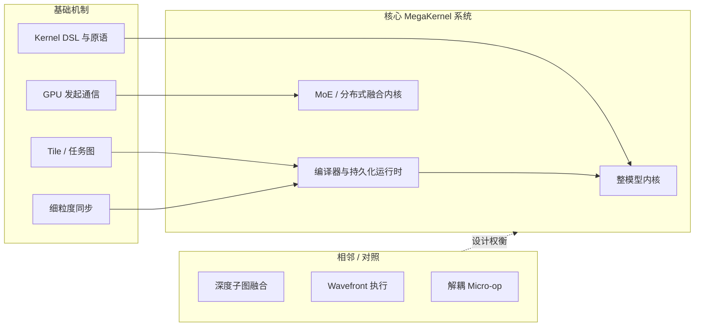
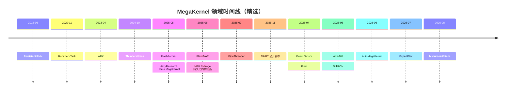

<div align="center">

# 🚀 Awesome MegaKernel

### 整模型内核、持久化运行时与深度融合 LLM 系统的证据优先精选图谱

[](https://awesome.re)
[](https://github.com/qhy991/Awesome-MegaKernel)
[](#-研究论文与报告)
[](#-系统仓库与制品)
[](#-博客与深度阅读)
[](CONTRIBUTING.md)

[English README](README.md)

[简介](#-简介) · [范围与分类](#-范围与分类) · [领域图谱](#-领域图谱) · [文献综述](docs/megakernel-survey.zh-CN.md) · [论文](#-研究论文与报告) · [系统](#-系统仓库与制品) · [阅读](#-博客与深度阅读) · [贡献](#-贡献指南)

</div>

---

## 📖 简介

**Awesome MegaKernel** 追踪把原本分散在多次加速器 Launch 中的工作搬入单一设备常驻执行底座的系统。这个底座可能是静态调度的整模型内核、Kernel 内任务解释器、分布式 Tile 运行时，或运行在 GPU/其他加速器上的多算子 MoE 内核。

这类方法尤其适合低 Batch LLM 推理和强耦合分布式工作负载，因为其中的 Launch Gap、算子间 HBM 往返、Wave Quantization，以及粗粒度算通 Barrier 可能占据主要开销。

> **收录原则：**“很大/融合的 Kernel”并不足够。核心条目必须在持久化内核或等价设备常驻引擎中调度多个模型算子或通信阶段。基础工作和相邻工作会被显式标注。

**最近整理：**2026-08-14。标题、会议、代码关系与制品限制均依据论文主页、官方仓库和第一方文档核验。

### 快速结论

- 当前主要有三条路线：**手写整模型内核**、**编译器生成的任务图/解释器**，以及**分布式/MoE 持久化内核**。
- 调度单位正从“算子”转向 **Tile/Task**。MPK、Event Tensor、DITRON、Fleet、TileRT 等系统分别体现了这一思路。
- Mixture-of-Kittens 把开源 MoE Megakernel 的边界推进到 Blackwell 确定性训练，覆盖 Backward、Router Gradient 与有界 Activation Replay。
- “开源”需要进一步说明：有些项目发布完整研究代码，有些只开放围绕二进制后端的 Python 工具，还有一些是强模型/硬件绑定的研究制品。
- Megakernel 并非总是更快。分支发散、寄存器压力、指令体积、动态负载和异步硬件单元都可能让 Wavefront 或解耦执行更合适。

> 想按研究路线而不是逐条目录阅读，可参见
> [《MegaKernel 研究综述》](docs/megakernel-survey.zh-CN.md)。
> Mixture-of-Kittens 的 SM100 源码级拆解见
> [《Mixture-of-Kittens：确定性 MoE 训练 Megakernel》](docs/case-studies/mixture-of-kittens.zh-CN.md)。

> 想区分通用的算通重叠与 MegaKernel 的独有机制，可参见
> [《MegaKernel 的专属能力》](docs/megakernel-distinctive-capabilities.zh-CN.md)。

> 想沿着 CUDA、编译器、Profiling、推理系统到 MegaKernel 系统学习，可参见
> [《知乎“算子优化”收藏夹调研》](docs/zhihu-kernel-reading-guide.zh-CN.md)。

### 相关列表

- [Awesome LLM Kernel Agent](https://github.com/qhy991/Awesome-LLM-Kernel-Agent)
  — LLM/Agent 驱动的内核生成与优化。
- [Awesome LLM Circuit Agent](https://github.com/qhy991/Awesome-LLM-Circuit-Agent)
  — Agent 驱动的电路设计与优化。

---

## 🧭 范围与分类

| 层级 | 本列表中的定义 | 典型例子 |
| :--- | :------------- | :------- |
| **核心** | 整模型或多算子持久化内核；生成它们的编译器/运行时；在 Kernel 内联合调度计算和通信的 MoE/分布式内核 | MPK、FlashFormer、Event Tensor、FlashMoE、TileRT |
| **基础** | 被核心系统直接复用的机制：Persistent Threads、任务图、Tile 同步、DSL、GPU 发起通信 | Persistent RNNs、Rammer、PipeThreader、ThunderKittens、cuSync |
| **相邻** | 较小范围的深度融合、替代执行模型，或帮助澄清设计边界的非 LLM 研究 | VDCores、FlashFuser、路径追踪 Wavefront 研究 |

通常不收录：孤立的单算子内核、泛 CUDA 教程、没有融合/持久化实现路径的框架封装，以及缺少一手技术制品的营销结论。



详细定义与证据规则见
[`megakernel_landscape/docs/taxonomy.md`](megakernel_landscape/docs/taxonomy.md)。

---

## 🗺️ 领域图谱

时间线采用论文/制品首次公开的日期，而非后续会议年份；它由数据目录自动生成，并只展示主要里程碑。

<!-- CATALOG:TIMELINE:START -->

<!-- CATALOG:TIMELINE:END -->

---

## 📚 研究论文与报告

存在正式出版页面时优先链接会议/出版社，否则链接 arXiv。只有当一手来源明确建立论文与代码的关系时才展示“代码”；不会把生态项目默认为论文官方实现。“首次公开”记录论文或制品最初出现的日期，因此可能早于会议年份。

<!-- CATALOG:PAPERS:START -->
### 整模型内核、编译器与持久化运行时

将模型或张量程序转化为单一持久化执行底座的核心工作。

| 工作 | 会议/来源 | 首次公开 | 代码 | 范围与贡献 |
| :--- | :---: | :---: | :---: | :--- |
| [**AutoMegaKernel: A Statically-Checked Agent Harness for Self-Retargeting Megakernel Synthesis**](https://arxiv.org/abs/2606.09682) | arXiv | 2026-06 | [代码](https://github.com/RightNow-AI/AutoMegaKernel) | **核心** — 通过面向 Agent 的调度 IR 与死锁/竞态静态检查，在多代 NVIDIA 架构上合成单个 cooperative CUDA 前向内核。<br><sub>`Agent` `CUDA` `Verification`</sub> |
| [**Ada-MK: Adaptive MegaKernel Optimization via Automated DAG-based Search for LLM Inference**](https://arxiv.org/abs/2605.11581) | arXiv | 2026-05 | — | **核心** — 将调度决策前移到离线 MLIR DAG 搜索，并把生成的 Decode Megakernel 集成到 NVIDIA L20 上的混合 TensorRT-LLM 服务路径。<br><sub>`DAG Search` `MLIR` `Ada GPU`</sub> |
| [**DITRON: Distributed Multi-level Tiling Compiler for Parallel Tensor Programs**](https://arxiv.org/abs/2605.02953) | ICML 2026 | 2026-05 | [代码](https://github.com/ByteDance-Seed/Triton-distributed) | **核心** — 提出 Core、Device、Task 三级 Tiling；Task 层通过记分牌调度把 Triton 任务与通信组合为分布式 Megakernel。<br><sub>`Compiler` `Distributed` `Tiling`</sub> |
| [**Event Tensor: A Unified Abstraction for Compiling Dynamic Megakernel**](https://proceedings.mlsys.org/paper_files/paper/2026/hash/53d3f45797970d323bd8a0d379c525aa-Abstract-Conference.html) | MLSys 2026 | 2026-04 | — | **核心** — 以 Event Tensor 表达 Tile 任务依赖，为形状和数据相关的持久化内核提供静态与动态调度。<br><sub>`Compiler` `Dynamic Shapes` `IR`</sub> |
| [**Fleet: Hierarchical Task-based Abstraction for Megakernels on Multi-Die GPUs**](https://arxiv.org/abs/2604.15379) | arXiv | 2026-04 | — | **核心** — 在持久化运行时中加入 Chiplet 感知任务与逐 Chiplet 调度，使 MI350 Worker 能围绕正确的私有 L2 层级协作。<br><sub>`AMD` `Chiplet` `Persistent Runtime`</sub> |
| [**MPK: A Compiler and Runtime for Mega-Kernelizing Tensor Programs**](https://www.usenix.org/conference/osdi26/presentation/cheng) | OSDI 2026 | 2025-12 | [代码](https://github.com/mirage-project/mirage) | **核心** — 把张量程序降为 SM 级任务图，并由去中心化的 Kernel 内运行时执行，从而实现跨算子流水与细粒度算通重叠。<br><sub>`Compiler` `Multi-GPU` `SM Task Graph`</sub> |
| [**FlashFormer: Whole-Model Kernels for Efficient Low-Batch Inference**](https://arxiv.org/abs/2505.22758) | arXiv | 2025-05 | [代码](https://github.com/cheetah-lang/flashformer) | **核心** — 面向低 Batch、低延迟推理的整模型 Kernel 原型，将完整 Transformer 前向融合在一个内核中。<br><sub>`Whole Model` `Low Batch` `CUDA`</sub> |

### MoE、分布式执行与通信

在层或子图尺度联合调度专家计算、路由与通信的 Megakernel。

| 工作 | 会议/来源 | 首次公开 | 代码 | 范围与贡献 |
| :--- | :---: | :---: | :---: | :--- |
| [**ExpertPlex: A High-Goodput Disaggregated Serving System for MoE LLMs with Adaptive Persistent Kernels**](https://arxiv.org/abs/2607.18002) | arXiv | 2026-07 | — | **核心** — 在 Prefill 与 Decode 间共享专家权重，并用自适应 Tile 粒度持久化内核隔离、调度动态专家计算。<br><sub>`MoE` `Disaggregation` `Persistent Kernel`</sub> |
| [**UniEP: Unified Expert-Parallel MoE MegaKernel for LLM Training**](https://arxiv.org/abs/2604.19241) | HPDC 2026 | 2026-04 | [代码](https://github.com/ByteDance-Seed/Triton-distributed) | **核心** — 把专家并行通信与计算融合为可配置 Megakernel，并保持确定性 Token 顺序；实现位于更大的 Triton-distributed 项目中。<br><sub>`MoE Training` `Expert Parallel` `Overlap`</sub> |
| [**Alpha-MoE: A Megakernel for Faster Tensor Parallel Inference**](https://aleph-alpha.com/wp-content/uploads/Alpha-MoE_A-Megakernel-for-Faster-Tensor-Parallel-Inference_Report.pdf) | Technical report | 2025-12 | [代码](https://github.com/Aleph-Alpha/Alpha-MoE) | **核心** — 面向 Hopper 的 W8A8 MoE 层 Megakernel，为张量并行服务融合两次投影、激活、量化与本地 Combine。<br><sub>`MoE` `Tensor Parallel` `FP8`</sub> |
| [**FlashMoE: Fast Distributed MoE in a Single Kernel**](https://neurips.cc/virtual/2025/poster/119124) | NeurIPS 2025 | 2025-06 | [代码](https://github.com/osayamenja/FlashMoE) | **核心** — 把 Dispatch、专家计算、Combine 与 GPU 发起的跨 GPU 通信融合进单个持久化内核。<br><sub>`MoE` `NVSHMEM` `Persistent Kernel`</sub> |

### 基础工作

现代系统所依赖的持久线程、任务抽象、同步机制与软件流水线。

| 工作 | 会议/来源 | 首次公开 | 代码 | 范围与贡献 |
| :--- | :---: | :---: | :---: | :--- |
| [**Eliminating Hidden Serialization in Multi-Node Megakernel Communication**](https://arxiv.org/abs/2605.00686) | arXiv | 2026-05 | — | **基础** — 在不改动 FlashMoE 核心计算组件的前提下，消除其 Proxy RDMA 传输中的 Fence 串行化，是对 Megakernel 通信层的补充。<br><sub>`Multi-Node` `RDMA` `MoE`</sub> |
| [**Mirage: A Multi-Level Superoptimizer for Tensor Programs**](https://www.usenix.org/conference/osdi25/presentation/wu-mengdi) | OSDI 2025 | 2025-07 | [代码](https://github.com/mirage-project/mirage) | **基础** — 提供多层 μGraph 表示与带验证的张量程序搜索，后来成为 MPK 编译栈的基础。<br><sub>`Superoptimization` `μGraph` `Verification`</sub> |
| [**PipeThreader: Software-Defined Pipelining for Efficient DNN Execution**](https://www.usenix.org/conference/osdi25/presentation/cheng) | OSDI 2025 | 2025-07 | [代码](https://github.com/tile-ai/tilelang) | **基础** — 提出面向 GPU 专用单元的 sTask 图与软件定义流水线；它是编译基础，而非整模型 Megakernel。<br><sub>`sTask Graph` `Software Pipeline` `TileLang`</sub> |
| [**ThunderKittens: Simple, Fast, and Adorable Kernels**](https://proceedings.iclr.cc/paper_files/paper/2025/hash/05dc08730e32441edff52b0fa6caab5f-Abstract-Conference.html) | ICLR 2025 | 2024-10 | [代码](https://github.com/HazyResearch/ThunderKittens) | **基础** — 提供 HazyResearch 单 GPU 与多 GPU Megakernel 所使用的 Tile 原语和 Persistent-grid 编程层。<br><sub>`CUDA DSL` `Tile Primitives` `Persistent Grid`</sub> |
| [**A Framework for Fine-Grained Synchronization of Dependent GPU Kernels**](https://conf.researchr.org/details/cgo-2024/cgo-2024-main-conference/14/A-Framework-for-Fine-Grained-Synchronization-of-Dependent-GPU-Kernels) | CGO 2024 | 2023-05 | [代码](https://github.com/microsoft/cusync) | **基础** — cuSync 以 Tile 粒度同步相互依赖的内核，暴露通常被 Kernel 级 Barrier 隐藏的重叠机会。<br><sub>`Synchronization` `Tiles` `Compiler`</sub> |
| [**ARK: GPU-driven Code Execution for Distributed Deep Learning**](https://www.usenix.org/conference/nsdi23/presentation/hwang) | NSDI 2023 | 2023-04 | [代码](https://github.com/microsoft/ark) | **基础** — 历史性的 GPU 驱动执行系统，其 Loop Kernel 可在没有 CPU 干预的情况下运行分布式应用的计算与通信。<br><sub>`GPU-driven` `Distributed` `Loop Kernel`</sub> |
| [**Rammer: Enabling Holistic Deep Learning Compiler Optimizations with rTasks**](https://www.usenix.org/conference/osdi20/presentation/ma) | OSDI 2020 | 2020-11 | — | **基础** — 提出硬件中立的 rTask，以及跨算子和算子内的静态时空协同调度。<br><sub>`rTask` `Co-scheduling` `Compiler`</sub> |
| [**Persistent RNNs: Stashing Recurrent Weights On-Chip**](https://proceedings.mlr.press/v48/diamos16.html) | ICML 2016 | 2016-06 | — | **基础** — 早期证明持久化 GPU 内核可将模型权重留在片上，并改善低 Batch 序列执行。<br><sub>`Persistent Kernel` `Low Batch` `On-chip Weights`</sub> |
| [**A Study of Persistent Threads Style GPU Programming for GPGPU Workloads**](https://escholarship.org/uc/item/3j76d3td) | InPar 2012 | 2012 | — | **基础** — 系统讨论 Persistent Threads 编程方式、调度收益，以及可能失效的工作负载。<br><sub>`Persistent Threads` `GPGPU` `Scheduling`</sub> |

### 相邻工作与设计边界

有价值的对照方案与较小范围融合工作；不将它们表述为整模型 LLM Megakernel。

| 工作 | 会议/来源 | 首次公开 | 代码 | 范围与贡献 |
| :--- | :---: | :---: | :---: | :--- |
| [**Megakernel vs Wavefront GPU Path Tracing**](https://arxiv.org/abs/2605.27323) | arXiv | 2026-05 | — | **相邻** — 现代图形学场景中的对比研究，有助于把 Megakernel 执行策略与 LLM 特有负载区分开。<br><sub>`Graphics` `Wavefront` `Cache Locality`</sub> |
| [**VDCores: Resource Decoupled Programming and Execution for Asynchronous GPU**](https://arxiv.org/abs/2605.03190) | arXiv | 2026-05 | [代码](https://github.com/vdcores/vdcores) | **相邻** — 针对异步 GPU 单元质疑单体式编排，改以依赖连接的 Micro-op 在资源隔离的 Virtual Core 上调度。<br><sub>`Micro-ops` `Async GPU` `Alternative`</sub> |
| [**RaMP: Runtime-Aware Megakernel Polymorphism for Mixture-of-Experts**](https://arxiv.org/abs/2604.26039) | arXiv | 2026-04 | — | **相邻** — 依据运行时专家路由直方图，而不是仅凭 Batch Size，在多种 CuTe 内核配置间动态选择。<br><sub>`MoE` `Routing` `CuTe`</sub> |
| [**Deep Kernel Fusion for Transformers**](https://aclanthology.org/2026.acl-short.15/) | ACL 2026 (Short) | 2026-02 | [代码](https://github.com/ZixiBenZhang/deepfusionkernel) | **相邻** — 对 SwiGLU MLP 子图进行深度融合并集成 SGLang，但并未融合完整 Transformer 模型。<br><sub>`MLP` `HBM Traffic` `SGLang`</sub> |
| [**FlashFuser: Expanding the Scale of Kernel Fusion for Compute-Intensive Operators via Inter-Core Connection**](https://2026.hpca-conf.org/details/hpca-2026-main-conference/33/FlashFuser-Expanding-the-Scale-of-Kernel-Fusion-for-Compute-Intensive-operators-via-) | HPCA 2026 | 2025-12 | — | **相邻** — 利用 Hopper 分布式共享内存把融合扩展到 Thread-block Cluster；范围是大型子图，而非整模型运行时。<br><sub>`DSM` `Fusion` `Compiler`</sub> |
| [**ClusterFusion: Expanding Operator Fusion Scope for LLM Inference via Cluster-Level Collective Primitive**](https://proceedings.neurips.cc/paper_files/paper/2025/hash/3760d0ea4709a913a4804f4b4c073836-Abstract-Conference.html) | NeurIPS 2025 | 2025-08 | [代码](https://github.com/xinhao-luo/ClusterFusion) | **相邻** — 利用 Hopper Thread-block Cluster 与分布式共享内存 Collective，使 QKV 投影、Decode Attention 和输出投影的中间结果留在片上；属于 Attention 阶段融合，而非持久化整模型运行时。<br><sub>`Hopper` `DSMEM` `Attention`</sub> |
| [**Megakernels Considered Harmful: Wavefront Path Tracing on GPUs**](https://research.nvidia.com/publication/2013-07_megakernels-considered-harmful-wavefront-path-tracing-gpus) | HPG 2013 | 2013-07 | — | **相邻** — 经典反例：当分支发散、寄存器压力和指令体积主导时，大内核可能不如 Wavefront 执行。<br><sub>`Graphics` `Divergence` `Register Pressure`</sub> |
<!-- CATALOG:PAPERS:END -->

---

## 🧰 系统、仓库与制品

每个条目都包含制品状态。“核心”只表示主题相关性，不代表可移植性、完整性或生产就绪程度。

<!-- CATALOG:REPOS:START -->
### 整模型编译器、运行时与制品

在持久化内核或等价引擎中编译、执行完整模型的系统。

| 项目 | 目标 / 角色 | 硬件与制品状态 | 价值 |
| :--- | :--- | :--- | :--- |
| [**AutoMegaKernel**](https://github.com/RightNow-AI/AutoMegaKernel)<br> | Llama 家族前向合成 | 公开 CUDA 源码；目标覆盖 sm_75–sm_120，具体验证平台随任务而异 | **核心** — 可由 Agent 驱动的编译、校验、验证与自调优 Harness，带冻结的安全验证器。 |
| [**Luminal**](https://github.com/luminal-ai/luminal)<br> | 计算图 → 符号化 Megakernel 工作队列 | 开源 Rust 推理编译器；Megakernel 支持仍在演进 | **核心** — 把图算子切成 Block-op，推导细粒度 Barrier，并生成由单个内核解释执行的全局指令队列。 |
| [**TileRT**](https://github.com/tile-ai/TileRT)<br> | 超低延迟多 GPU LLM Decode | Python/工具源码可见；核心后端以固定 ABI 的二进制 Wheel 发布，当前聚焦 8×B200 | **核心** — 编译器驱动的 Tile-task 运行时，动态重叠计算、I/O 与通信；底层编译技术仍在逐步开放。 |
| [**Mirage / MPK**](https://github.com/mirage-project/mirage)<br> | 张量程序 → 单/多 GPU Megakernel | 开源；CUDA 编译器与 Kernel 内运行时 | **核心** — MPK 的官方实现，建立在 Mirage 多层 Superoptimizer 之上。 |
| [**FlashFormer**](https://github.com/cheetah-lang/flashformer)<br> | 与 FlashFormer 关联的 Kernel 组件和同步原语 | 部分公开研究源码；缺少整模型 Runner，且未清晰展示许可证 | **相邻** — 作者关联仓库公开了算子、同步原语与测试，但未提供论文完整的整模型执行路径。 |
| [**AWS Transformer TKG**](https://awsdocs-neuron.readthedocs-hosted.com/en/v2.29.1/nki/library/api/transformer-tkg.html) | 多层 Transformer Token Generation | 官方 NKI 库 API；仅适用于 AWS Trainium2/Trainium3 | **核心** — 把版图扩展到 GPU 之外：Attention、MLP、Residual 与跨层 Collective 在一次 Megakernel 调用中执行。 |
| [**model-as-a-kernel**](https://huggingface.co/kernels/phanerozoic/model-as-a-kernel) | Llama 家族前向与 Greedy Generation | Apache-2.0 制品；单 CUDA 设备、Batch Size 1、仅 Greedy，Llama/RoPE 变体有限 | **核心** — 可运行的教学型制品，其 Phase Interpreter 可在一次 Launch 内完成 Prompt 消费和完整 Greedy-generation 循环。 |

### 手写与模型专用实现

围绕特定模型族、加速器或部署形态优化的具体实现。

| 项目 | 目标 / 角色 | 硬件与制品状态 | 价值 |
| :--- | :--- | :--- | :--- |
| [**ClusterFusion**](https://github.com/xinhao-luo/ClusterFusion)<br> | QKV + Decode Attention + 输出投影 | 源码与 Python 包；CUDA 12.4 / H100；仓库暂未清晰展示许可证 | **相邻** — Hopper 上 Attention 阶段 Cluster Collective 的参考实现；不提供持久化整模型运行时。 |
| [**HazyResearch Megakernels**](https://github.com/HazyResearch/Megakernels)<br> | Llama 低延迟与张量并行吞吐 Demo | 开源研究代码；H100/B200，对编译器与环境敏感 | **核心** — 包含原始 Llama-1B 整前向内核，以及基于 ThunderKittens 的 8×H100 张量并行 Llama-70B 吞吐分支。 |
| [**Lucebox**](https://github.com/Luce-Org/lucebox)<br> | 带模型专用 Megakernel 路径的本地 LLM 服务 | 开源；CUDA 实现位于 optimizations/megakernel | **核心** — 包含具体模型专用持久化 Dispatch 实现的服务项目，而非仅有框架封装。 |
| [**megagdn-pto**](https://github.com/huawei-csl/megagdn-pto)<br> | Gated DeltaNet / KDA 层 | 公开源码；Ascend NPU 与 PTO-ISA；未清晰展示许可证 | **相邻** — 在非 CUDA 平台融合 GDN/KDA 层内六个阶段并集成 vLLM-Ascend；属于层级融合，而非整模型持久化运行时。 |
| [**MegaQwen**](https://github.com/Infatoshi/MegaQwen)<br> | Qwen3-0.6B Batch-1 Decode | 公开 CUDA 学习项目；针对 RTX 3090 调优；未清晰展示许可证 | **核心** — 面向消费级 GPU 的实现；主 Cooperative Kernel 后仍有独立 LM-head Kernel，并提供细致的优化开发日志。 |
| [**qwen_megakernel**](https://github.com/AlpinDale/qwen_megakernel)<br> | Qwen3-0.6B BF16 Decode | 开源 CUDA 制品；RTX 5090 且 CUDA ≥12.8 | **核心** — 在单个持久化内核中覆盖 Embedding、全部 28 层 Transformer 与 Final Norm，LM Head 和 Argmax 仍为独立 Kernel；并配有透明的优化记录。 |

### 分布式、MoE 与通信内核

将通信与张量或专家计算融合的持久化内核和框架。

| 项目 | 目标 / 角色 | 硬件与制品状态 | 价值 |
| :--- | :--- | :--- | :--- |
| [**Mixture-of-Kittens**](https://github.com/cursor/mixture-of-kittens)<br> | NVL72 上的确定性专家并行 MoE 训练 | Apache-2.0 CUDA 源码；SM100/SM103、CUDA 13+、PyTorch 对称内存、EP 4/8/16/32/64 | **核心** — 以前向和反向 Megakernel 闭合训练链路：结合 Pull-Dispatch/Push-Combine、通信 SM 专职化、CLC 调度的双 CTA 计算 Cluster、确定性归约与有界激活重放。 |
| [**Alpha-MoE**](https://github.com/Aleph-Alpha/Alpha-MoE)<br> | 张量并行 W8A8 MoE 服务 | Apache-2.0；CUDA FP8，模型形状与硬件针对性较强 | **核心** — 兼容 vLLM/SGLang 的融合 MoE 层，也是 RaMP 的具体适配目标。 |
| [**FlashMoE**](https://github.com/osayamenja/FlashMoE)<br> | 分布式 MoE Dispatch + FFN + Combine | BSD-3-Clause；支持 SM70+、主要在 H100 评测；依赖 NVSHMEM/CUTLASS/cuBLASDx | **核心** — 在单个持久化内核中实现全 GPU 常驻 MoE 执行的主要代码制品。 |
| [**Microsoft ARK**](https://github.com/microsoft/ark)<br> | GPU 驱动的分布式应用 Loop Kernel | MIT；支持 CUDA 与 AMD CDNA3；2026 年仍在持续维护 | **基础** — 把分布式计算与通信编排从 CPU 移到 GPU 的历史性系统。 |
| [**mKernel**](https://github.com/uccl-project/mKernel)<br> | 多 GPU / 多节点融合内核 | MIT；主要面向 Hopper sm_90a 与 CX7/EFA | **核心** — 在持久化内核中融合 NVLink/RDMA 与 GEMM、MoE Dispatch/FFN/Combine 和 Ring Attention。 |
| [**Triton-distributed**](https://github.com/ByteDance-Seed/Triton-distributed)<br>[文档](https://triton-distributed.readthedocs.io/en/latest/getting-started/megakernel/index.html)<br> | 分布式 Triton 内核与 Megakernel 教程 | MIT，部分组件 Apache-2.0；支持 NVIDIA/AMD，分布式路径依赖 NVSHMEM | **核心** — 包含 Qwen 张量并行 MegaTritonKernel、专家并行 Dispatch/GroupGEMM/Combine 示例及 UniEP 实现。 |

### 支撑型运行时与基础组件

被直接复用的 DSL、Tile 原语、同步和通信底座；它们本身不一定是 Megakernel。

| 项目 | 目标 / 角色 | 硬件与制品状态 | 价值 |
| :--- | :--- | :--- | :--- |
| [**Syncopate**](https://github.com/tie-pilot-qxw/syncopate)<br> | Triton 源到源算通重叠 | 开放的 OSDI 2026 制品；Triton/CUDA | **基础** — 从 Triton 程序自动生成 Chunk 级算通重叠；与 Megakernel 调度直接相关，但不是整模型持久化内核。 |
| [**VDCores**](https://github.com/vdcores/vdcores)<br> | 资源解耦的异步 GPU 执行 | 公开研究源码但未展示许可证；固定 132-SM Hopper（sm_90a），示例为 GH200/H100 NVL | **相邻** — 以依赖连接的 Micro-operation 替代单体式 Megakernel 编排的具体方案。 |
| [**ThunderKittens**](https://github.com/HazyResearch/ThunderKittens)<br> | CUDA Tile 原语、Persistent Grid 与 PGL | 开源；聚焦 NVIDIA GPU | **基础** — HazyResearch 单 GPU 与多 GPU Megakernel 的直接编程底座。 |
| [**cuSync**](https://github.com/microsoft/cusync)<br> | Tile 级同步策略 | 已归档、只读的公开研究制品；CUDA | **基础** — 用于在 Tile 粒度重叠相互依赖内核的编译器与运行时机制。 |
| [**DeepEP**](https://github.com/deepseek-ai/DeepEP)<br> | 专家并行通信底座 | 开源；聚焦 CUDA/NVLink/RDMA | **基础** — 常用的 MoE 通信底座与对照系统；其本身并不是 Megakernel。 |
| [**FlashInfer**](https://github.com/flashinfer-ai/flashinfer)<br>[文档](https://docs.flashinfer.ai/api/fused_moe.html#monomoe-single-kernel-block-fp8-sm90a)<br> | 生产级 LLM Serving 内核库；含 MonoMoE 路径 | Apache-2.0；覆盖多代 NVIDIA GPU | **基础** — 不是整模型系统，但 MonoMoE 可在一次 Launch 中融合路由、上投影、激活、下投影和归约。 |
| [**FLUX**](https://github.com/bytedance/flux)<br> | 细粒度计算-通信融合 | 开源；分布式 CUDA 内核 | **基础** — 用于 Collective 与 GEMM 重叠的相邻底座；作为基础组件收录，而非整模型持久化运行时。 |
| [**TileLang**](https://github.com/tile-ai/tilelang)<br> | Python Tile DSL 与编译器 | 开源；支持 NVIDIA 与 AMD 后端 | **基础** — PipeThreader 的公开代码载体和可复用 Task/Tile 编译底座；本身不是整模型 Megakernel。 |
<!-- CATALOG:REPOS:END -->

---

## 📖 博客与深度阅读

这里优先收录原项目/作者文章，或明确标注的案例研究。厂商和项目方给出的性能结论仍然依赖具体配置。

<!-- CATALOG:READINGS:START -->
### 设计与实现

第一方实现说明与可复现实践文章。

- [RTX 5090 Decode Optimization](https://blog.alpindale.net/posts/5090_decode_optimization/) — **优化日志。** qwen_megakernel 背后的透明工程记录，适合理解消费级 Blackwell 的约束。
- [Compiling Models to Megakernels](https://blog.luminal.com/p/compiling-models-to-megakernels) — **编译器实践解析。** Luminal 讲解全局指令队列、细粒度 Barrier 推导、符号化工作队列与一模型一内核的编译流程。
- [We Bought the Whole GPU, So We're Damn Well Going to Use the Whole GPU](https://hazyresearch.stanford.edu/blog/2025-09-28-tp-llama-main) — **工程博客。** Hazy Llama Megakernel 的多 GPU 张量并行续作，包含环境敏感性与调度选择。
- [Look Ma, No Bubbles! Designing a Low-Latency Megakernel for Llama-1B](https://hazyresearch.stanford.edu/blog/2025-05-27-no-bubbles) — **工程博客。** 从第一性原理解释 Launch Gap、Wave Quantization、持久化调度与 Hazy 原始实现。
- [Compiling LLMs into a Megakernel: A Path to Low-Latency Inference](https://zhihaojia.medium.com/compiling-llms-into-a-megakernel-a-path-to-low-latency-inference-cf7840913c17) — **作者博客。** 由作者介绍 MPK 的 SM 任务图、编译器与 Kernel 内运行时。
- [Megakernel](https://zhuanlan.zhihu.com/p/2059950781344789216) — **仓库导读。** 利用 MegaQwen 并存的逐算子目录与 Transformer-block Megakernel 目录解释两种执行模型。
- [Megakernel: Matching Apple Silicon Efficiency at 2x the Throughput on a RTX 3090](https://www.lucebox.com/blog/megakernel) — **项目博客。** 介绍 Luce 的持久化 Dispatch 设计，以及模型专用服务内核的约束。
- [MegaQwen Development Log](https://github.com/Infatoshi/MegaQwen/blob/main/DEVLOG.md) — **开发日志。** 逐步记录消费级 GPU 上的正确性、数据搬运和内核优化决策。

### 多 GPU 与通信

张量/专家并行、GPU 发起通信与算通重叠的工程资料。

- [Mixture-of-Kittens: our open-source MoE megakernel for NVL72s](https://cursor.com/blog/mixture-of-kittens) — **第一方深度解析。** 解释可复用的 Pull-Dispatch/Push-Combine 调度、Minibatch 算通重叠、反向 Macrobatch Ring、精确 SM 分区、CLC 与跨机架通信共存、确定性及作者报告的 NVL72 结果。
- [Alpha-MoE: A Megakernel for Faster Tensor Parallel Inference](https://aleph-alpha.com/en/blog/alpha-moe-a-megakernel-for-faster-tensor-parallel-inference/) — **官方工程文章。** 解释 Alpha-MoE 的融合边界与服务集成；性能数字应视为作者报告且依赖具体配置。
- [One Kernel for All Your GPUs](https://hazyresearch.stanford.edu/blog/2025-09-22-pgl) — **工程博客。** 介绍 ThunderKittens PGL，以及在持久化多 GPU 内核中直接发起通信。
- [MegaMoE 不止 MegaKernel](https://zhuanlan.zhihu.com/p/2061030607040390226) — **对比分析。** 将 MegaMoE 放回融合计算与 Collective 的技术谱系，并区分通用算通重叠与 Megakernel 专属调度。
- [mKernel: Fast Multi-GPU, Multi-Node Fused Kernels](https://uccl-project.github.io/posts/mkernel/) — **项目博客。** 解释 GPU 发起 RDMA、SM 专职化与库中的通信-计算融合内核。

### 案例与视角

提供背景与实践视角；阅读结论时需同时考虑其硬件和制品限制。

- [MegaKernel是创新还是传销？](https://www.zhihu.com/question/2013258505231050695/answer/2071314457918183125) — **作者工程分析。** 在 B300 上分析 MegaRTP，并将 Kernel Fusion、Multistream DAG 与 PDL 的收益同 Megakernel Tile 级调度的增量价值分开归因。
- [Building a Single-Kernel LLM Engine on AMD MI300X](https://blog.kog.ai/building-a-single-kernel-latency-optimized-llm-inference-engine-on-amd-mi300x-gpus/) — **行业案例。** 技术细节丰富的完整 Decode Monokernel 案例，覆盖 Prefill、Sampling 与张量并行；实现未开源，结果为厂商自报。
- [How Rammer Squeezes More out of Accelerator Performance](https://www.microsoft.com/en-us/research/articles/osdi-20-how-rammer-squeezes-more-out-of-accelerator-performance/) — **研究文章。** 理解 rTask 与跨算子/算子内整体调度的历史背景。
- [megakernel 的 sync 开销](https://zhuanlan.zhihu.com/p/2054985214791775283) — **工程分析。** 对比 AMD Megakernel 设计中的 HBM、LLC 与 L2 同步层级，并提醒同步元数据流量本身未必能解释关键路径成本。
- [PipeThreader: Software-Defined Pipelining for Efficient DNN Execution](https://www.microsoft.com/en-us/research/articles/pipethreader/) — **研究文章。** 易读地介绍 sTask 图、GPU 专用单元和软件定义流水线。
- [如何看待 Hazy Research 团队将 1B 模型的 Forward 融合为一个 MegaKernel？](https://www.zhihu.com/question/1911094042047000841/answer/1924145663601542224) — **第三方代码分析。** 从动机、执行模型、实现、意义与局限几个层面解读 Hazy Research 的 Llama-1B Megakernel。
<!-- CATALOG:READINGS:END -->

---

## 🧭 怎么选择入口

| 你想探索…… | 建议从这里开始 |
| :---------- | :------------- |
| 自动整模型 / 多 GPU 编译 | **MPK**、**DITRON**、**Event Tensor**，再阅读 **Mirage** |
| 小而易读的模型专用实现 | **model-as-a-kernel**、**qwen_megakernel**、**MegaQwen**（注意各自输出阶段边界） |
| 手写低延迟 CUDA | **HazyResearch Megakernels**、**qwen_megakernel**、**Lucebox** |
| 多 GPU 低延迟服务 | **TileRT**、**MPK**、Hazy 的张量并行分支 |
| 分布式 MoE 融合 | **Mixture-of-Kittens**、**FlashMoE**、**mKernel**、**Triton-distributed**、**Alpha-MoE** |
| 动态形状或路由 | **Event Tensor**、**RaMP**、**ExpertPlex** |
| AMD / 非 NVIDIA 路线 | **Fleet**、**TileLang**、**megagdn-pto**、**AWS Transformer TKG** |
| Agent 生成 Megakernel | **AutoMegaKernel** 与 [Awesome LLM Kernel Agent](https://github.com/qhy991/Awesome-LLM-Kernel-Agent) |
| 为什么 Megakernel 可能失败 | **VDCores** 与 **Megakernels Considered Harmful** |

---

## 🔧 维护方式

本仓库参考同系列 Awesome 项目，采用数据驱动维护：

```text
megakernel_landscape/data/catalog.json
        ├── validate → ID、日期、URL、分类、翻译、关联
        └── render   → README.md + README.zh-CN.md + 徽章 + 日期 + 时间线
```

```bash
make -C megakernel_landscape validate
make -C megakernel_landscape render
make -C megakernel_landscape test
make -C megakernel_landscape check
```

脚本只依赖 Python 标准库。CI 会运行 `make check`，避免 PR 悄悄造成双语生成区块、徽章或整理日期不同步；生成区块之外的手写内容仍需人工进行双语审阅。更多说明见
[`图谱维护指南`](megakernel_landscape/README.md)。

---

## 🤝 贡献指南

欢迎 PR。提交前请阅读 [CONTRIBUTING.md](CONTRIBUTING.md) 并使用 PR 模板。新增条目需要一手/权威来源、明确的范围标签和制品限制；任何性能数字都必须带足以解释它的实验上下文。

---

## 📝 引用

GitHub 可根据 [`CITATION.cff`](CITATION.cff) 导出仓库引用：

```bibtex
@misc{awesome_megakernel,
  title        = {Awesome MegaKernel},
  author       = {Awesome MegaKernel Contributors},
  year         = {2026},
  howpublished = {\url{https://github.com/qhy991/Awesome-MegaKernel}},
  note         = {A curated catalog of MegaKernel research and systems}
}
```

---

## 📄 许可证

本仓库整理的列表元数据采用 [CC0 1.0 Universal](LICENSE)。链接到的论文、代码、图片和项目页面保留各自许可证。
