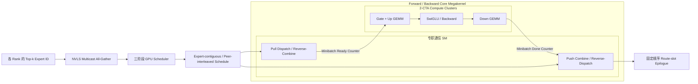
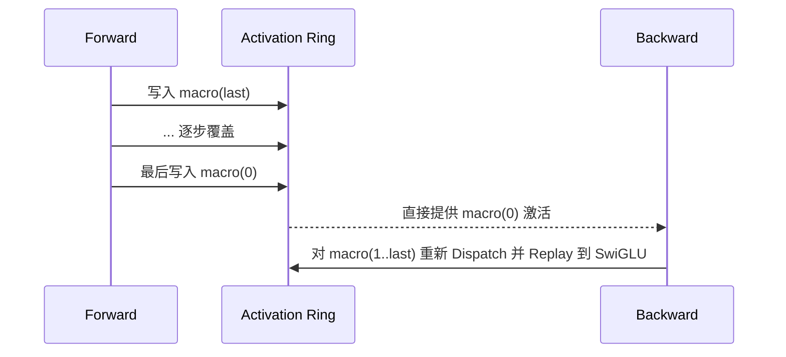
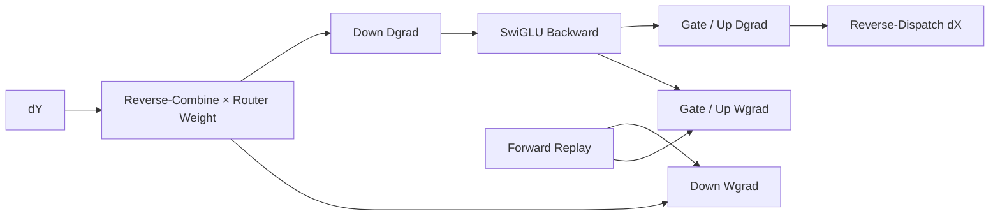

# Mixture-of-Kittens：面向 NVL72 的确定性 MoE 训练 Megakernel

[返回中文主页](../../README.zh-CN.md) ·
[返回研究综述](../megakernel-survey.zh-CN.md) ·
[官方仓库](https://github.com/cursor/mixture-of-kittens) ·
[官方技术文章](https://cursor.com/blog/mixture-of-kittens)

> 源码审计基于提交
> [`3e1cf43ab93ad040afed52a45ab03cb490ffe4be`](https://github.com/cursor/mixture-of-kittens/tree/3e1cf43ab93ad040afed52a45ab03cb490ffe4be)
>（2026-08-05）。该提交在首个公开版本上修复了 SM100 Functional API 的
> Capability Validation。本文把“源码可见事实”“项目方报告”“本机验证”和
> “跨项目推断”分开陈述。

## 1. 结论先行

Mixture-of-Kittens（MoK）不是又一个 Grouped GEMM，也不是 DeepEP 的同类
通信库。它把 DeepSeek-V3 风格 MoE 层的 Shared/Routed Expert、专家并行通信、
Forward、Backward、Router Gradient 和 Activation Replay 作为同一个训练系统
设计。其最值得迁移的思想有六点：

1. **调度表首先是一种数据布局。** Pull-Dispatch 让目标 Rank 自己构造
   `{source rank, source route}` 表；同一张表可以反向解释为 Push-Combine，
   并在 Forward/Backward 四次通信中复用。
2. **两级专门化。** 先在 SM/Cluster 层把一部分资源固定给通信，其余资源给
   计算；再在计算 CTA 内拆分 TMA/MMA 与 TMEM Epilogue Warpgroup。
3. **把 CLC 当成异构任务窃取机制。** 逻辑 Grid 的 Block-ID 区间编码不同
   计算任务，驻留的计算 Cluster 通过取消尚未启动的尾部 Block 取得新任务。
4. **动态执行不必牺牲确定性。** CLC 可改变 Task 完成次序，但每个浮点归约点
   都使用固定 Slot 和固定相加次序，因此数值依赖图保持确定。
5. **Forward 的存储顺序由 Backward 反推。** Forward 逆序走 Macrobatch，
   让 Ring 最终保留 Backward 最先需要的激活；后续批次再有界重放。
6. **Epilogue 为下游消费者生成布局。** MXFP8 路径在数据仍片上时同步产生
   Normal/Transposed Data 与 Scale，避免 Backward 再做整张量转置和量化。

## 2. “Single Kernel”究竟覆盖到哪里

MoK 的核心 Forward Megakernel 覆盖 Dispatch、Shared/Routed Gate/Up、SwiGLU、
Down 和 Combine；Backward Megakernel 覆盖 Reverse-Combine、Dgrad、Wgrad、
Router-weight Gradient、Reverse-Dispatch 与 Activation Replay。

但官方 Functional API 仍包含多次设备 Launch：Route Metadata All-Gather、三个
Schedule Kernel、设备 Barrier、主 Megakernel、另一道 Barrier 和最终 Epilogue。
Router Top-k 也由调用方提供。因此，更准确的说法是：

- **成立：**Forward 和 Backward 各自的算通核心由一个 Megakernel 承载；
- **不成立：**一次 API 调用从路由选择到输出只产生一次 CUDA Launch；
- **“无 CPU-GPU 同步”：**Workspace 建好后，热路径调度不依赖 D2H Token-count
  读回；这并不意味着初始化阶段没有 Host 协调。

这一边界可从固定提交的
[`functional.py`](https://github.com/cursor/mixture-of-kittens/blob/3e1cf43ab93ad040afed52a45ab03cb490ffe4be/mok/functional.py)
和
[`ops.py`](https://github.com/cursor/mixture-of-kittens/blob/3e1cf43ab93ad040afed52a45ab03cb490ffe4be/mok/ops.py)
直接核对。

## 3. 控制与数据流



图中的三个粒度必须分开：

| 粒度 | 控制对象 | 设计目的 |
| :--- | :--- | :--- |
| Expert / Route | Token 怎样进入本地 Expert Segment | 保证 GEMM 连续、Peer 访问交错、顺序可复用 |
| Minibatch | 通信与计算多久交接一次 | 在 Tensor Core 饱和与首尾等待之间折中 |
| Macrobatch | Ring Buffer 容纳多少 Routed Activation | 在显存占用与 Backward Replay FLOPs 之间折中 |

## 4. Scheduler：先决定布局，再谈重叠

[`scheduler.cuh`](https://github.com/cursor/mixture-of-kittens/blob/3e1cf43ab93ad040afed52a45ab03cb490ffe4be/csrc/scheduler.cuh)
包含三个设备 Kernel：

1. 统计 `(local expert, source peer)` Route 数量；
2. 把每个 Expert 的总行数向上补齐到 256，并求 Padded Token 总量；
3. 为每个 Expert 写入连续 Segment，在 Segment 内交错不同 Source Peer 的 Route。

```text
Expert e 的目标布局：

peer0.route0, peer1.route0, ... peerR.route0,
peer0.route1, peer1.route1, ... peerR.route1,
...
padding 到 256 的整数倍
```

该布局同时满足三个约束：Grouped GEMM 的 M 轴不跨 Expert；NVLink 访问不会长
时间集中到单个 Peer；Schedule 可在 Forward/Backward 复用。Pull-Dispatch 的
目的也不只是改变 Load/Store 方向：目标 Rank 可以自行决定落点，不需要多个
Source Rank 协调远端写地址。

256 行 Padding 与主核的 `M256×N256` Cluster Tile 对齐。它减少 Predication、
跨 Expert Tile 和原子合并，但冷 Expert 较多时会扩大无效计算。项目通过
`schedule_capacity_multiplier` 预留不均衡 Envelope；容量不足会在设备侧
Trap，而不是动态扩容。

## 5. SM100 主核：空间分区与 Warp Specialization

### 5.1 SM/Cluster 级空间分区

主核固定使用双 CTA Cluster。逻辑 Grid 前部放置可配置数量的通信 SM，后部是
Shared/Routed Gate、Up、SwiGLU、Down 等计算任务。通信工作必须先驻留，计算
Cluster 才通过 Cluster Launch Control（CLC）取消尚未被调度的后部 Block，
从返回的 Block ID 解码下一个任务。

这个布局隐藏着一条很强的通用规则：**保证系统进度的 Worker 放在不可被偷走
的 Grid 前部，可弹性扩缩的工作放在尾部。**否则 Work-stealing 机制可能先把
通信进度引擎取消，造成整个流水等待。

官方文章还给出 CLC 的第二层作用：训练时，FSDP All-Gather 等跨机架 RDMA
运行在高优先级 Stream，需要占用自己的 SM；CLC Persistent Grid 能让尚未
启动的工作被取消，从而比不可让出的静态 Grid 更容易与该通信共存。这说明
CLC 的价值不只是均衡 MoE Tile，也包括**资源可让渡性**。

### 5.2 Compute CTA 内的 Warpgroup 分工

每个 CTA 使用 256 Threads / 8 Warps，两个 CTA 合作一个 `M256×N256` GEMM：

| 角色 | 源码职责 |
| :--- | :--- |
| Producer Warpgroup | TMA 搬 Activation/Weight/Scale；选举线程发起 2-SM `tcgen05` |
| Consumer/Epilogue Warpgroup | 从 TMEM 读取 FP32 Accumulator，转换 BF16，并按需要量化/转置 |
| 两 CTA | Cluster TMA Multicast；每 CTA 负责 128 行，联合完成 256 行 Tile |

这不是“所有 Blackwell Kernel 都必须 16 Warps”的固定模板。MoK 选择 8 Warps、
255 Registers/Thread 和接近上限的 Dynamic Shared Memory，目标是每 SM 驻留
一个资源充足的 CTA。源码的 6-stage GEMM Load Ring、8-stage BF16 Epilogue
Ring 和 TMEM Accumulator 共同分离 TMA、Tensor Core 与 Epilogue 的延迟。

SwiGLU 是 CTA-local 任务，而 GEMM 是 Cluster-cooperative 任务。一个 Persistent
Cluster 通过 CLC 在两类任务间切换时，代码在重新进入 Cooperative Task 前做
Cluster Sync，避免两个 CTA 的任务状态错位。核心实现位于
[`mok_megakernel.cuh`](https://github.com/cursor/mixture-of-kittens/blob/3e1cf43ab93ad040afed52a45ab03cb490ffe4be/csrc/mok_megakernel.cuh)。

## 6. 为什么 Forward Pull、Combine Push

MoK 使用 PyTorch Symmetric Memory 暴露 Peer Buffer 和 NVLS Multicast Alias：

- Forward Dispatch：目标 Rank 从 Source Rank **Pull** Token；
- Forward Combine：计算 Rank向 Source Rank 的独立 Route Slot **Push** 结果；
- Backward Reverse-Combine：计算 Rank **Pull** `dY` 并乘 Router Weight；
- Backward Reverse-Dispatch：计算 Rank向 Source Rank **Push** Route `dX`。

该组合让同一张 `{peer, route index}` Schedule 被四次通信复用，并把完成信号留
在发起方本地。官方微基准报告：在专家不均衡的 Dispatch 中，Pull 最多提高
29% NVLink Bandwidth Utilization；Push-Dispatch 的跨 GPU Signalling 为 103 µs，
Pull-Dispatch 为 18 µs。它们是项目方在 GB300/NVLink 环境下的测量，不应脱离
Transfer Size、拓扑和协议推广为“Pull 永远更快”。

Combine 不对同一 Token 直接做远端 Atomic Add。每条 Route 写入独立 Slot，
最后由
[`utils.cuh`](https://github.com/cursor/mixture-of-kittens/blob/3e1cf43ab93ad040afed52a45ab03cb490ffe4be/csrc/utils.cuh)
中的独立 Epilogue 按固定 Top-k 顺序乘 Router Weight 并相加。这多占一块
`tokens × topk × hidden` Buffer，却换来了简单同步和确定的求和图。

## 7. 两个批次旋钮解决不同问题

### Minibatch：重叠粒度

Minibatch 太小，Grouped GEMM 不足以形成完整 Wave，Barrier 和 Tail 开销过高；
太大，首批计算启动晚，最后 Combine 也更晚。官方文章给出一个实用启发式：
让每个 Expert GEMM 至少产生两个完整 Wave，使第二个 Wave 能与第一个 Wave 的
Epilogue 和依赖算子重叠。Minibatch 因此应该按 `Token × Hidden/Intermediate ×
可用计算 SM` 推导，再实测 Sweep，而不是固定采用 256 行的最小 MMA 粒度。

### Macrobatch：存储与重放粒度

Macrobatch 是固定容量 Activation Ring。Forward 逆序处理 Macrobatch：



这样 Ring 容量与总 Route 数解耦。Macrobatch 越大，Replay 越少、显存越多；
Minibatch 则只影响通信—计算交接频率。把两个粒度拆开，是比“做一个 Ring
Buffer”更重要的设计点。

## 8. Backward、Router Gradient 与确定性

Backward 不是 Forward 的机械镜像：



Router Weight Gradient 没有保存完整 Routed Down-projection Output。对无 Bias 的
Down Projection，可利用 `dY · y = dHidden · hidden`，在 SwiGLU Backward 中
形成固定位置的 Partial，再由通信 CTA 以固定顺序求和。

MoK 的 Determinism 来自固定算术图，而不是固定 CTA 时间顺序：

- Expert/Peer/Route Schedule 固定；
- 每个输出 GEMM Tile 不重叠；
- Combine 先写 Route Slot，再固定顺序 Reduce；
- Router Gradient 写固定 Partial Slot，再固定顺序 Reduce；
- Routed Wgrad 的 Macrobatch Contribution 按顺序串行累加；
- Forward 与 Backward 使用同一 Schedule。

因此，CLC 可以改变“谁先完成”，但不改变“哪些浮点数按什么顺序相加”。这是
把 Work-stealing 与 Bitwise Determinism 兼容起来的关键。

## 9. MXFP8：为未来消费者写输出

MoK 使用 E4M3 Data + E8M0 Block Scale。Routed Weight 在主核外预量化，以便
与 FSDP 权重生命周期组合；Shared Expert 保留 BF16。Activation Quantization
则融合进 Dispatch、Grouped GEMM Epilogue 和 SwiGLU。

| 产生位置 | 同时生成的消费者布局 |
| :--- | :--- |
| Dispatch | Normal `x` 给 Fwd Gate/Up；Transposed `x` 给 Wgrad |
| Gate/Up Epilogue | BF16 给当前 SwiGLU；MXFP8 给保存/重放 |
| Forward SwiGLU | Normal Hidden 给 Down；Transposed Hidden 给 Down Wgrad |
| Reverse-Combine | Normal/Transposed `dY` 给 Down Dgrad/Wgrad |
| Backward SwiGLU | Normal/Transposed `dGate,dUp` 给 Dgrad/Wgrad |

可迁移的原则是：**布局转换应在 Producer 的 Epilogue 中完成，因为数据此时仍
在 TMEM/Register/SMEM 附近；不要等 Consumer 启动前再扫一次全局内存。**

## 10. 与相邻路线的定位

| 系统 | 核心目标 | 与 MoK 的主要差别 |
| :--- | :--- | :--- |
| DeepEP | 高吞吐/低延迟 Expert-parallel 通信 | 是通信底座，专家计算与训练闭环在库外 |
| FlashMoE | 单 Persistent Kernel 的分布式 MoE | 更广泛的 SM70+ 路径；公开评测主要围绕 H100，MoK 深度绑定 SM100/SM103 与 NVL72 训练 |
| UniEP | 可配置 EP MoE Training Megakernel | 更偏 Triton-distributed 抽象；MoK 更偏手写 CUDA、CLC、TMEM 与确定性协议 |
| DeepGEMM MegaMoE（审计快照） | SM100 Forward Engine 与更细 Tile/L1-L2 流水 | Forward 数据驻留更激进；MoK 的独特价值是 Backward、Router Grad、Replay 和确定性闭环 |

MoK 并非在所有维度“融合更多”。它愿意使用有界的 Global-memory Macrobatch
Ring，以换取完整训练、可控显存与确定性；这与追求每个 Forward Tile 极致片上
驻留的路线是不同优化目标。

## 11. 性能证据怎样读


项目方在 GB300 NVL72、EP=64、每 GPU 路由前 2,048 Tokens 的单层实验中，覆盖
Kimi K2.7、GLM-5.2、Qwen3.5-397B-A17B 和 DeepSeek-V4-Pro 形状。相对每个形状
最快公开 Baseline，报告的最大值为：

| 路径 | 项目方报告最大加速 |
| :--- | ---: |
| MXFP8 Forward | 2.37× |
| MXFP8 Backward | 1.78× |
| BF16 Forward | 1.92× |
| BF16 Backward | 1.58× |

在 512 张 GB300、多个 NVL72 Rack 的内部生产训练对比中，项目方报告从
760.9 提升到 1,070.2 Tokens/s/GPU，即 1.41×。该对比的旧路径是 DeepEP 加
自研 MXFP8 MoE Kernel。上述数字均为**作者报告**；公开仓库提供单层 Benchmark
代码，但内部 512-GPU 训练栈不可独立复现，也不应把最大加速比当作所有形状的
典型收益。

## 12. 本机 SM100 验证边界

本次审计在 4×NVIDIA B200 宿主上进行，但作业只向当前进程暴露一张 GPU。
使用 Python 3.12、PyTorch 2.11.0+cu130 与 CUDA 13.0，`ARCH=SM100` 的只编译
验证通过：

- BF16/MXFP8 Forward/Backward 主核均为 255 Registers/Thread、0 Spill；
- `ptxas` 报告 Forward 5 Barriers / 592B Static SMEM，Backward 5 Barriers /
  608B Static SMEM；主核还在 Launch 时请求接近上限的 Dynamic SMEM；
- MXFP8 Backward 有 16B Stack Frame，仍为 0 Spill；
- 单卡 `128×128` BF16 输入的 `mxfp8_quantize` Normal/Transposed Data 与 Scale
  Smoke Test 通过。

完整 Functional Forward/Backward 要求 EP=4/8/16/32/64。4-Rank 尝试在 Rank
1–3 的 `torch.cuda.set_device()` 处因 GPU 不可见失败，尚未进入 MoK Kernel。
因此，本次证据支持“SM100 可编译、独立量化算子可运行”，**不支持**“已复现
多 GPU 正确性或 GB300 NVL72 性能”。

## 13. 对 SM100 Kernel 设计的可迁移 Insight

1. **先设计数值依赖图，再允许调度动态化。**只要每个 Reduction Slot 和顺序
   固定，CLC Work-stealing 不必破坏 Determinism。
2. **把进度保证编码进 Grid Layout。**通信 Worker 前置、可窃取 Task 后置，
   是硬件 Cancellation 能安全用于异构任务的前提。
3. **SM 分区与 Warp 分工是两个维度。**网络与 Tensor Core 的资源配比在 SM
   层调，TMA/MMA/Epilogue 的流水在 CTA 内调。
4. **通信方向是调度协议的一部分。**Push/Pull 不只比较峰值带宽，还决定远端
   地址协调、Signalling 数量、Schedule 是否可复用。
5. **Overlap 粒度应由 Wave 数量决定。**最细通信块未必最快；Tensor Core
   需要足够连续工作来摊销 Pipeline 和 Tail。
6. **Checkpointing 应反向影响 Forward。**逆序 Ring 说明遍历顺序也是训练
   内存算法的一部分。
7. **TMEM 改变了融合边界。**Accumulator 不占满通用寄存器后，Epilogue Warp
   可以承担转换、量化和多布局输出，而 MMA 继续推进。
8. **为并发 Kernel 留出可让渡性。**Persistent Grid 的吞吐不能以阻塞 FSDP/
   RDMA 高优先级工作为代价；CLC 的 Cancellation 是系统级资源协议的一部分。

## 14. 推荐源码阅读顺序

1. [`README`](https://github.com/cursor/mixture-of-kittens/blob/3e1cf43ab93ad040afed52a45ab03cb490ffe4be/README.md)：支持范围、参数和作者报告口径；
2. [`functional.py`](https://github.com/cursor/mixture-of-kittens/blob/3e1cf43ab93ad040afed52a45ab03cb490ffe4be/mok/functional.py)：Workspace、Schedule 与 Fwd/Bwd 生命周期；
3. [`scheduler.cuh`](https://github.com/cursor/mixture-of-kittens/blob/3e1cf43ab93ad040afed52a45ab03cb490ffe4be/csrc/scheduler.cuh)：256 Padding 与 Peer Interleave；
4. [`utils.cuh`](https://github.com/cursor/mixture-of-kittens/blob/3e1cf43ab93ad040afed52a45ab03cb490ffe4be/csrc/utils.cuh)：NVLS、Multimem Barrier 与最终 Reduction；
5. [`mok_megakernel.cuh`](https://github.com/cursor/mixture-of-kittens/blob/3e1cf43ab93ad040afed52a45ab03cb490ffe4be/csrc/mok_megakernel.cuh)：配置、通信、Grouped GEMM、CLC Task Dispatch；
6. [`tests`](https://github.com/cursor/mixture-of-kittens/tree/3e1cf43ab93ad040afed52a45ab03cb490ffe4be/tests)：确定性、异常和 Shape 契约；
7. [`benchmarks`](https://github.com/cursor/mixture-of-kittens/tree/3e1cf43ab93ad040afed52a45ab03cb490ffe4be/benchmarks)：计时边界与 Baseline。

## 15. 证据说明

- **源码事实：**以固定提交中的 CUDA/Python 实现为准；
- **性能与生产使用：**来自 Cursor 官方仓库和 2026-08-04 官方技术文章，均按
  作者报告处理；
- **SM100 语义校验：**参考 KernelWiki 的 `hw-clc`（`source-reported`）、
  `hw-tmem`（`verified`）、`hw-2sm-cooperative`（`source-reported`）、
  `technique-persistent-kernels` 与 `technique-warp-specialization`
  （均为 `source-reported`）；
- **时间边界：**KernelWiki 截止 2026-04-27，早于 MoK 发布，因此只用于硬件
  语义交叉检查，不作为 MoK 实现本身的来源。
