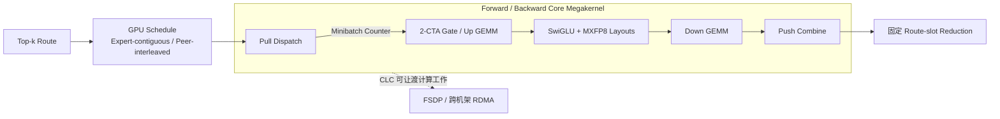

# MegaKernel 研究综述：从持久线程到整模型与分布式设备常驻运行时

[返回中文主页](../README.zh-CN.md) ·
[论文目录](../README.zh-CN.md#-研究论文与报告) ·
[系统目录](../README.zh-CN.md#-系统仓库与制品) ·
[阅读目录](../README.zh-CN.md#-博客与深度阅读) ·
[分类规范](../megakernel_landscape/docs/taxonomy.md)

> 本文是一份持续维护的中文综述，覆盖截至 **2026-08-05** 收录于
> Awesome MegaKernel 的论文、系统仓库与一手工程资料。完整条目与制品状态以
> [`catalog.json`](../megakernel_landscape/data/catalog.json) 为准。

## 摘要

MegaKernel 研究试图改变加速器程序的基本执行边界：原本由主机逐算子启动、
通过全局内存交换中间结果的执行流，被重组为设备常驻的内核或等价引擎，并在
其中调度多个模型算子、Tile 任务或通信阶段。其直接动因包括 Kernel Launch
间隙、算子间 HBM 往返、Wave Quantization，以及分布式工作负载中的粗粒度
算通同步。融合范围扩大后，系统也必须同时处理资源竞争、任务依赖、动态负载、
死锁风险、跨设备通信与硬件可移植性。

现有工作可以沿四条主线理解：手写或模型专用的整模型内核；把张量程序降为
Tile/Task 图的编译器与设备常驻运行时；把专家计算、路由和通信放入同一执行
底座的分布式/MoE MegaKernel；以及借助搜索或 Agent 自动生成、验证和重定向
MegaKernel 的方法。四条路线正在共享一个趋势：调度单位从“算子”下沉为
Tile/Task，控制逻辑从主机侧迁入设备侧，但它们对静态形状、硬件代际、模型
结构、通信后端和公开制品完整度有不同假设。现有证据因此支持“MegaKernel
在特定条件下重构执行开销”的判断，而不支持脱离工作负载与实验协议的普遍
优越性结论。

### 三分钟结论

- MegaKernel 的核心不是“代码很大”，而是把多个逻辑算子、任务或通信阶段的
  控制权移入一个设备常驻执行底座。
- 目前最清晰的四条路线是手写整模型 Kernel、编译器/设备运行时、分布式/MoE
  融合，以及带静态检查的自动搜索或 Agent 合成。
- 多条编译器路线正在收敛到 Tile/Task 级表示，但静态调度、动态依赖和
  Chiplet/多 GPU 层级仍采用不同抽象。
- 单次 Launch 不自动等于完整 End-to-end 推理；LM Head、Sampling、KV Cache
  管理、通信 Proxy 与 Host Setup 经常位于测量边界之外。
- Mixture-of-Kittens 表明，MoE Megakernel 的设计边界可以闭合到训练
  Forward/Backward、Router Gradient、确定性归约和有界 Activation Replay；
  但其“核心单 Kernel”仍不等于 Functional API 只有一次 Launch。
- Wavefront、解耦 Micro-op 和较小作用域的深度融合在高发散、强动态或资源
  压力较大的场景中可能更合适，因此 MegaKernel 是条件化选择而非默认答案。

## 1. 综述边界与术语

本文把 **MegaKernel** 定义为：在单个 Kernel 或等价设备常驻引擎中，协调
较大计算图、模型区域或计算—通信阶段的执行机制。它与几个相邻概念有明确
区别：

- **Kernel Fusion** 消除某些算子边界，但融合范围可能只覆盖一个 MLP、一次
  Attention 或若干 Pointwise 操作。
- **Persistent Kernel** 强调工作在设备上持续驻留；一个持久化单算子并不
  自动构成 MegaKernel。
- **Whole-model Kernel** 把完整或近完整模型前向放进一个执行底座，是
  MegaKernel 的一种强形式。
- **Device-resident Runtime** 在 Kernel 内解释任务队列或任务图，未必把所有
  算子静态展开成一个巨型函数。
- **Wavefront/Decoupled Execution** 把工作拆成阶段或 Micro-op，是 MegaKernel
  的重要对照路线，而非其同义词。

本文采用三层范围标签：

- **核心（Core）**：直接设计、生成、编译或运行整模型/多算子持久化内核，
  或在 Kernel 内联合调度计算和通信。
- **基础（Foundation）**：提供持久线程、任务图、细粒度同步、Tile DSL、
  GPU 发起通信等可复用机制。
- **相邻（Adjacent）**：研究更小范围的深度融合、替代执行模型或非 LLM
  对照场景，用于界定 MegaKernel 的适用边界。

## 2. 核心矛盾：消除执行边界，也会引入新的全局约束

传统深度学习执行栈把模型拆为独立算子。这样的模块化边界便于复用库、独立
调优和动态调度，但每个边界也可能产生启动、同步和中间数据落回全局内存的
成本。低 Batch Decode、短算子链和通信密集型 MoE 更容易暴露这些固定开销。

MegaKernel 通过扩大执行作用域来减少边界成本，却同时扩大了必须联合求解的
问题：

1. **资源约束**：不同算子争用寄存器、Shared Memory、Tensor Core、Load/
   Store Pipeline 和 SM 驻留资源。
2. **依赖与同步**：跨 Tile、跨算子甚至跨 GPU 的依赖必须在设备侧表达，
   Kernel-wide Barrier 往往过于粗粒度。
3. **负载不规则性**：动态形状、MoE 路由和网络延迟会破坏静态调度的均衡。
4. **正确性与活性**：设备侧调度器必须防止竞态、遗漏依赖和死锁；通过少量
   输入测试不等同于形式化保证。
5. **代码与硬件规模**：融合会增加指令体积、寄存器压力和架构专用逻辑，
   可能损害 Occupancy、缓存局部性或可移植性。

因此，文献中的关键问题不是“是否融合”，而是：**以什么任务粒度、在哪一侧
控制、在多大作用域内、依赖哪些静态假设进行融合与调度。**

## 3. 历史脉络

### 3.1 持久线程与模型权重常驻

Persistent Threads 研究较早系统化讨论了让线程块持续驻留、由其反复领取
工作的编程风格，并指出该方式并非对所有 GPGPU 工作负载都占优。[^1]
2013 年的路径追踪研究进一步展示了一个重要反例：当分支发散、寄存器压力和
指令体积主导时，Wavefront 执行可能优于 Megakernel。[^2] 这两项工作共同
奠定了后续文献的基本边界——设备常驻可以减少调度成本，但不会自动改善每一类
工作负载。

Persistent RNNs 把这一思路带入深度学习模型执行：通过持续驻留的 GPU Kernel
把循环网络权重保留在片上，证明“跨逻辑步骤保留状态与执行上下文”能够直接
服务低 Batch 序列推理。[^3] 它尚不是现代 Transformer 整模型运行时，却建立
了模型级持久化执行的重要先例。

### 3.2 从算子图到设备侧任务图

Rammer 将跨算子与算子内并行统一到硬件中立的 rTask 表示，并进行静态时空
协同调度。[^4] ARK 随后把分布式深度学习应用的计算与通信编排移入 GPU
Loop Kernel，使设备能够在较少 CPU 干预的条件下推进整个应用。[^5]
cuSync 则聚焦依赖算子之间的 Tile 级同步，使独立 Tile 可以越过传统
Kernel-wide 边界并发执行。[^6]

这些工作虽然不都属于现代 LLM MegaKernel，但分别提供了三个关键部件：
可组合任务表示、设备侧控制循环和细粒度依赖同步。ThunderKittens 进一步把
Tile 原语与 Persistent Grid 组织为较易使用的 CUDA 编程层，为后续手写
Llama MegaKernel 和多 GPU Persistent Kernel 提供了直接底座。[^7]

### 3.3 2025 年：整模型原型与分布式单 Kernel

FlashFormer 把完整 Transformer 前向作为 Whole-model Kernel 的直接研究
对象，强调低 Batch、低延迟场景中的启动与数据搬运成本。[^8] 同期的
HazyResearch 工程实践展示了手写 Llama MegaKernel 以及向多 GPU 张量并行
扩展的路径。[^E1] 这类工作证明了整模型作用域在特定模型和硬件上的可实现性，
也暴露出代码生成、编译环境、LM Head 边界和硬件专用化问题。

FlashMoE 把另一类边界推向单 Kernel：Dispatch、专家计算、Combine 和设备
发起的跨 GPU 通信被组织进同一持久化内核。[^9] Mirage 从编译器方向提供多层
μGraph 表示和带验证的张量程序搜索，[^10] PipeThreader 则用 sTask 图在 GPU
专用单元之间构造软件定义流水。[^11] 这批工作使“MegaKernel”逐渐从一个手工
融合结果，转变为可由编译器和运行时生成、调度的执行模型。

ClusterFusion 和 FlashFuser 同样扩大了 Fusion Scope：二者利用 Hopper
Thread-block Cluster 与分布式共享内存，把中间结果保留在片上并跨 Block
协作。[^12][^15] 但其作用域仍主要是 Attention/大子图融合，而非完整的设备
常驻模型运行时，因此更适合作为 MegaKernel 边界上的相邻路线。

### 3.4 2026 年：任务化、动态化、分布式化与自动生成

MPK 把张量程序降为 SM 级任务图，并交给去中心化的 Kernel 内运行时执行，
使跨算子流水与细粒度算通重叠成为编译目标。[^13] Event Tensor 用事件张量
表达 Tile 任务依赖，覆盖形状相关和数据相关的动态 MegaKernel 调度。[^17]
Fleet 把任务抽象进一步适配多 Die GPU，通过 Chiplet 感知任务和逐 Chiplet
调度处理 MI350 等架构的私有缓存层级。[^18] DITRON 则把 Tiling 扩展为
Core、Device 和 Task 三层，并在 Task 层组合 Triton 计算与通信。[^19]
二者处理的是正交的层级问题：Fleet 细化单个设备内部的 Die/Cache 归属，
DITRON 扩展 Core 到 Device/分布式任务之间的数据与通信路径。这里的“层级”
不仅决定 Tile 大小，也决定数据归属、同步范围和控制权位置。

MoE 路线也在细化。Alpha-MoE 面向张量并行 W8A8 推理融合两次投影、激活、
量化与本地 Combine；[^14] UniEP 把专家并行通信和计算组织为可配置
MegaKernel，并关注 Token 顺序的确定性；[^20] RaMP 根据运行时路由直方图
选择不同 CuTe 配置，展示了动态路由下的 Kernel Polymorphism，但其选择逻辑
仍位于 Kernel 外部，因此更接近运行时适配层。[^21] ExpertPlex 则把自适应
Persistent Kernel 放入 Prefill/Decode 解耦的 MoE Serving 场景。[^27]

2026 年 8 月公开的 Mixture-of-Kittens（MoK）把这条路线进一步推到完整训练
闭环：在 SM100/SM103 上以 Pull-Dispatch/Push-Combine、通信 SM 与计算 SM
空间分区、双 CTA Cluster、CLC 任务窃取和 Macrobatch Ring Replay 联合实现
Forward/Backward，并通过固定 Route Slot 与归约次序保持 Bitwise
Determinism。[^E16][^E17] 它是当前列表中观察 Blackwell 专用 MoE 训练
Megakernel 如何同时处理算通重叠、显存上界和数值协议的代表性开源制品。

自动化方向形成了两种互补思路。Ada-MK 在离线阶段搜索 MLIR DAG 调度，再把
结果集成到混合服务路径；[^23] AutoMegaKernel 暴露面向 Agent 的 Schedule
IR，并在生成 CUDA 前检查死锁和竞态相关不变量。[^22] 后者提供的是有明确
检查边界的静态验证 Harness，而不是对任意 CUDA 程序的普遍形式化证明。

## 4. 主要研究路线

### 4.1 手写与模型专用整模型 Kernel

这一类方法直接围绕固定模型、固定 Batch 或固定 GPU 设计一个大型
Cooperative/Persistent Kernel。其优势是让一组工作线程或 CTA 跨模型阶段
常驻，并精确控制寄存器、Shared Memory、Warp Specialization 和阶段流水；
代价是代码规模大、编译敏感，并且模型结构、精度或硬件代际变化都可能要求
重写调度。

HazyResearch Megakernels、qwen_megakernel、MegaQwen、Lucebox 和
model-as-a-kernel 展示了不同工程取舍。[^E1][^E3][^E4][^E14] 其中“整模型”
需要按实际执行边界理解：部分项目把 Transformer 层与 Final Norm 放入主
Persistent Kernel，但 LM Head、Argmax 或其他输出阶段仍由独立 Kernel
完成。此类制品适合作为机制教学与硬件极限探索，却不能仅凭项目名称推断完整
End-to-end 覆盖。

### 4.2 编译器与设备常驻任务运行时

这一方向不要求把每个算子完全手工展开，而是把模型转换为设备侧可解释或可
调度的任务表示：

- Rammer 的 rTask 统一跨算子和算子内调度。[^4]
- PipeThreader 的 sTask 描述专用 GPU 单元之间的软件流水。[^11]
- MPK 使用 SM 级任务图和去中心化 Kernel 内运行时。[^13]
- Event Tensor 把动态依赖编码为事件张量。[^17]
- DITRON 用多层 Tiling 连接 Core、GPU Device 和分布式任务。[^19]
- Fleet 显式建模多 Die/Chiplet 缓存层级。[^18]
- Luminal 等工程系统把图算子切成 Block-op，并生成由单 Kernel 解释的全局
  工作队列。[^E5]

这一路线的中心问题是 **IR 与运行时的职责划分**：越多决策静态完成，设备侧
开销越低，但动态形状、路由和通信抖动越难处理；越多决策推迟到 Kernel 内，
运行时越灵活，也越需要低成本队列、同步和活性保证。

### 4.3 分布式与 MoE MegaKernel

分布式 MegaKernel 的目标不是简单地把 NCCL 调用与 GEMM 放在相邻位置，而是
让通信任务与计算 Tile 在设备侧共同调度。ARK 提供了较早的 GPU-driven
应用循环，[^5] FlashMoE 将 MoE Dispatch、专家计算、Combine 和一侧通信
融为单一持久化内核，[^9] UniEP 和 DITRON 则从可配置任务与编译抽象角度组织
专家并行或张量程序。[^19][^20]

该路线的关键变量包括：通信由 GPU 还是 Host 发起、网络进度依赖 Proxy 还是
设备原语、多少 SM 专职处理通信、Token 路由何时可见，以及跨节点 Fence 是否
破坏计算—通信重叠。Perseus 对 FlashMoE 传输层中的隐藏串行化进行修正，但
没有改写核心专家计算组件，因而更适合作为通信基础机制理解。[^24] mKernel
等工程仓库则把 NVLink/RDMA 与 GEMM、MoE 和 Ring Attention 组合为多 GPU/
多节点融合 Kernel。[^E6]

#### 4.3.1 Mixture-of-Kittens：从算通融合到确定性训练闭环

MoK 的贡献不宜简化成“把更多算子放进一个 Kernel”。它同时改变了通信方向、
调度表含义、SM 资源归属、Activation 生命周期和浮点归约协议：

- **Pull-Dispatch、Push-Combine。**目标 Rank 自行决定 Expert-contiguous 落点，
  同一张 `{peer, route}` 表可供 Forward/Backward 的四次通信复用；独立 Route
  Slot 让最终 Weighted Sum 按固定 Top-k 次序执行。[^E17]
- **SM 级和 Warp 级两层专门化。**一部分完整 SM 负责 NVLink Pull/Push，其余
  双 CTA Cluster 执行 `M256×N256` GEMM；Compute CTA 内再把 TMA/Tensor Core
  与 TMEM Epilogue 分给不同 Warpgroup。[^E16]
- **CLC 不只处理 Tail。**逻辑 Block ID 编码异构任务，驻留的计算 Cluster
  取消尚未启动的尾部 Block 来取得工作；可取消的 Persistent Grid 也更容易
  向高优先级的 FSDP/RDMA Kernel 让出资源。[^E16][^E17]
- **Minibatch 与 Macrobatch 解耦。**前者决定算通交接粒度，后者决定 Activation
  Ring 容量。Forward 逆序走 Macrobatch，使 Ring 最终保留 Backward 最先消费
  的激活，后续批次只 Replay 到 SwiGLU。[^E17]
- **动态调度、固定算术图。**CLC 可以改变任务完成顺序，但 Combine Route
  Slot、Router-gradient Partial 和 Wgrad Macrobatch 累加次序固定，因此
  Work-stealing 不改变浮点归约图。[^E16]

这里也必须保留 Fusion Boundary：Functional Forward 仍包含 Route All-gather、
三个 Scheduler Kernel、设备 Barrier、核心 Megakernel 和最终 Epilogue；所谓
“消除 CPU-GPU 同步”指 Workspace 建好后的热路径调度不依赖 D2H Token-count
读回，不表示整个 API 只有一次 Launch。更完整的固定提交源码审计见
[《Mixture-of-Kittens：面向 NVL72 的确定性 MoE 训练 Megakernel》](case-studies/mixture-of-kittens.zh-CN.md)。

### 4.4 自动搜索、生成与验证

当融合作用域扩大到完整模型或分布式任务图，调度空间也随之增大。Ada-MK 把
候选 DAG 调度搜索放到离线阶段，减少运行时选择成本；[^23] AutoMegaKernel
进一步允许 Agent 修改受限 Schedule IR，并在代码执行前检查图不变量。[^22]
Mirage 的多层 Superoptimization 则从等价张量程序和布局搜索出发，为 MPK
提供编译基础。[^10][^13]

三者体现了不同的自动化边界：

1. 在通用 IR 中搜索调度并生成静态结果；
2. 在受限、可检查的 Schedule IR 中允许 Agent 自主修改；
3. 搜索等价张量程序，再由设备侧任务运行时承接执行。

文献中的“动态”或“自适应”也需要拆开理解：Ada-MK 是编译期 DAG 搜索，
RaMP 是 Host 侧根据路由分布选择 Kernel 配置，Event Tensor 是 Kernel 内
依赖驱动调度，ExpertPlex 则在服务系统层调整 Tile 资源。[^17][^21][^23][^27]
这些决策发生在不同时间和控制平面，不能仅因名称相似而视为同类机制。

未来自动化系统需要同时报告搜索预算、候选正确性门槛、静态检查覆盖、拒绝
行为和最终制品支持范围。仅报告“生成成功”或最大加速比，无法区分生成器能力、
搜索策略和验证机制的贡献。

### 4.5 深度子图融合与替代执行模型

Deep Kernel Fusion 聚焦 SwiGLU MLP 子图，[^16] ClusterFusion 和 FlashFuser
利用 Hopper Cluster/DSM 扩大 Attention 或计算密集子图的片上作用域。[^12][^15]
这些方法可能消除显著的中间流量，却不具备整模型调度器，因此不宜与 MPK、
FlashFormer 或 TileRT 直接归为同一种执行模型。

另一组工作从反面界定 MegaKernel。经典路径追踪研究和新的 MegaKernel/
Wavefront 对照均表明，分支发散、寄存器占用、缓存行为与工作队列局部性会改变
最佳执行策略。[^2][^26] VDCores 则把异步 GPU 单元解耦为依赖相连的
Micro-op，显式挑战单体式设备侧编排。[^25] 这些证据说明，选择 MegaKernel
应当是工作负载与硬件条件驱动的决策，而不是默认目标。

## 5. 文献定位矩阵

| 路线 / 工作 | 主要问题 | 调度单位与控制位置 | 适用作用域 | 主要边界 |
| :--- | :--- | :--- | :--- | :--- |
| Persistent Threads[^1] | 如何减少反复调度并保持工作驻留 | 持久线程块；设备侧领取工作 | 通用 GPGPU | 并非所有负载都受益 |
| Persistent RNNs[^3] | 如何让循环权重跨步骤留在片上 | RNN 步骤；持久 GPU Kernel | 低 Batch RNN | 模型结构专用 |
| Rammer[^4] | 如何统一跨算子/算子内调度 | rTask；编译期静态调度 | DNN 图 | 不等同于整模型单 Kernel |
| ARK[^5] | 如何去除 CPU 对分布式应用的逐步编排 | 应用任务；GPU Loop Kernel | 分布式训练 | 运行时与硬件栈假设较强 |
| cuSync[^6] | 如何细化依赖 Kernel 的同步粒度 | Tile；跨 Kernel 同步策略 | 依赖算子重叠 | 基础同步机制 |
| FlashFormer[^8] | 如何消除低 Batch Transformer 的执行间隙 | 模型阶段；静态 Whole-model Kernel | Llama 类低 Batch 推理 | 公开仓库不是完整 Runner |
| FlashMoE[^9] | 如何联合调度专家计算与跨 GPU 通信 | MoE Tile/阶段；单持久化 Kernel | 分布式 MoE | 通信后端与拓扑相关 |
| Mixture-of-Kittens[^E16] | 如何把算通融合闭合到确定性 MoE 训练 | Minibatch/Macrobatch；通信 SM + CLC 双 CTA Cluster | NVL72 MoE Training | SM100/SM103、对称内存与 NVLink Domain 假设强 |
| MPK[^13] | 如何自动 Mega-kernelize 张量程序 | SM Task；去中心化 Kernel 内运行时 | 单/多 GPU 张量程序 | 编译与运行时复杂度 |
| Event Tensor[^17] | 如何表达动态形状/数据依赖 | Event Tensor/Tile Task；设备运行时 | 动态 MegaKernel | 依赖表达和运行时成本 |
| Fleet[^18] | 如何适配多 Die GPU 层级 | Chiplet-aware Task；逐 Chiplet 调度 | AMD 多 Die GPU | 架构层级专用 |
| DITRON[^19] | 如何统一 Core、Device 与分布式 Tiling | 多层 Tile/Task；Scoreboard | 分布式张量程序 | 编译栈与通信原语依赖 |
| UniEP[^20] | 如何融合专家并行训练的通信与计算 | Dispatch/GEMM/Combine Task | MoE Training | 路由与确定性约束 |
| Ada-MK[^23] | 如何搜索静态 Decode MegaKernel 调度 | MLIR DAG；离线搜索 | 特定 GPU/服务路径 | 搜索成本与部署适配 |
| AutoMegaKernel[^22] | 如何让 Agent 安全修改 MegaKernel 调度 | 受限 Schedule IR；静态检查后生成 | 多代 NVIDIA、限定模型族 | 检查边界不等于普遍证明 |
| VDCores[^25] | 是否必须采用单体式设备编排 | 依赖相连的 Micro-op；解耦执行 | 异步 GPU 单元 | 与 Whole-model 路线目标不同 |

## 6. 核心判断与证据边界

| 判断 | 主要证据 | 证据强度 | 不能推出的结论 |
| :--- | :--- | :--- | :--- |
| 调度粒度正从算子下沉到 Tile/Task | Rammer、cuSync、PipeThreader、MPK、Event Tensor、DITRON、Fleet[^4][^6][^11][^13][^17][^18][^19] | 多条独立研究路线的机制证据 | 所有系统最终都会采用同一种 Task IR |
| 设备侧控制可减少 Host 编排边界 | ARK、FlashFormer、FlashMoE、MPK、MoK[^5][^8][^9][^13][^E16] | 论文与系统实现均支持 | 任意模型、Batch 和硬件都会更快 |
| 分布式 MegaKernel 的核心是计算—通信共同调度 | FlashMoE、UniEP、DITRON、Perseus、MoK[^9][^19][^20][^24][^E16] | 机制与制品证据 | 不同网络、精度和拓扑的性能可以直接横比 |
| 动态 Task 次序可以与确定浮点归约图解耦 | MoK 的 Route Slot、Router Partial 与顺序 Wgrad 累加[^E16] | 固定提交源码证据 | 任意使用 Work-stealing 的 Kernel 都自动确定 |
| 动态性要求新的依赖表示或运行时选择 | Event Tensor、RaMP、ExpertPlex[^17][^21][^27] | 多个场景的存在性证据 | 已形成统一的动态 MegaKernel 方案 |
| MegaKernel 存在明确反例和替代路线 | 两代路径追踪研究、VDCores[^2][^25][^26] | 直接对照与替代机制 | MegaKernel 在 LLM 中没有价值 |
| “公开仓库”不等于完整可复现系统 | FlashFormer、TileRT、多个模型专用仓库的制品审计[^E2][^E7] | 仓库级直接观察 | 未完整开源的论文结论必然无效 |

## 7. 开源制品与可复现性

论文中的“Code available”只说明存在相关代码入口，不说明以下条件同时满足：
完整模型路径、训练/推理 Harness、固定依赖、许可证、公开编译器后端、多硬件
支持和论文结果复现脚本。因此，评估生态成熟度需要把源码可见性与执行完整度
分开。

| 制品 | 公开形态 | 可观察边界 |
| :--- | :--- | :--- |
| Mirage / MPK[^E8] | CUDA 编译器与 Kernel 内运行时源码 | 完整度较高，但环境与硬件要求仍需按仓库配置 |
| AutoMegaKernel[^E9] | Agent Harness、验证器与 CUDA 源码 | 目标架构覆盖较广，具体验证配置随任务变化 |
| HazyResearch Megakernels[^E1] | 单/多 GPU 研究代码 | H100/B200 与编译环境敏感 |
| FlashFormer[^E2] | 算子、同步原语与测试 | 缺少论文完整 Whole-model Runner，未清晰展示许可证 |
| TileRT[^E7] | Python/工具源码与固定 ABI 二进制 Wheel | 核心后端并非全部源码开放，当前硬件路径集中 |
| model-as-a-kernel[^E4] | Apache-2.0 教学制品 | 单 CUDA 设备、Batch Size 1、Greedy-only |
| FlashMoE[^E10] | BSD-3-Clause 源码 | 支持 SM70+，主要评测与依赖围绕 H100/NVSHMEM |
| Mixture-of-Kittens[^E16] | Apache-2.0 CUDA/Python、测试与单层 Benchmark | SM100/SM103、CUDA 13+、PyTorch 对称内存；公开路径支持 EP 4/8/16/32/64，NVL72 假设强 |
| Alpha-MoE[^E11] | Apache-2.0 源码 | FP8、模型形状和硬件针对性较强 |
| Triton-distributed[^E12] | 分布式 Triton Kernel、教程与 UniEP 路径 | NVIDIA/AMD 能力与 NVSHMEM 依赖因路径而异 |
| mKernel[^E6] | MIT，多 GPU/多节点融合 Kernel | 主要面向 Hopper sm_90a 与 CX7/EFA |
| MegaQwen / qwen_megakernel[^E3] | 消费级 GPU 学习/研究实现 | 主 Persistent Kernel 之外仍有独立输出阶段 |

对读者而言，最稳妥的复现顺序是：先确认许可证与硬件；再确认模型、精度、
Batch、KV Cache、LM Head 和采样是否属于同一测量边界；最后检查论文基线与
仓库默认配置是否一致。

## 8. 跨路线趋势

### 8.1 从静态融合转向“编译器 + 设备运行时”

手写 Whole-model Kernel 把大部分决策固化在编译结果中。MPK、Event Tensor、
Fleet、DITRON 与 Luminal 则把一部分决策保留为设备侧任务调度。这种组合允许
系统在保留大作用域优化机会的同时，处理多 GPU、动态依赖或异构单元，但运行时
自身的队列、同步和状态管理必须足够轻量。

### 8.2 从计算融合转向计算—通信协同

MoE 与张量/专家并行使通信进入关键路径。FlashMoE、UniEP、DITRON、mKernel
和 Mixture-of-Kittens
表明，设备发起通信只是起点；真正的优化对象是 Token/Tile 何时产生、何时
传输、由哪些 SM 执行，以及计算和网络进度如何互不阻塞。跨节点场景中的 Proxy、
Fence 和 NIC 能力会重新决定最优调度。MoK 进一步说明 Push/Pull 方向会同时
改变远端地址协调、完成信号和 Schedule 复用，而 CLC 的价值还包括让
Persistent Grid 与高优先级跨机架通信共享 SM。[^E16][^E17]

### 8.3 从单架构极致调优转向受约束的可移植抽象

ThunderKittens、TileLang、Triton-distributed、Fleet 和 AWS Transformer TKG
展示了不同层次的可移植性：DSL 原语、编译 IR、分布式任务抽象、Chiplet 感知
运行时或非 GPU NPU API。当前文献尚未给出一个同时覆盖 NVIDIA、AMD、Trainium
和 Ascend 的统一 MegaKernel 抽象；可移植性通常来自重新定义受支持的算子、
同步和通信子集，而不是无条件复用同一 Kernel。[^7][^18][^E12][^E13][^E15]

### 8.4 从“能运行”转向静态检查和证据边界

作用域越大，错误的后果越可能表现为全局死锁、跨阶段竞态或静默错误。
AutoMegaKernel 把 Agent 的编辑面限制为 Schedule IR 并执行静态检查，
Event Tensor 和 DITRON 则通过结构化依赖/Scoreboard 表达执行关系。这一趋势
说明，MegaKernel 自动化需要把正确性门槛放在性能搜索之前，并明确哪些性质由
静态分析保证、哪些只经过动态测试。

## 9. 如何阅读性能结果

MegaKernel 论文经常给出显著的延迟或吞吐改进，但不同工作的分母并不天然
可比。阅读一个性能结论时，至少需要同时核对：

| 维度 | 必须明确的问题 |
| :--- | :--- |
| Hardware | GPU/NPU 型号与数量、SM/Chiplet、显存、NVLink/PCIe/RDMA 拓扑是什么？ |
| Workload | 模型、层或算子、Prefill/Decode、Dense/MoE、Batch 与 Context 是什么？ |
| Precision | 输入、权重、累加与输出精度如何，是否包含量化/反量化？ |
| Software | 编译器、CUDA/CANN/Neuron、框架、通信库和代码版本是什么？ |
| Baseline | Eager、CUDA Graph、Vendor Library、专家 Kernel 还是另一运行时？配置是否匹配？ |
| Boundary | 测量 Kernel-only、单层、完整 Forward、单 Token Decode 还是 End-to-end Serving？ |
| Protocol | Warmup、重复次数、聚合方式、正确性门槛和超时/失败处理是什么？ |
| Metric | 延迟、吞吐、Goodput、GPU 利用率或重叠率的单位与分母是什么？ |

以 MoK 为例，项目方在 GB300 NVL72、EP=64、每 GPU 路由前 2,048 Tokens 的
四组模型形状上报告最大 2.37× MXFP8 Forward、1.78× MXFP8 Backward、1.92×
BF16 Forward 和 1.58× BF16 Backward；在 512 张 GB300 的内部生产栈中，相对
此前 DeepEP-based 自研 MXFP8 路径报告 1.41× Tokens/s/GPU。[^E17] 前一组有
公开单层 Benchmark 代码，后一组依赖未公开训练栈；二者都是作者报告最大值，
不等于独立复现或跨拓扑的典型收益。本次源码审计只完成 SM100 编译和单 GPU
MXFP8 Quantize Smoke，受作业 GPU 可见性限制未进入 EP≥4 的多卡主核；详见
[MoK 案例文档](case-studies/mixture-of-kittens.zh-CN.md#12-本机-sm100-验证边界)。

只有这些条件足够匹配时，Speedup 才适合横向比较。单篇论文的最大值可以证明
某个配置下存在优化机会，不能代表典型收益；“出现通信和计算并发”也不能直接
推出通信延迟已被完全隐藏。对于技术报告、项目博客和二进制后端，性能结论应
明确标记为作者报告，并与可独立复现的证据分开。

## 10. 尚未解决的研究问题

1. **统一而可信的评测协议。** 当前结果跨模型、Batch、上下文长度、精度、
   GPU、拓扑、软件版本和基线配置，缺少能够区分 Kernel-only 与 End-to-end
   边界的公共协议。未来 Benchmark 应同时报告正确性、典型性能、尾延迟、
   编译/搜索成本和失败率。
2. **动态工作负载的低成本调度。** Event Tensor、RaMP、ExpertPlex 与 MoK
   已开始处理形状、路由、服务阶段或动态 Task 次序；MoK 证明固定归约图可以
   与 Work-stealing 共存，但动态队列、负载均衡、容量溢出和确定性之间仍缺少
   跨系统通用解法。
3. **跨节点活性与通信语义。** RDMA Proxy、Fence、NIC 能力和网络拓扑可能
   破坏 Kernel 内预期的重叠；需要能表达进度保证与故障行为的通信—计算 IR。
4. **完整 End-to-end 边界。** 许多模型专用实现仍把 LM Head、Sampling、
   Prefix/Paged KV 管理或请求调度留在 MegaKernel 外。论文应明确“整模型”
   覆盖的输入、输出和排除阶段。
5. **可移植性与资源模型。** 寄存器、Shared Memory、TMEM、CLC、Cluster、
   Chiplet Cache、NPU ISA 和通信原语差异巨大。MoK 展示了充分利用 SM100
   可以得到的系统收益，也展示了双 CTA、NVLS 和对称地址空间带来的强绑定。
   需要既能暴露硬件结构、又不会把调度完全锁死在单代设备上的 IR 与成本模型。
6. **自动生成的验证边界。** Agent 可以扩大调度搜索规模，但也扩大错误空间。
   后续工作需要公开拒绝样例、假阴性/假阳性、Trusted Base、搜索预算和跨架构
   正确性证据。
7. **负结果与选择准则。** 路径追踪和 VDCores 已展示替代路线。LLM 领域仍
   需要更多说明“何时不应采用 MegaKernel”的对照实验与解析模型。
8. **制品完整度。** 二进制后端、无许可证源码、缺失 Whole-model Runner 和
   环境敏感性会限制复现。论文与 Awesome 列表应把“有代码”细化为源码范围、
   许可证、硬件、入口和复现状态。

## 11. 推荐阅读路径

- **理解历史基础**：Persistent Threads → Persistent RNNs → Rammer →
  ARK → cuSync。
- **理解整模型与设备运行时**：HazyResearch 工程文章 → FlashFormer →
  PipeThreader → Mirage → MPK → Event Tensor。
- **理解分布式/MoE**：ARK → FlashMoE → Alpha-MoE → UniEP →
  DITRON → Mixture-of-Kittens → ExpertPlex → Perseus。
- **理解设计边界**：Megakernels Considered Harmful → ClusterFusion /
  FlashFuser → VDCores → 新的 MegaKernel/Wavefront 对照。
- **理解自动化方向**：Mirage → Ada-MK → AutoMegaKernel，并结合各自的
  正确性与制品边界阅读。

## 12. 综述方法与局限

本文优先采用会议/出版社页面、arXiv、作者仓库与第一方工程文章，并将研究论文
与工程制品分开描述。文中的机制判断来自一手来源；跨论文的趋势归纳属于基于
多项机制证据的综合解释。本文有意不汇总或排序加速比，因为不同论文的硬件、
精度、模型、Batch、上下文、通信拓扑、软件栈和基线模式通常不匹配。

本综述不是系统性文献计量研究，也不声称覆盖所有包含“大 Kernel”或 Fusion
的工作。收录范围聚焦 LLM/深度学习 MegaKernel、其直接基础与能界定设计边界
的相邻研究。随着 2026 年论文和制品持续更新，Venue、代码开放程度和硬件支持
可能变化；后续更新应同步修改目录数据、本文定位和变更记录。

## 参考文献

[^1]: [A Study of Persistent Threads Style GPU Programming for GPGPU Workloads](https://escholarship.org/uc/item/3j76d3td), InPar 2012.
[^2]: [Megakernels Considered Harmful: Wavefront Path Tracing on GPUs](https://research.nvidia.com/publication/2013-07_megakernels-considered-harmful-wavefront-path-tracing-gpus), HPG 2013.
[^3]: [Persistent RNNs: Stashing Recurrent Weights On-Chip](https://proceedings.mlr.press/v48/diamos16.html), ICML 2016.
[^4]: [Rammer: Enabling Holistic Deep Learning Compiler Optimizations with rTasks](https://www.usenix.org/conference/osdi20/presentation/ma), OSDI 2020.
[^5]: [ARK: GPU-driven Code Execution for Distributed Deep Learning](https://www.usenix.org/conference/nsdi23/presentation/hwang), NSDI 2023.
[^6]: [A Framework for Fine-Grained Synchronization of Dependent GPU Kernels](https://conf.researchr.org/details/cgo-2024/cgo-2024-main-conference/14/A-Framework-for-Fine-Grained-Synchronization-of-Dependent-GPU-Kernels), CGO 2024.
[^7]: [ThunderKittens: Simple, Fast, and Adorable Kernels](https://proceedings.iclr.cc/paper_files/paper/2025/hash/05dc08730e32441edff52b0fa6caab5f-Abstract-Conference.html), ICLR 2025.
[^8]: [FlashFormer: Whole-Model Kernels for Efficient Low-Batch Inference](https://arxiv.org/abs/2505.22758), 2025.
[^9]: [FlashMoE: Fast Distributed MoE in a Single Kernel](https://neurips.cc/virtual/2025/poster/119124), NeurIPS 2025.
[^10]: [Mirage: A Multi-Level Superoptimizer for Tensor Programs](https://www.usenix.org/conference/osdi25/presentation/wu-mengdi), OSDI 2025.
[^11]: [PipeThreader: Software-Defined Pipelining for Efficient DNN Execution](https://www.usenix.org/conference/osdi25/presentation/cheng), OSDI 2025.
[^12]: [ClusterFusion: Expanding Operator Fusion Scope for LLM Inference via Cluster-Level Collective Primitive](https://proceedings.neurips.cc/paper_files/paper/2025/hash/3760d0ea4709a913a4804f4b4c073836-Abstract-Conference.html), NeurIPS 2025.
[^13]: [MPK: A Compiler and Runtime for Mega-Kernelizing Tensor Programs](https://www.usenix.org/conference/osdi26/presentation/cheng), OSDI 2026.
[^14]: [Alpha-MoE: A Megakernel for Faster Tensor Parallel Inference](https://aleph-alpha.com/wp-content/uploads/Alpha-MoE_A-Megakernel-for-Faster-Tensor-Parallel-Inference_Report.pdf), Technical Report, 2025.
[^15]: [FlashFuser: Expanding the Scale of Kernel Fusion for Compute-Intensive Operators via Inter-Core Connection](https://2026.hpca-conf.org/details/hpca-2026-main-conference/33/FlashFuser-Expanding-the-Scale-of-Kernel-Fusion-for-Compute-Intensive-operators-via-), HPCA 2026.
[^16]: [Deep Kernel Fusion for Transformers](https://aclanthology.org/2026.acl-short.15/), ACL 2026 Short Papers.
[^17]: [Event Tensor: A Unified Abstraction for Compiling Dynamic Megakernel](https://proceedings.mlsys.org/paper_files/paper/2026/hash/53d3f45797970d323bd8a0d379c525aa-Abstract-Conference.html), MLSys 2026.
[^18]: [Fleet: Hierarchical Task-based Abstraction for Megakernels on Multi-Die GPUs](https://arxiv.org/abs/2604.15379), 2026.
[^19]: [DITRON: Distributed Multi-level Tiling Compiler for Parallel Tensor Programs](https://arxiv.org/abs/2605.02953), ICML 2026.
[^20]: [UniEP: Unified Expert-Parallel MoE MegaKernel for LLM Training](https://arxiv.org/abs/2604.19241), HPDC 2026.
[^21]: [RaMP: Runtime-Aware Megakernel Polymorphism for Mixture-of-Experts](https://arxiv.org/abs/2604.26039), 2026.
[^22]: [AutoMegaKernel: A Statically-Checked Agent Harness for Self-Retargeting Megakernel Synthesis](https://arxiv.org/abs/2606.09682), 2026.
[^23]: [Ada-MK: Adaptive MegaKernel Optimization via Automated DAG-based Search for LLM Inference](https://arxiv.org/abs/2605.11581), 2026.
[^24]: [Eliminating Hidden Serialization in Multi-Node Megakernel Communication](https://arxiv.org/abs/2605.00686), 2026.
[^25]: [VDCores: Resource Decoupled Programming and Execution for Asynchronous GPU](https://arxiv.org/abs/2605.03190), 2026.
[^26]: [Megakernel vs Wavefront GPU Path Tracing](https://arxiv.org/abs/2605.27323), 2026.
[^27]: [ExpertPlex: A High-Goodput Disaggregated Serving System for MoE LLMs with Adaptive Persistent Kernels](https://arxiv.org/abs/2607.18002), 2026.

### 一手工程资料

[^E1]: [HazyResearch Megakernels](https://github.com/HazyResearch/Megakernels)；[Look Ma, No Bubbles!](https://hazyresearch.stanford.edu/blog/2025-05-27-no-bubbles)。
[^E2]: [FlashFormer author-linked repository](https://github.com/cheetah-lang/flashformer)。
[^E3]: [MegaQwen](https://github.com/Infatoshi/MegaQwen)；[qwen_megakernel](https://github.com/AlpinDale/qwen_megakernel)。
[^E4]: [model-as-a-kernel](https://huggingface.co/kernels/phanerozoic/model-as-a-kernel)。
[^E5]: [Compiling Models to Megakernels](https://blog.luminal.com/p/compiling-models-to-megakernels)。
[^E6]: [mKernel](https://github.com/uccl-project/mKernel)；[项目技术文章](https://uccl-project.github.io/posts/mkernel/)。
[^E7]: [TileRT](https://github.com/tile-ai/TileRT)。
[^E8]: [Mirage / MPK](https://github.com/mirage-project/mirage)。
[^E9]: [AutoMegaKernel](https://github.com/RightNow-AI/AutoMegaKernel)。
[^E10]: [FlashMoE](https://github.com/osayamenja/FlashMoE)。
[^E11]: [Alpha-MoE](https://github.com/Aleph-Alpha/Alpha-MoE)。
[^E12]: [Triton-distributed](https://github.com/ByteDance-Seed/Triton-distributed)。
[^E13]: [AWS Transformer TKG documentation](https://awsdocs-neuron.readthedocs-hosted.com/en/v2.29.1/nki/library/api/transformer-tkg.html)。
[^E14]: [Lucebox](https://github.com/Luce-Org/lucebox)。
[^E15]: [TileLang](https://github.com/tile-ai/tilelang)。
[^E16]: [Mixture-of-Kittens 源码](https://github.com/cursor/mixture-of-kittens)，本文审计固定到提交 `3e1cf43ab93ad040afed52a45ab03cb490ffe4be`；详见[源码级案例](case-studies/mixture-of-kittens.zh-CN.md)。
[^E17]: [Mixture-of-Kittens: our open-source MoE megakernel for NVL72s](https://cursor.com/blog/mixture-of-kittens)，Cursor Research，2026-08-04；性能结论按作者报告处理。
