# DSV2-236B-MegaKernel

DeepSeek-V2-236B decode as **one persistent CuTe-DSL kernel** per token, spanning
8× B200 (sm_100) with tensor parallelism and expert parallelism *inside* the kernel.

A stock inference stack issues roughly 600 kernel launches per decode token
(60 layers × ~10 ops). At batch size 1 that launch-and-dispatch cost, not the
math, is what sets the wall clock. This kernel issues **one**: all 60 decoder
layers, both collectives, and the LM head run inside a single `@cute.kernel`
launch, with layers separated by in-kernel grid syncs instead of by returning
to the host.

## Results

B=1 decode, TP=EP=8 on 8× B200, prompt 128 / 1008 generated tokens,
FP8 block-scaled MoE and shared-expert GEMMs, bf16 elsewhere.

| implementation      | ms/token (p50) |      tok/s |
| ------------------- | -------------: | ---------: |
| **this megakernel** |       **9.31** | **107.41** |
| vLLM                |          13.65 |       73.3 |

**46.5% higher throughput** than vLLM, on the same numerics and the same topology: per-128 block-scaled FP8, TP=8 with the 160 routed experts sharded 20-per-rank across all 8 GPUs.

That pairing is not a choice — it is the only way this model can be served in
block-FP8 at TP=8. DeepSeek-V2's `moe_intermediate_size` is 1536, so a TP=8
shard is 192 columns, and 192 is not a multiple of the 128-wide scale block a
block-FP8 GEMM needs. The experts cannot be split along that axis, so whole
experts go to whole ranks and expert parallelism follows. Both sides of the
table pay for it.

vLLM baseline: p50 TPOT from `vllm bench serve` at `--max-concurrency 1` on the
same 8× B200 node, B=1 / in=128 / out=1024, serving a native block-FP8
checkpoint with `--enable-expert-parallel`, `VLLM_USE_DEEP_GEMM=1`,
MultiprocExecutor, FlashInfer MLA, DeepGEMM grouped-GEMM experts with DeepEP
all-to-all, `torch.compile` and full CUDA graphs.

## What runs inside the single launch

One launch, one token. Shapes below are per rank at TP=EP=8.

```mermaid
flowchart TD

TOK["token_id · int32 · 1"]:::io
POS["decode_pos · int32 · 1"]:::io

S0["Stage 0 · inline embed gather<br/>W_embed 102400 × 5120 → row lookup<br/>out h · 5120"]:::rep
HC(["h · residual stream · 5120 bf16 · held in SMEM"]):::state

TOK --> S0 --> HC --> A

subgraph LOOP["for ℓ = 0 … 59 · 23 grid syncs per layer"]
direction TB

subgraph ATT["ATTENTION — MLA, W_UK / W_UV absorbed · TP=8 → 16 of 128 heads"]
direction TB
  A["A · h += residual_ℓ · RMSNorm × γ1<br/>5120 → 5120"]:::attn
  B["B · fused qkv_a GEMV · (replicated)<br/>W_qkva 2112 × 5120<br/>5120 → 2112"]:::attn
  S1{{"grid sync 1"}}:::sync
  C["C · split 2112 → q_c 1536 · kv_c 512 · k_pe 64<br/>RMSNorm q_c × γ2 → 1536"]:::attn
  D["D · q_b GEMV · (TP column-parallel)<br/>W_qb 3072 × 1536<br/>1536 → 3072 = 16 heads × 192"]:::attn
  E["E · RMSNorm kv_c × γ3 → 512<br/>append KV cache C at ℓ, pos"]:::attn
  F["F · RoPE k_pe → 64<br/>append KV cache PE at ℓ, pos"]:::attn
  S2{{"grid sync 2"}}:::sync
  G["G · RoPE q_pe · 16 × 64 in place"]:::attn
  HH["H · W_UK absorption<br/>q_nope 16 × 128 · W_UK 16 × 512 × 128<br/>→ q_abs 16 × 512"]:::attn
  S3{{"grid sync 3"}}:::sync
  II["I · MLA decode · KV range split across clusters<br/>Q 16 × 576 · KV cache S × 576<br/>→ per split: m, l, O_unnorm 16 × 512"]:::attn
  S4{{"grid sync 4"}}:::sync
  IC["I-combine · online-softmax merge of splits<br/>→ attn_out 16 × 512"]:::attn
  S5{{"grid sync 5"}}:::sync
  JJ["J · W_UV absorption<br/>attn_out 16 × 512 · W_UV 16 × 128 × 512<br/>→ o_per_head 16 × 128 = 2048"]:::attn
  S6{{"grid sync 6"}}:::sync
  KK["K · o_proj GEMM · (TP row-parallel)<br/>W_O 5120 × 2048 · K = 2048 of 16384<br/>→ attn_proj PARTIAL · 5120"]:::attn

  A --> B --> S1 --> C --> D --> E --> F --> S2 --> G --> HH --> S3
  S3 --> II --> S4 --> IC --> S5 --> JJ --> S6 --> KK
end

subgraph TPC["TENSOR-PARALLEL ALL-REDUCE — 8 ranks, in-kernel"]
direction TB
  KS["K epilogue · multimem.red scatter (PUSH)<br/>attn_proj 5120 → all 8 peers"]:::coll
  S7{{"grid sync 7"}}:::sync
  TPB{{"TP barrier · cross-rank"}}:::coll
  LL["L · multimem.ld_reduce consume<br/>attn_proj 5120 summed over 8 ranks<br/>h += attn_proj"]:::coll
  KS --> S7 --> TPB --> LL
end

subgraph MOE["MoE — 2 shared experts + top-6 of 160 routed · EP=8 → 20 experts/rank"]
direction TB
  MM["M · RMSNorm h × γ4 → 5120"]:::moe
  NN["N · router GEMV · (replicated)<br/>W_router 160 × 5120<br/>5120 → logits 160"]:::moe
  OO["O · softmax · group-limited greedy<br/>max over 8 groups × 20 → top-3 groups<br/>→ top-6 experts · w = score × 16.0<br/>→ ids 6 · w 6"]:::moe

  P1["P1 · routed gate + up · FP8 block-scaled<br/>clusters 0…35 · 6 per expert · (local experts only)<br/>W_gate, W_up 1536 × 5120 per expert<br/>5120 → g, u 1536 → SiLU g × u<br/>→ inter 0…9215 = 6 × 1536"]:::moeR
  Q1["Q1 · shared gate + up · FP8 block-scaled<br/>clusters 36…47 · (replicated)<br/>W_gate, W_up 3072 × 5120<br/>5120 → g, u 3072 → SiLU g × u<br/>→ inter 9216…12287"]:::moeS

  EOP1{{"end-of-PASS-1 spin"}}:::sync
  P2["P2 · routed down · FP8 block-scaled<br/>clusters 0…59 · 3 expert slots × 20 m-tiles · 2 sub-passes<br/>W_down 5120 × 1536 per expert<br/>inter_k 1536 → 5120 · × w_k<br/>→ red.add.f32 into routed_acc fp32 5120"]:::moeR
  EOP2{{"end-of-PASS-2 spin"}}:::sync
  Q2["Q2 · shared down · FP8 block-scaled · runs alone<br/>clusters 0…59 · 20 m-tiles × 2 K-splits<br/>W_down_shared 5120 × 3072<br/>inter 3072 → shared_out 5120"]:::moeS
  S8{{"grid sync"}}:::sync
  EPB{{"EP barrier · cross-rank"}}:::coll
  RR["R · distributed all-reduce + broadcast (PULL)<br/>multimem.ld_reduce routed_acc 5120 over 8 ranks<br/>~5 CTAs pull disjoint slices → intra-rank bcast<br/>h += shared_out + routed_allreduced"]:::coll

  MM --> NN --> OO
  OO ==>|"concurrent · disjoint clusters"| P1
  OO ==>|"concurrent · disjoint clusters"| Q1
  P1 --> EOP1
  Q1 --> EOP1
  EOP1 --> P2 --> EOP2 --> Q2 --> S8 --> EPB --> RR
end

KK --> KS
LL --> MM
end

RR -.->|"h carries to layer ℓ+1"| A

subgraph TAIL["EPILOGUE — once per token, same launch"]
direction TB
  T0["T.0 · final RMSNorm h × γ_final → 5120"]:::rep
  T1["T.1 · lm_head GEMV · (replicated)<br/>W_lm 102400 × 5120<br/>5120 → logits 102400 · per-CTA local argmax"]:::rep
  T2["T.2 · cross-CTA argmax reduce over 132 CTAs"]:::rep
  T0 --> T1 --> T2
end

RR ==>|"after layer 59"| T0
T2 --> NXT["next_token_id · int32 · 1"]:::io
NXT -.->|"fed back · no host round-trip"| TOK
POS -.-> F
POS -.-> G

classDef io    fill:#eef1f5,stroke:#5b6472,stroke-width:1.5px,color:#1b2027
classDef rep   fill:#f4f5f7,stroke:#8a929e,stroke-width:1.5px,color:#1b2027
classDef state fill:#ece7fb,stroke:#7c5cd6,stroke-width:2px,color:#2a1d52
classDef attn  fill:#dceffa,stroke:#1f7fb5,stroke-width:1.5px,color:#0b3550
classDef moe   fill:#fbf1cf,stroke:#b58900,stroke-width:1.5px,color:#4a3800
classDef moeR  fill:#fce3d2,stroke:#c2601c,stroke-width:1.5px,color:#4d2409
classDef moeS  fill:#d9f2e4,stroke:#1f8a5c,stroke-width:1.5px,color:#0d3d28
classDef coll  fill:#fbdcdc,stroke:#c0392b,stroke-width:2px,color:#4d1512
classDef sync  fill:#e8e9ec,stroke:#767c87,stroke-width:1px,color:#22262c
```



Per-layer cost of each stage:

| stage | work | µs/layer |
|---|---|---:|
| A+B | residual add, input RMSNorm, fused q/kv_a down-projection | 13.57 |
| C–F | q_a RMSNorm, q_b up-projection, kv_a norm, decoupled k_pe RoPE | 8.69 |
| G+H | q_pe RoPE, W_UK absorption BMM | 7.35 |
| I | MLA decode over the compressed KV cache, split across CTAs | 21.06 |
| I-combine | cross-CTA partial reduction with online-softmax rescale | 2.06 |
| J, K | per-head output gather, o_proj GEMM, `multimem.red` TP scatter | 22.49 |
| TP barrier | | 4.33 |
| L | TP all-reduce consume, folded into the residual | 20.66 |
| M+N | post-attention RMSNorm, router GEMV | 6.68 |
| O | group-limited-greedy top-6 selection (ballot + popc + ctz) | 6.58 |
| Q1, Q2 | shared experts: FP8 gate/up, SiLU, down-projection | 23.09 |
| EP barrier | | 2.06 |
| P1, P2 | routed experts: FP8 gate/up, SiLU, down-projection | 42.56 |
| R | distributed `multimem.ld_reduce` all-reduce + intra-rank broadcast | 4.18 |

followed once per token by an in-kernel embedding lookup, final norm, and
`lm_head` argmax — so a decode step never leaves the GPU to pick its own next
token.

Model geometry: 60 layers, hidden 5120, 128 attention heads, MLA with a 512-dim
compressed KV cache plus a 64-dim decoupled RoPE key, 160 routed experts in 8
groups (top-3 groups, top-6 experts) plus 2 shared experts, vocab 102400.
Weights are stacked along a leading layer dimension and indexed with `Int64`
pointer arithmetic; the grid is 132 CTAs, one per SM.

Everything is written in CuTe-DSL. No external compute library is called from
inside the kernel body — no cuBLAS, no DeepGEMM, no FlashMLA, no FlashAttention.

A full walkthrough of the diagram — every tensor shape, which weights are replicated
vs TP- vs EP-sharded, and how layer 0's dense FFN is folded into the shared-expert
path — is in [docs/megakernel-flow.md](docs/megakernel-flow.md).

## Hardware and software

- 8× NVIDIA B200 (sm_100) on one node, NVLink, with `multimem` fabric support
- CUDA 13.1, Python 3.12
- `torch >= 2.7` (needs `torch.distributed._symmetric_memory`)
- `nvidia-cutlass-dsl >= 4.5.2`
- ~70 GB of free HBM per rank for the sharded FP8 weights, KV cache and
  symmetric-memory buffers

## Setup

```bash
git clone https://github.com/SwayamInSync/DSV2-236B-MegaKernel.git
cd DSV2-236B-MegaKernel
pip install -r requirements.txt
pip install -e .
```

Fetch the weights (~470 GB) once:

```bash
huggingface-cli download deepseek-ai/DeepSeek-V2
```

The snapshot is found automatically in the HuggingFace hub cache. To point at a
directory elsewhere, set `DSV2MK_SNAPSHOT` to a path containing `config.json`,
the tokenizer, and the safetensors shards.

## Running

### Decode benchmark — the headline number

```bash
./scripts/run_decode_bench.sh results/decode_bench
```

which is:

```bash
INCLUDE_LAYER0=1 torchrun --nproc_per_node=8 --master_port=29793 \
    bench/bench_decode.py \
    --input_len 128 --output_len 1008 --warmup 2 --iters 3 \
    --output_json results/decode_bench/run.json
```

Prints mean / p50 / p90 / p99 ms per token and sustained tok/s, and writes the
same as JSON.

### Gold gate + benchmark

```bash
./scripts/run_gold_gate.sh results/gold_gate
```

Runs the numerical gate and the benchmark in one load-and-compile, dumping PTX,
CUBIN, and an environment fingerprint alongside the log. Exits non-zero if the
gate fails.

The gate is **not** a byte-exact token match. Stage K's
`multimem.red.add.bf16x2` server-side adds complete in peer arrival order, and
bf16 is non-associative, so 1-ULP logit differences are expected and can flip an
argmax. The decision metrics are per-position top-5 logit overlap and top-1
agreement against the calibrated reference in `tests/gold_ref/ref_v7_stageR.pt`,
plus a non-degeneracy check on free-running greedy decode. Pass `--strict_gold`
to force the byte-exact comparison anyway.

### Generate text

```bash
INCLUDE_LAYER0=1 torchrun --nproc_per_node=8 --master_port=29580 \
    tests/test_generate.py
```

Greedy-decodes 16 tokens from `"Hello, my name is"` and prints them.

### Where the time goes

```bash
# per-layer stage breakdown from the kernel's own clock64 timestamps
INCLUDE_LAYER0=1 torchrun --nproc_per_node=8 --master_port=29794 \
    bench/bench_stage_timing.py --input_len 128 --n_steps 5

# the same, resolved per rank, to find the straggler behind collective skew
INCLUDE_LAYER0=1 torchrun --nproc_per_node=8 --master_port=29795 \
    bench/bench_rank_attribution.py --input_len 128 --n_steps 8
```

The largest remaining stages are the routed experts (P1+P2, 42.6 µs/layer, of
which P2 spends 81 % spinning on the end of P1 rather than computing), Stage L's
20.7 µs TP-all-reduce land-stall, and the MLA decode at 21.1 µs. Stage L is the
clearest lever: Stage R performs the same H=5120 all-reduce in 4.18 µs using a
*distributed* pull, while Stage L still pays a push land-stall.

## First run

The first launch is slow and this is expected:

- **Weight sharding**: the 236B checkpoint is sliced for TP=8 / EP=8 and
  quantised to block-scaled FP8, then cached per rank. Set `DSV2MK_WEIGHT_CACHE`
  to a path on a fast, roomy filesystem; it defaults to
  `~/.cache/dsv2mk/weights`. Later runs hit the cache and skip this entirely.
  The cache key covers the snapshot, the shard geometry, and the hashes of the
  files that build it, so editing the loader or the quantiser rebuilds it.
- **Compilation**: CuTe-DSL compiles a ~7000-line kernel, which took about
  20 minutes on the development node. NCCL's timeout is raised to 60 minutes in
  the runners so the host-side collective after the first launch does not
  falsely time out.

## Environment variables

| variable | default | meaning |
|---|---|---|
| `DSV2MK_SNAPSHOT` | HF hub cache | directory holding `config.json`, tokenizer, safetensors |
| `DSV2MK_WEIGHT_CACHE` | `~/.cache/dsv2mk/weights` | where sharded FP8 weights are cached |
| `DSV2MK_WEIGHT_CACHE_DISABLE` | `0` | `1` re-shards every run |
| `DSV2MK_CACHE_SAFETY_GIB` | — | free-space margin to keep when writing the cache |
| `INCLUDE_LAYER0` | `1` in the runners | run all 60 layers in-kernel; layer 0's dense MLP folds into the shared-expert path |
| `MOE_SPLITK` | `0` | `1` enables the shared-expert Q1 K-split path (validated, currently ~0.2 ms slower at the wall) |
| `DSV2MK_DISABLE_INLINE_EMBED` | `0` | move the embedding lookup back to the host |
| `DSV2MK_DISABLE_INLINE_ROTARY` | `0` | precompute RoPE tables on the host |
| `CUTE_DSL_KEEP` | — | `ptx,cubin` to dump generated code into `CUTE_DSL_DUMP_DIR` |

## Layout

```
dsv2mk/
  kernels/megakernel.py           the kernel — every stage above, one launch
  kernels/softmax_primitives.py   warp-level reductions for the MLA online softmax
  runtime/engine.py               DSv2InKernelTPEP: buffers, KV cache, per-step launch
  runtime/weight_loader.py        safetensors -> layer-stacked TP/EP shards
  runtime/weight_cache.py         signature-keyed on-disk cache of those shards
  quant/fp8_block_quant.py        block-scaled FP8 E4M3 with UE8M0 scale factors
  paths.py                        snapshot and cache-path resolution
bench/                            decode latency, stage timing, per-rank attribution
tests/                            gold gate + benchmark, generation smoke test
scripts/                          the two commands above, wrapped
```

## Notes

- Decode only, batch size 1. There is no prefill kernel: prompt tokens are fed
  through the same single-token decode path one at a time.
- All 8 ranks run identical code under `torchrun`. The collectives are in-kernel
  `multimem` operations over PyTorch symmetric memory, not NCCL calls.
- The reported numbers were measured on the 8× B200 node this kernel was
  developed on; they are reproduced here from that machine's benchmark records
  rather than re-measured for this repository.
