# One decode step inside the megakernel

Everything below happens in **one** `@cute.kernel` launch per rank per token.
Shapes are **per rank** at TP=EP=8, batch size 1. The grid is 132 CTAs = 66
clusters of 2 CTAs; layers are separated by in-kernel grid syncs (atomic
counter, release/acquire at gpu scope), never by returning to the host.

Model: DeepSeek-V2-236B — 60 layers, hidden 5120, 128 heads (16 per rank),
MLA with a 512-dim compressed KV cache plus a 64-dim decoupled RoPE key,
160 routed experts in 8 groups (top-3 groups, top-6 experts) + 2 shared,
vocab 102400.

```mermaid
flowchart TD

TOK["token_id · int32 · 1"]:::io
POS["decode_pos · int32 · 1"]:::io

S0["Stage 0 · inline embed gather<br/>W_embed 102400 × 5120 → row lookup<br/>out h · 5120"]:::rep
HC(["h · residual stream · 5120 bf16 · held in SMEM"]):::state

TOK --> S0 --> HC --> A

subgraph LOOP["for ℓ = 0 … 59 · 23 grid syncs per layer"]
direction TB

subgraph ATT["ATTENTION — MLA, W_UK / W_UV absorbed · TP=8 → 16 of 128 heads"]
direction TB
  A["A · h += residual_ℓ · RMSNorm × γ1<br/>5120 → 5120"]:::attn
  B["B · fused qkv_a GEMV · (replicated)<br/>W_qkva 2112 × 5120<br/>5120 → 2112"]:::attn
  S1{{"grid sync 1"}}:::sync
  C["C · split 2112 → q_c 1536 · kv_c 512 · k_pe 64<br/>RMSNorm q_c × γ2 → 1536"]:::attn
  D["D · q_b GEMV · (TP column-parallel)<br/>W_qb 3072 × 1536<br/>1536 → 3072 = 16 heads × 192"]:::attn
  E["E · RMSNorm kv_c × γ3 → 512<br/>append KV cache C at ℓ, pos"]:::attn
  F["F · RoPE k_pe → 64<br/>append KV cache PE at ℓ, pos"]:::attn
  S2{{"grid sync 2"}}:::sync
  G["G · RoPE q_pe · 16 × 64 in place"]:::attn
  HH["H · W_UK absorption<br/>q_nope 16 × 128 · W_UK 16 × 512 × 128<br/>→ q_abs 16 × 512"]:::attn
  S3{{"grid sync 3"}}:::sync
  II["I · MLA decode · KV range split across clusters<br/>Q 16 × 576 · KV cache S × 576<br/>→ per split: m, l, O_unnorm 16 × 512"]:::attn
  S4{{"grid sync 4"}}:::sync
  IC["I-combine · online-softmax merge of splits<br/>→ attn_out 16 × 512"]:::attn
  S5{{"grid sync 5"}}:::sync
  JJ["J · W_UV absorption<br/>attn_out 16 × 512 · W_UV 16 × 128 × 512<br/>→ o_per_head 16 × 128 = 2048"]:::attn
  S6{{"grid sync 6"}}:::sync
  KK["K · o_proj GEMM · (TP row-parallel)<br/>W_O 5120 × 2048 · K = 2048 of 16384<br/>→ attn_proj PARTIAL · 5120"]:::attn

  A --> B --> S1 --> C --> D --> E --> F --> S2 --> G --> HH --> S3
  S3 --> II --> S4 --> IC --> S5 --> JJ --> S6 --> KK
end

subgraph TPC["TENSOR-PARALLEL ALL-REDUCE — 8 ranks, in-kernel"]
direction TB
  KS["K epilogue · multimem.red scatter (PUSH)<br/>attn_proj 5120 → all 8 peers"]:::coll
  S7{{"grid sync 7"}}:::sync
  TPB{{"TP barrier · cross-rank"}}:::coll
  LL["L · multimem.ld_reduce consume<br/>attn_proj 5120 summed over 8 ranks<br/>h += attn_proj"]:::coll
  KS --> S7 --> TPB --> LL
end

subgraph MOE["MoE — 2 shared experts + top-6 of 160 routed · EP=8 → 20 experts/rank"]
direction TB
  MM["M · RMSNorm h × γ4 → 5120"]:::moe
  NN["N · router GEMV · (replicated)<br/>W_router 160 × 5120<br/>5120 → logits 160"]:::moe
  OO["O · softmax · group-limited greedy<br/>max over 8 groups × 20 → top-3 groups<br/>→ top-6 experts · w = score × 16.0<br/>→ ids 6 · w 6"]:::moe

  P1["P1 · routed gate + up · FP8 block-scaled<br/>clusters 0…35 · 6 per expert · (local experts only)<br/>W_gate, W_up 1536 × 5120 per expert<br/>5120 → g, u 1536 → SiLU g × u<br/>→ inter 0…9215 = 6 × 1536"]:::moeR
  Q1["Q1 · shared gate + up · FP8 block-scaled<br/>clusters 36…47 · (replicated)<br/>W_gate, W_up 3072 × 5120<br/>5120 → g, u 3072 → SiLU g × u<br/>→ inter 9216…12287"]:::moeS

  EOP1{{"end-of-PASS-1 spin"}}:::sync
  P2["P2 · routed down · FP8 block-scaled<br/>clusters 0…59 · 3 expert slots × 20 m-tiles · 2 sub-passes<br/>W_down 5120 × 1536 per expert<br/>inter_k 1536 → 5120 · × w_k<br/>→ red.add.f32 into routed_acc fp32 5120"]:::moeR
  EOP2{{"end-of-PASS-2 spin"}}:::sync
  Q2["Q2 · shared down · FP8 block-scaled · runs alone<br/>clusters 0…59 · 20 m-tiles × 2 K-splits<br/>W_down_shared 5120 × 3072<br/>inter 3072 → shared_out 5120"]:::moeS
  S8{{"grid sync"}}:::sync
  EPB{{"EP barrier · cross-rank"}}:::coll
  RR["R · distributed all-reduce + broadcast (PULL)<br/>multimem.ld_reduce routed_acc 5120 over 8 ranks<br/>~5 CTAs pull disjoint slices → intra-rank bcast<br/>h += shared_out + routed_allreduced"]:::coll

  MM --> NN --> OO
  OO ==>|"concurrent · disjoint clusters"| P1
  OO ==>|"concurrent · disjoint clusters"| Q1
  P1 --> EOP1
  Q1 --> EOP1
  EOP1 --> P2 --> EOP2 --> Q2 --> S8 --> EPB --> RR
end

KK --> KS
LL --> MM
end

RR -.->|"h carries to layer ℓ+1"| A

subgraph TAIL["EPILOGUE — once per token, same launch"]
direction TB
  T0["T.0 · final RMSNorm h × γ_final → 5120"]:::rep
  T1["T.1 · lm_head GEMV · (replicated)<br/>W_lm 102400 × 5120<br/>5120 → logits 102400 · per-CTA local argmax"]:::rep
  T2["T.2 · cross-CTA argmax reduce over 132 CTAs"]:::rep
  T0 --> T1 --> T2
end

RR ==>|"after layer 59"| T0
T2 --> NXT["next_token_id · int32 · 1"]:::io
NXT -.->|"fed back · no host round-trip"| TOK
POS -.-> F
POS -.-> G

classDef io    fill:#eef1f5,stroke:#5b6472,stroke-width:1.5px,color:#1b2027
classDef rep   fill:#f4f5f7,stroke:#8a929e,stroke-width:1.5px,color:#1b2027
classDef state fill:#ece7fb,stroke:#7c5cd6,stroke-width:2px,color:#2a1d52
classDef attn  fill:#dceffa,stroke:#1f7fb5,stroke-width:1.5px,color:#0b3550
classDef moe   fill:#fbf1cf,stroke:#b58900,stroke-width:1.5px,color:#4a3800
classDef moeR  fill:#fce3d2,stroke:#c2601c,stroke-width:1.5px,color:#4d2409
classDef moeS  fill:#d9f2e4,stroke:#1f8a5c,stroke-width:1.5px,color:#0d3d28
classDef coll  fill:#fbdcdc,stroke:#c0392b,stroke-width:2px,color:#4d1512
classDef sync  fill:#e8e9ec,stroke:#767c87,stroke-width:1px,color:#22262c
```

## Reading the diagram

Blue is attention, orange routed experts, green shared experts, yellow routing,
red cross-rank collectives, grey in-kernel syncs.

Four things the per-stage tables hide:

- **`Q1` and `P1` run concurrently**, not in sequence. They are gated onto
  disjoint cluster partitions — routed P1 on clusters 0…35
  (`K_topk × I_routed / 256 = 36`, six clusters per selected expert), shared Q1
  on clusters 36…47 — and they write disjoint halves of the same `inter`
  scratch buffer, so no barrier separates them. Only the end-of-PASS-1 spin
  joins them.
- **The attention output never leaves the 512-dim latent space.** `W_UK` is
  absorbed into the query before the MLA (stage H) and `W_UV` is applied after
  it (stage J), so the decode reads a compressed `S × 576` cache instead of
  materialising `S × 128 heads × 128`. That is the point of MLA, and the reason
  context length is nearly free at B=1.
- **The two collectives are opposite mechanisms.** The TP reduce is a *push*:
  stage K scatters partials with `multimem.red`, and stage L stalls waiting for
  them to land. The EP reduce is a *pull*: stage R issues a distributed
  `multimem.ld_reduce` from ~5 CTAs over disjoint slices, then broadcasts
  intra-rank. The pull does the same 5120-wide all-reduce in 4.2 µs against the
  push's 20.7 µs — which is why stage L is the next lever.
- **The token loop closes on the device.** Stage T writes the argmax straight
  into the buffer stage 0 reads, so a decode step never returns to the host to
  choose its own next token.

## Sharding at a glance

| tensor | per-rank shape | sharding |
|---|---|---|
| `W_qkva` | 2112 × 5120 | replicated |
| `W_qb` | 3072 × 1536 | TP column-parallel · 16 of 128 heads |
| `W_UK` / `W_UV` | 16 × 512 × 128 / 16 × 128 × 512 | TP · 16 heads |
| KV cache C / PE | 60 × S × 512 / 60 × S × 64 | per-rank copy of the shared latent |
| `W_O` | 5120 × 2048 | TP row-parallel → needs the all-reduce |
| `W_router` | 160 × 5120 | replicated |
| `W_gate/up_shared` | 3072 × 5120 | replicated |
| `W_down_shared` | 5120 × 3072 | replicated |
| `W_gate/up_routed` | 20 × 1536 × 5120 | EP · 20 of 160 experts |
| `W_down_routed` | 20 × 5120 × 1536 | EP · 20 of 160 experts |
| `W_embed` / `W_lm` | 102400 × 5120 | replicated |

## Layer 0

DeepSeek-V2 sets `first_k_dense_replace = 1`, so layer 0 is a dense FFN of width
12288 rather than an MoE block. Rather than compile a second layer skeleton, the
kernel folds it into the shared-expert path: the shared-expert buffers are sized
at `I_shared_extended = max(12288, 3072) = 12288`, layer 0 uses all 48 Q1
m-tiles, and layers 1–59 use only the first 12 (`3072 / 256`), leaving the rest
zero-padded and never read.
