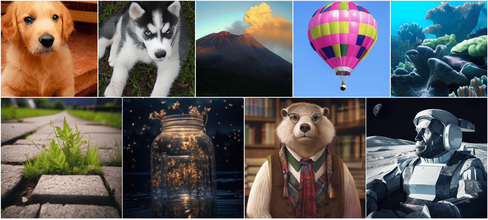

# Autoregressive Model Beats Diffusion: 🦙 Llama for Scalable Image Generation


<div align="center">

[](https://huggingface.co/spaces/FoundationVision/LlamaGen)&nbsp;
[](https://arxiv.org/abs/2406.06525)&nbsp;
[](https://peizesun.github.io/llamagen/)&nbsp;

</div>


<p align="center">

<p>


This repo contains pre-trained model weights and training/sampling PyTorch(torch>=2.1.0) codes used in

> [**Autoregressive Model Beats Diffusion: Llama for Scalable Image Generation**](https://arxiv.org/abs/2406.06525)<br>
> [Peize Sun](https://peizesun.github.io/), [Yi Jiang](https://enjoyyi.github.io/), [Shoufa Chen](https://www.shoufachen.com/), [Shilong Zhang](https://jshilong.github.io/), [Bingyue Peng](), [Ping Luo](http://luoping.me/), [Zehuan Yuan](https://shallowyuan.github.io/)
> <br>HKU, ByteDance<br>

You can find more visualizations on [](https://peizesun.github.io/llamagen/)

## 🔥 Update
- [2024.06.28] Image tokenizers and AR models for text-conditional image generation are released ! Try it !
- [2024.06.15] All models ranging from 100M to 3B parameters are supported by vLLM ! 
- [2024.06.11] Image tokenizers and AR models for class-conditional image generation are released !
- [2024.06.11] Code and Demo are released !

## 🌿 Introduction
We introduce LlamaGen, a new family of image generation models that apply original ``next-token prediction`` paradigm of large language models to visual generation domain. It is an affirmative answer to whether vanilla autoregressive models, e.g., Llama, ``without inductive biases`` on visual signals can achieve state-of-the-art image generation performance if scaling properly. We reexamine design spaces of image tokenizers, scalability properties of image generation models, and their training data quality.

In this repo, we release:
* Two image tokenizers of downsample ratio 16 and 8.
* Seven class-conditional generation models ranging from 100M to 3B parameters.
* Two text-conditional generation models of 700M parameters.
* Online demos in  [](https://huggingface.co/spaces/FoundationVision/LlamaGen) for running pre-trained models.
* Supported vLLM serving framework to enable 300% - 400% speedup.

## 🦄 Class-conditional image generation on ImageNet
### VQ-VAE models
Method | params | tokens | rFID (256x256) | weight
--- |:---:|:---:|:---:|:---:
vq_ds16_c2i | 72M | 16x16 | 2.19 | [vq_ds16_c2i.pt](https://huggingface.co/FoundationVision/LlamaGen/resolve/main/vq_ds16_c2i.pt) 
vq_ds16_c2i | 72M | 24x24 | 0.94 | above
vq_ds16_c2i | 72M | 32x32 | 0.70 | above
vq_ds8_c2i  | 70M | 32x32 | 0.59 | [vq_ds8_c2i.pt](https://huggingface.co/FoundationVision/LlamaGen/resolve/main/vq_ds8_c2i.pt)

### AR models
Method | params | training | tokens | FID (256x256) | weight 
--- |:---:|:---:|:---:|:---:|:---:|
LlamaGen-B   | 111M | DDP | 16x16 | 5.46 | [c2i_B_256.pt](https://huggingface.co/FoundationVision/LlamaGen/resolve/main/c2i_B_256.pt)
LlamaGen-B   | 111M | DDP | 24x24 | 6.09 | [c2i_B_384.pt](https://huggingface.co/FoundationVision/LlamaGen/resolve/main/c2i_B_384.pt)
LlamaGen-L   | 343M | DDP | 16x16 | 3.80 | [c2i_L_256.pt](https://huggingface.co/FoundationVision/LlamaGen/resolve/main/c2i_L_256.pt)
LlamaGen-L   | 343M | DDP | 24x24 | 3.07 | [c2i_L_384.pt](https://huggingface.co/FoundationVision/LlamaGen/resolve/main/c2i_L_384.pt)
LlamaGen-XL  | 775M | DDP | 24x24 | 2.62 | [c2i_X_384L.pt](https://huggingface.co/FoundationVision/LlamaGen/resolve/main/c2i_XL_384.pt)
LlamaGen-XXL | 1.4B | FSDP | 24x24 | 2.34 | [c2i_XXL_384.pt](https://huggingface.co/FoundationVision/LlamaGen/resolve/main/c2i_XXL_384.pt)
LlamaGen-3B  | 3.1B | FSDP | 24x24 | 2.18 | [c2i_3B_384.pt](https://huggingface.co/FoundationVision/LlamaGen/resolve/main/c2i_3B_384.pt)


### Demo
Please download models, put them in the folder `./pretrained_models`, and run
```
python3 autoregressive/sample/sample_c2i.py --vq-ckpt ./pretrained_models/vq_ds16_c2i.pt --gpt-ckpt ./pretrained_models/c2i_L_384.pt --gpt-model GPT-L --image-size 384
# or
python3 autoregressive/sample/sample_c2i.py --vq-ckpt ./pretrained_models/vq_ds16_c2i.pt --gpt-ckpt ./pretrained_models/c2i_XXL_384.pt --gpt-model GPT-XXL --from-fsdp --image-size 384
```
The generated images will be saved to `sample_c2i.png`.

### Gradio Demo <a href='https://github.com/gradio-app/gradio'></a>

You can use our online gradio demo [](https://huggingface.co/spaces/FoundationVision/LlamaGen) or run gradio locally:
```bash
python app.py
```


## 🚀 Text-conditional image generation
### VQ-VAE models
Method | params | tokens | data | weight
--- |:---:|:---:|:---:|:---:
vq_ds16_t2i | 72M | 16x16 | LAION COCO (50M) + internal data (10M) | [vq_ds16_t2i.pt](https://huggingface.co/peizesun/llamagen_t2i/resolve/main/vq_ds16_t2i.pt)

### AR models
Method | params | tokens | data | weight 
--- |:---:|:---:|:---:|:---:
LlamaGen-XL  | 775M | 16x16 | LAION COCO (50M) | [t2i_XL_stage1_256.pt](https://huggingface.co/peizesun/llamagen_t2i/resolve/main/t2i_XL_stage1_256.pt)
LlamaGen-XL  | 775M | 32x32 | internal data (10M) | [t2i_XL_stage2_512.pt](https://huggingface.co/peizesun/llamagen_t2i/resolve/main/t2i_XL_stage2_512.pt)

### Demo
Before running demo, please refer to [language readme](language/README.md) to install the required packages and language models.  

Please download models, put them in the folder `./pretrained_models`, and run
```
python3 autoregressive/sample/sample_t2i.py --vq-ckpt ./pretrained_models/vq_ds16_t2i.pt --gpt-ckpt ./pretrained_models/t2i_XL_stage1_256.pt --gpt-model GPT-XL --image-size 256
# or
python3 autoregressive/sample/sample_t2i.py --vq-ckpt ./pretrained_models/vq_ds16_t2i.pt --gpt-ckpt ./pretrained_models/t2i_XL_stage2_512.pt --gpt-model GPT-XL --image-size 512
```
The generated images will be saved to `sample_t2i.png`.

### Local Gradio Demo


## 🚀 Triton Megakernel Decode

A fused single-kernel decode for class-conditional models (`c2i`) that runs the full transformer — embedding lookup, RMSNorm, QKV projection, 2D RoPE, flash-attention, output projection, SwiGLU MLP — in one persistent Triton kernel, eliminating per-operation kernel-launch overhead.

### End-to-end decode benchmark

Measured on LlamaGen-XL (775M), 576 image tokens (384px / ds16), bf16, single A100.

Implementation | tok/s  | GB/s  | Speedup
---------------|--------|-------|--------
Standard eager |   34.2 |  54.7 | 1×
Triton fused   |  411.7 | 658.8 | **12×**

Correctness (greedy, `--temperature 0`): **96.2%** token match — first divergence at step 504 due to bf16 vs fp32 accumulation rounding.

### Usage

```bash
# benchmark + image save
python benchmark_megakernel.py \
    --gpt-model GPT-XL \
    --gpt-ckpt  pretrained_models/c2i_XL_384.pt \
    --vq-ckpt   pretrained_models/vq_ds16_c2i.pt \
    --image-size 384 --class-label 207 \
    --temperature 1.0 --top-k 2000
```

To use the kernel in your own generation loop:

```python
from autoregressive.models.model_triton import setup_from_transformer, llamagen_decode

params, buffers = setup_from_transformer(model, max_context=577)
# run standard model.forward() for prefill, then:
logits = llamagen_decode(cur_token, params, buffers)  # returns (1, vocab_size)
```

### Architecture notes vs Qwen megakernel

| Feature | Qwen (learn-cuda) | LlamaGen (this) |
|---|---|---|
| QK-norm | per-head RMSNorm on Q, K | none |
| RoPE format | half-split `[x₁\|x₂]` | interleaved pairs `(x₀,x₁),(x₂,x₃)` |
| MLP weights | fused `w13` (1 load) | separate `w1` + `w3` (2 loads) |
| Non-power-of-2 dim | assumes pow-2 (breaks on 4B) | `DIM_BLOCK` masking — works on any dim |


## ⚡ Serving
We use serving framework [vLLM](https://github.com/vllm-project/vllm) to enable higher throughput. Please refer to [serving readme](autoregressive/serve/README.md) to install the required packages.
```
python3 autoregressive/serve/sample_c2i.py --vq-ckpt ./pretrained_models/vq_ds16_c2i.pt --gpt-ckpt ./pretrained_models/c2i_XXL_384.pt --gpt-model GPT-XXL --from-fsdp --image-size 384
```
The generated images will be saved to `sample_c2i_vllm.png`.


## Getting Started
See [Getting Started](GETTING_STARTED.md) for installation, training and evaluation.


## License
The majority of this project is licensed under MIT License. Portions of the project are available under separate license of referred projects, detailed in corresponding files.


## BibTeX
```bibtex
@article{sun2024autoregressive,
  title={Autoregressive Model Beats Diffusion: Llama for Scalable Image Generation},
  author={Sun, Peize and Jiang, Yi and Chen, Shoufa and Zhang, Shilong and Peng, Bingyue and Luo, Ping and Yuan, Zehuan},
  journal={arXiv preprint arXiv:2406.06525},
  year={2024}
}
```
