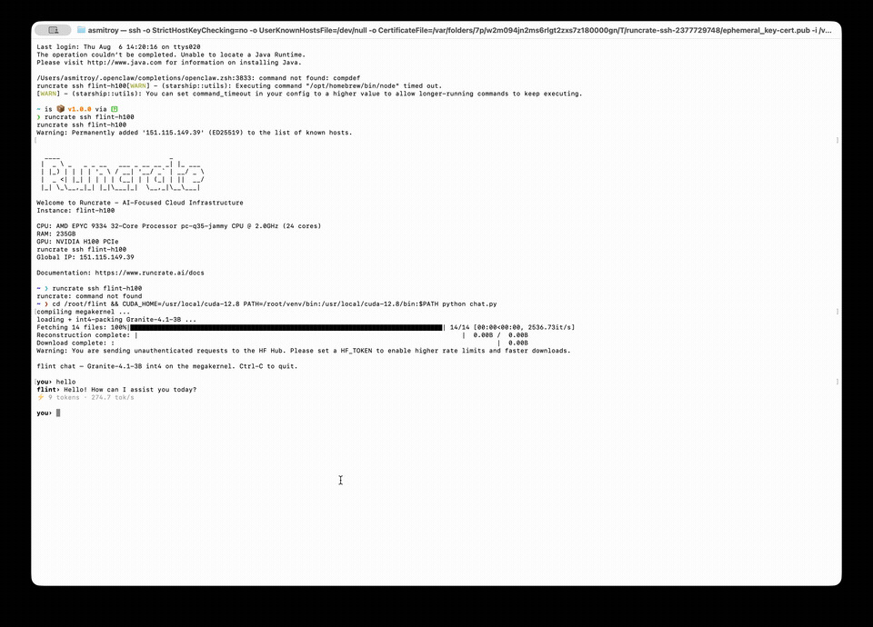

# flint

> A measured study of batch-1 int4 LLM decode on H100 — a hand-written full-decode **megakernel** running real Granite-4.1-3B, with **speculative decode built on top of it that clears the single-pass wall (302 vs 275 tok/s)**.

Batch-1 decode is where single-stream LLM latency lives: one token at a time, read the whole weight matrix,
do almost no math. The folk wisdom is *"it's memory-bandwidth-bound, so read fewer bytes (int4, activation
sparsity) and you win."* flint set out to do exactly that — and **measured that on an H100 the
folk wisdom is mostly wrong.** What we found instead, and the megakernel we hand-wrote in response, is the
project. Every number here is measured end-to-end on real hardware; every result is annotated with *why*
it's fast or slow. Where a projection existed, it's marked and superseded by the measurement.

- **Model:** Granite-4.1-3B dense (GQA / RoPE / SwiGLU, tied embeddings, Apache 2.0).
- **Base engine:** fork of [gpt-fast](https://github.com/pytorch-labs/gpt-fast) (BSD-3, attribution in `engine/NOTICE`).
- **Hardware:** H100 PCIe (2 TB/s peak HBM, 114 SMs).

## Talk to it

`chat.py` runs the whole 40-layer decode on the **megakernel** (our int4 path) with real Granite weights:



*(real-time; [full-quality clip](assets/chat-demo.mp4))*

```bash
python chat.py               # interactive; watch the tok/s
python chat.py --selftest    # one prompt, checks coherence + prints tok/s
```

```
you› In two sentences, what is a GPU and why is it fast?
flint› A GPU (Graphics Processing Unit) is a specialized electronic circuit designed to accelerate the
processing of complex visual data and parallel computations. It is fast because it is optimized to handle
numerous simultaneous processing tasks, leveraging its massively parallel architecture ...
⚡ 58 tokens · 274 tok/s (megakernel int4, decode only)
```

Coherent, correct text — the megakernel is a real engine, not just a benchmark. One subtlety worth noting:
the megakernel's RoPE is **HF/NEOX half-split** (`out[i]=x0·cos − x[i+d/2]·sin`), so `chat.py` packs the QKV
weights **raw/unpermuted** — *not* through gpt-fast's `convert_hf_checkpoint.py`, which rewrites them into
gpt-fast's *interleaved* RoPE layout. Feed permuted weights to a half-split kernel and you get fluent
garbage; matching the convention is what makes it coherent.

## The core finding (measured — and independently published)

On H100, batch-1 int4 decode is **NOT bandwidth-bound. It's overhead/latency-bound.** We measure ~27% MBU
(memory-bandwidth utilization); independent work ([arXiv 2605.30571](https://arxiv.org/html/2605.30571))
measures the same 27% and shows *why* — launch/latency overhead dominates, not bytes. A slow GPU (L4) hits
81% MBU on the same workload: it *is* bandwidth-bound. **Fast GPU → latency-bound; slow GPU → bandwidth-
bound.** Same kernel, opposite regime. Why: the weight bytes per token are fixed, but the H100 can read them
so fast that fixed per-op latency (kernel launch, barrier, address setup) — not the reading — sets the clock.

The consequence: the byte-cutting levers everyone reaches for **don't help at B=1 on H100**, because bytes
aren't the bottleneck. We proved each one by measurement rather than assuming:

| lever tried | result | why it's slow (or no faster) |
|---|---|---|
| hand int4 GEMV vs tinygemm | **ties** (~27% MBU) | the microbench "win" was an **L2-cache artifact** — one weight replayed stays resident; with 281 distinct HBM-cold weights it evaporated |
| activation sparsity (50%) | **2.8× slower** | scattered column gathers + atomic accumulation cost more than the dense read they save; the read was never the bottleneck |
| tensor cores (hand WMMA) | **100× slower** | M=1 fills 1 of 16 MMA rows — 15/16 of every tensor-core op is wasted on padding |
| split-K reduction | slower | the cross-partition reduction is pure overhead when there's no math to parallelize |
| gate/up fusion | **+3%** end-to-end | gpt-fast already fuses QKV; only the down-proj barrier was left to save, and it's tiny |
| cp.async deep pipeline | **+1%** (26→26%) | more in-flight loads don't help when you're latency-bound, not load-parallelism-bound |
| Marlin int4 | doesn't crack B=1 (also blocked on torch-2.11/Hopper) | tuned for batched throughput, not overhead-bound decode |

Every optimistic microbenchmark got corrected *downward* by end-to-end measurement. That discipline —
and the negative results it produced — is the real content.

## What actually beats the baseline: the megakernel

If B=1 is overhead-bound, the fix isn't fewer bytes — it's fewer *ops and launches*. Fuse the **entire**
decode step into **one persistent cooperative GPU kernel** so the residual stream stays on-chip across all 40
layers and there are zero inter-op relaunches. Hand-written, all correct (`kernels/megakernel_{mlp,attn,decode}.cu`):

| path | tok/s | MBU | why |
|---|---|---|---|
| gpt-fast int4 baseline | 237 | 27% | ~300 separate kernel launches/token; each pays launch + HBM round-trip for the residual |
| **flint megakernel** | **274** | 24% | one launch, residual on-chip; trades HBM round-trips for a lower op count |

**274 tok/s, 1.16× the baseline, numerically correct** (coherent real-weight generation in `chat.py`; argmax
matches the reference in the NL=1 assembly check). The dig that got there — each step annotated with *why*:

```
naive persistent            44 tok/s   SLOW: grid-wide atomicAdd in rmsnorm = 117k threads → 1 address, fully serialized
+ block-reduce rmsnorm      209 tok/s   4.7× FASTER: one atomic per block (not per thread) — contention was the whole cost
+ redundant per-block norm  217 tok/s   FASTER: recompute the norm in each block instead of sharing it → fewer barriers
+ vectorized 128-bit x-load 274 tok/s   FASTER: load 8 activations per instruction (int4/128-bit) — fewer load ops
+ flash-decode attention    ~274-284    FASTER: multi-warp-per-head online softmax fixed a 40-warp under-parallelization
```

What made it **slower** (all reverted, all for the same reason — this kernel is register/occupancy-bound, not
warp-starved):

| tried | effect | why |
|---|---|---|
| `__launch_bounds__` more warps | 274 → 169 | forced 40 regs/thread → register spills to local memory |
| multi-accumulator GEMV | 274 → 215 | regs 55 → 67, occupancy 50% → 38% — fewer resident warps to hide latency |
| bigger blocks (512/1024) | slower | register-limited, so bigger blocks = fewer total warps |

It's **latency/barrier-bound**: a diagnostic that halves *all* weight bytes speeds it up only 1.23× (not 2×) —
76% of bandwidth sits idle, confirming bytes aren't the wall. Removing the `grid.sync` barriers entirely (a
correctness-breaking diagnostic) would give ~404 tok/s, so the barriers cost ~30%. The obvious lever to
reclaim that — a **barrier-free producer-consumer redesign** (no `grid.sync`; producer warps stream the
gate/up weights and raise per-tile flags, consumer warps stream the down weights and consume tiles as they
land, so both weight streams fly at once) — was **built and measured (`kernels/pc_mlp.cu`), and it's a dead
end at B=1:**

| MLP path | time | MBU | why |
|---|---|---|---|
| sequential `[gate/up ｜ barrier ｜ down]` | **59 µs** | **27%** | all warps on each phase; one cheap `grid.sync` between |
| producer-consumer (best tuning) | 79 µs | 20% | **1.34× slower, MBU lower** — see below |

Three structural reasons it loses: **(1)** splitting warps into producers/consumers starves *each* phase of
parallelism; **(2)** the reduction dependency — `down[row]` needs *every* k-tile of gate/up — means no
consumer can finish until producers deliver the last tile, so the overlap window is a sliver; **(3)** the
per-tile fence + flag-poll sync costs *more* than the `grid.sync` it replaces. **The barrier is cheaper than
any way of removing it.** So ~274 is the single-pass B=1 ceiling — the multiplier has to come from the
algorithm, not the kernel.

## Speculative decode — past the single-pass wall (302 tok/s, measured)

Single-pass is walled at ~274. The multiplier is speculative decode: an EAGLE draft proposes K tokens, the
megakernel verifies K+1 in **one** cooperative int4 launch (weights read once), and the greedy-matching prefix
is accepted — draft + M=K int4 verify + accept + int4 head, all on the hand-written kernel, no bf16 stand-in.

The enabler is the drafter itself: **multi-step rollout training** closed its exposure-bias gap (it was
trained single-step but runs multi-step — errors compound and chains snap), lifting draft acceptance
**1.76 → 2.52**. Without that there's nothing worth accepting.

The dig from a broken 25 to 302 — each step measured, all at live acceptance ~1.9 tokens/step:

```
25.9 tok/s   BROKEN measurement: draft clocked 73ms — torch.compile silently re-captured its cudagraph every
             pass (the cooperative megakernel launches poison the pool) + eager per-shape autotune as Wc grew
219 tok/s    draft fix        — manual CUDA graph + warm every context-window shape before timing: 73 → 2.3ms
260 tok/s    bf16 verify      — __hfma2 accumulation in the M=K verify: 22% faster, argmax identical
285 tok/s    whole-roll graph — prime + all K draft steps as ONE graph (relative RoPE ⇒ fixed-shape): 2.3 → 1.2ms
302 tok/s    int4 head        — draft head reads the 128MB int4 lm_head, not the 513MB bf16 embedding: 1.2 → 0.9ms
```

**302 vs 275 single-pass**, B=1, on sustained code generation (240–300 live — it rides acceptance, so short or
open-ended prompts run slower). The mistakes cost more than the wins, and they're kept because they're the content:

- **the 73ms draft** — nearly banked the conclusion *"spec-decode loses at B=1"* on a **measurement bug**; the
  draft is 1.2ms once graphed properly. The whole "chain caps at ~130" phase was reasoning over broken numbers.
- **int4-feature draft** — retrained the draft on the megakernel's *own* int4 features to match inference;
  acceptance **dropped** 2.11 → 1.70. Data-starved (the megakernel harvest is M=1 / slow, so only 8k seqs) and
  the int4-vs-bf16 feature gap (cos 0.99) is too small to pay for the lost data. ~1h burned.
- **deeper-rollout retrain** — rollout depth 6 vs 3; acceptance **dropped** 1.92 → 1.75. Too deep: it trains on
  6-step own-predictions that are already too corrupted, and underfits. ~50min burned.
- **shared-memory activation staging** — staged the verify's activations in shared to flatten the M-scaling;
  it got **slower** (5.21 → 5.37ms). The verify isn't load-bound — activations are L2-hot, the latency already
  hides under occupancy. It's barrier/compute-bound, the same wall as the base.
- **"compute-bound" misdiagnosis** — assumed the verify was fp32-FLOP-bound and mis-projected a tensor-core
  "flat verify" path to 500. bf16 helped, but staging disproved it: the verify's floor *is* the barrier base.
- **M-dispatch fall-through** — the verify launcher defaulted to the M=3 kernel for any M∉{1,2,4,6,8}, running
  it on M-sized buffers; a long debug chasing "corrupted trees" (coherent-*looking* but wrong output) that was
  a one-line dispatch bug, hidden because the chain tests only ever used supported M.

**The ceiling — ~302 — is the drafter, not the kernel.** The verify's 3.6ms base is the same barrier-bound
per-token cost that caps single-pass, so spec-decode's floor and single-pass's floor are one wall. The
remaining headroom is acceptance (~1.9 tokens/step), and it's **under-trained**: the drafter behind 302 had
2–3 hours of harvest+training on 8k sequences. A real one is a 3–4 day, 50–100k-generation job (EAGLE-3). So
302 is what the kernel does sitting under a barely-trained drafter — the acceptance side is the untapped half.

## Layout
```
chat.py    interactive chat on the megakernel (real Granite weights, int4)
engine/    gpt-fast fork + Granite-4.1 support (LICENSE / NOTICE, BSD-3)
kernels/   custom CUDA — int4 GEMV variants + the megakernel (attn / mlp / full-decode) + the pc_mlp dead-end
train/     EAGLE draft: self-distill harvest, training, acceptance eval, spec-decode loop
bench/     measurement harnesses — every claim above is reproducible here
setup/     one-command box provisioning + baselines
```

## Honesty notes
- Numbers are **measured end-to-end**, not projected. Microbenchmarks lie at B=1 (L2 residency, launch
  amortization) — only the token clock counts.
- **Negative results are kept** — sparsity, tensor cores, split-K, Marlin, cp.async pipelining, and the
  barrier-free producer-consumer megakernel are all measured-dead at B=1, each with a documented *why*.
- int4 adds a small perplexity cost (quantization); activation sparsity is an opt-in quality trade. Neither
  is free, and neither is claimed to be.
